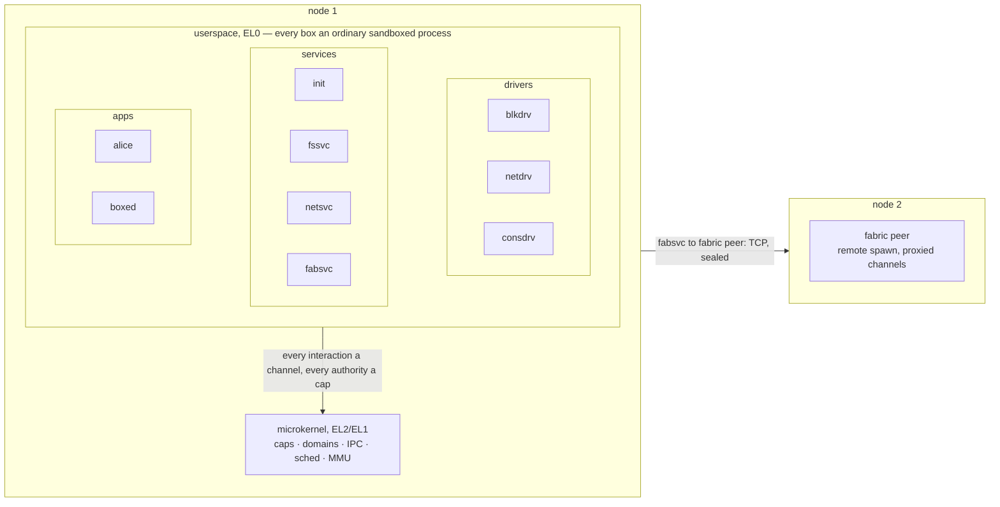

# moss

A clean-slate, capability-based microkernel OS in Zig — modern 64-bit
hardware only, sandboxed by construction, IPv6-native, and designed from the
first commit to compose multiple machines into pooled hardware.

Every numbered phase of the original roadmap (0–11) is built and covered by
an automated test suite: from boot-to-banner, through user-mode capabilities
and domains, IPC with typed comptime-generated stubs, a userspace init with
supervision, interposition sandboxing, userspace virtio drivers, async
rings, a filesystem with per-process namespace views, dual-stack TCP/IP,
and a multi-node fabric doing cross-VM RPC with node-kill recovery under
per-node cryptographic identities.

## The documents

**[docs/](docs/README.md)** explains the system in layers — a plain
version first, then the mechanism with diagrams, then the detail and the
known limits — grounded in the code of the same commit. The three
working documents it points into:

- **[ROADMAP.md](ROADMAP.md)** — the plan of record: locked decisions with
  rationale, phased milestones with exit criteria, invariants no change may
  break, and the Phase 12+ pool of future work.
- **[DESIGN.md](DESIGN.md)** — the architecture narrative: how the pieces
  work together, with "as built" sections and the lessons each phase paid
  for.
- **[HACKING.md](HACKING.md)** — the practical guide: building, running,
  debugging, and extending (new syscalls, services, tests).

## Quickstart

Requirements: Zig **0.16.0** (pinned — see `mise.toml`) and QEMU
(`brew install qemu`).

```sh
zig build check      # the whole test suite: 22 OS tests under QEMU (+6 again on a ReleaseSafe kernel) + host unit tests (~2 min)
zig build check -Donly=fs,ipc+rs   # a subset;  -Dsoak=10 repeats each test (intermittent failures)
zig build run        # boot interactively (TCG; Ctrl-A X exits)
zig build run-hvf    # boot with Hypervisor.framework acceleration (Apple Silicon)
```

## Architecture at a glance



The kernel provides exactly: address spaces, threads, domains (the unit of
spawn/quota/teardown), capability tables with generational badged handles,
synchronous channels + notifications, and interrupt/fault delivery as
messages. Everything else — drivers, filesystems, networking, init,
supervision, the multi-node fabric — is userspace reached over channels,
and therefore interposable, sandboxable, and revocable.

## Test matrix

`zig build check` builds one kernel variant per test (in parallel) and
boots each under QEMU with the right machine config; tests self-report a
PASS marker and power off. Individual tests can still be run by hand:

| Test | Proves | Manual invocation |
|---|---|---|
| panic, fault | Panic handler; decoded fault reports | `zig build run -Dpanic-test` / `-Dfault-test` |
| pan | PAN as a safeguard: a syscall touches a range-checked user buffer outside a uaccess window and the CPU refuses it | `zig build run -Dpan-test` |
| sched | SMP: pinned + migrating threads under load | `zig build run -Dsched-test` |
| cpu | CPU budgets and partitions: a quarter-core domain throttled to its share, an unlimited sibling, a core reserved for one domain | `zig build run -Dcpu-test` |
| domain | Spawn/revoke/leak-check; no ambient authority | `zig build run -Ddomain-test` |
| ipc | Typed RPC, cap grants, fault-as-message, peer death | `zig build run -Dipc-test` |
| init | Userspace root+init: lazy activation, supervised restart, re-wiring | `zig build run -Dinit-test` |
| sandbox | Interposition proxy, nested domains, one-call subtree revocation | `zig build run -Dsandbox-test` |
| flap | Restart budget exhaustion escalates up the supervision tree | `zig build run -Dflap-test` |
| blk | Userspace virtio-blk; sync channels vs async rings, raced | `zig build run-blk -Dblk-test` |
| smmu | The IOMMU: the block drill with every DMA translated by the SMMUv3, then a rogue driver's DMA into a kernel page refused and recorded | `zig build run-blk -Dsmmu-test` |
| vm | The hypervisor: a userspace VMM runs a bare-metal EL1 guest in its own stage-2 world — trapped MMIO, vGIC-injected timer ticks, PSCI power-off | `zig build run -Dvm-test` |
| guest | A moss kernel as a guest of moss: booted by the VMM from a devicetree it wrote, PL011 and GIC emulated, PSCI over HVC; runs its userspace and powers off | `zig build run -Dguest-test` |
| vmnode | The pooling story: a moss guest with a passed-through NIC and entropy device (SMMU stage 2, LPIs injected as SPIs) joins the fabric as node 2 and takes a remote spawn | `zig build run -Dvmnode-test` |
| fs | Namespace views (badged caps) on real storage; persistence; reclamation on client death (a hundred views come and go through one domain, two dozen held to the grave, the next client fits) | `zig build run-blk -Dfs-test` |
| users | Users as keys, sessions as domains, homes as encrypted volumes: `apply` creates the users from the desired state, passphrase-unlocked identities in a custodian's care, two sessions at once under their own budgets, wrong passphrase and unknown user refused, each home a volume keyed from its identity with the system volume holding only ciphertext, work persisting across logins, layered settings with a locked key | `zig build run-blk -Dusers-test` |
| login | Console login: two users at two consoles at once, each session an init instance with msh holding the home as its whole filesystem; a refused passphrase, the other's files unnameable, out and back in, `run` from the system store and `install` into the home's own, a share offered, accepted, read through, refused a write, and withdrawn, seats freed | `zig build run-login` (interactive) |
| net | Dual-stack TCP through userspace netsvc; allowlist views | `zig build run-net -Dnet-test` |
| rng | Userspace virtio-rng seeds the kernel CSPRNG via the entropy cap; getrandom fail-closed and policed | `zig build run -Drng-test` |
| fabric | Per-node identities (root-signed certs, signed DH, sealed transport): join, gossip, placement, death, rejoin, imposter refused, spawn authorization, revocation | `zig build run-cluster -Dfabric-test` |
| shell | msh scripted console session: typed pipelines (where/select/get over real listings), let/if/for/while/def, `>` redirection, data files, scripts and a startup script, tab completion, `run` of content-addressed programs whose results are values, and `run apply` making the volume match its desired state | `zig build run-shell` (interactive) |

Host-side unit tests (`zig build test`) cover the shared ABI (handles,
typed message codecs, rings, the boot archive), the devicetree parser,
the `lib/` modules (lz4, xts, fabric certificates, user credentials,
layered settings, the msh language),
and the full mossfs suite.

## Layout

| Path | Contents |
|---|---|
| `boot/` | The boot tree packed into the archive: `etc/` identity, `conf/units/*.msh` unit files, test key material (`conf/fs.key`, `conf/fabric/root.seed` are fixed placeholder strings for the drills, not secrets; the drill users' passphrases are compiled into `user/users.zig`) |
| `kernel/` | The microkernel (aarch64-freestanding, boots as an arm64 Image; embeds only the boot archive) |
| `shared/` | The ABI/IDL: types that compile identically for kernel, userspace, and host tests |
| `user/` | Userspace: root task, init, services, drivers, demo programs |
| `tools/` | Host-side tooling (`runner.zig` = the `check` harness, `mkmarc.zig` packs the boot archive, `bench.zig`) |

## License

MIT — see `LICENSE`.
