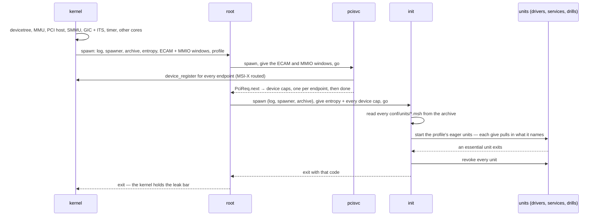
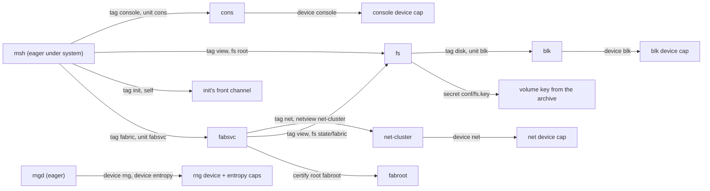
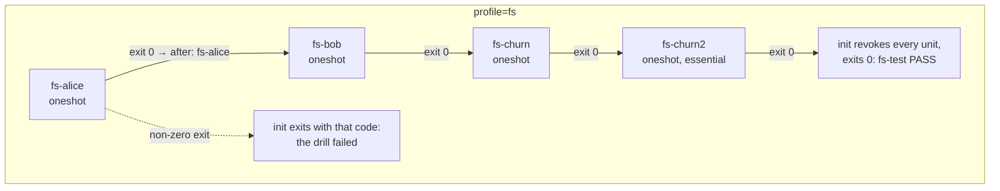
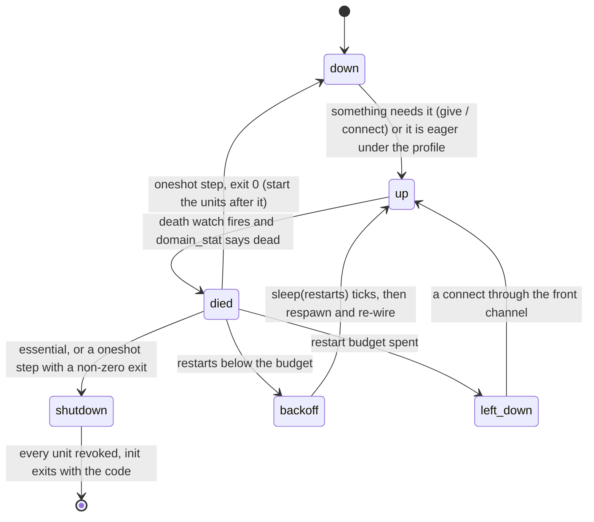

# Boot and init

## In one breath

moss boots by handing out permissions, not by running a script. The
kernel brings up the machine, then starts exactly one program, **root**,
with everything: the log, the authority to spawn, the boot archive, and
the devices. Root starts **init** and gives it all of that. Init reads
small text files called **unit files**, one per program, and each one
says what that program needs — a device, another program's channel, a
slice of disk. Init starts a program only when something needs it, and
the act of handing over a capability is what starts the dependency:
there is no boot order to get wrong. If a program dies, init restarts
it a bounded number of times; if an *essential* program exits, the
whole system follows it down and reports its exit code.

## How it works

### The kernel's part

Entered by QEMU as an arm64 Image with the devicetree's address in
`x0`, the kernel reads memory, the PCIe host, the SMMU, the interrupt
controller and its ITS from that tree — never from constants — builds
its page tables, brings the other cores online, starts the timer tick,
and then spawns root. Root receives: the debug log, spawn authority, the
boot archive mapped read-only, the entropy authority, and two *window*
capabilities (the PCIe configuration space and the MMIO window BARs are
placed in). Root's argument carries the **boot profile** the kernel
parsed from `profile=<name>` in the boot arguments; without one the
profile is `system`. The kernel's only remaining job is to wait for the
system to shut itself down and verify nothing leaked.

### Root, pcisvc, init

Root is deliberately near-finished. It spawns **pcisvc**, the PCI
enumerator, and hands it the two windows; pcisvc walks the bus, places
every BAR, programs MSI-X, registers each device with the kernel, and
hands back one *device capability* per endpoint until it says `done`.
Root then spawns init with the log, spawn authority and the archive, and
forwards the entropy cap and every device cap over init's boot channel,
each filed by kind (`blk`, `net`, `console`, `rng`). Root supervises
init alone: it restarts init once, and exits with init's code.



### Unit files

Every program init can start is a **unit**: `boot/conf/units/<name>.msh`
in the archive, an mshl *data literal* — a record, read by the strict
data parser, so a command in a unit file is a syntax error. The record
names the image, the budget, the kernel grants, and the `give` lines:
what the program is handed over its boot channel before init says `go`.
This is the console driver, the block driver, and the shell:

```
# cons.msh
{ image: cons, give: [ { tag: device, device: console } ] }

# blk.msh
{ image: blk, arg: 1, give: [ { tag: device, device: blk } ] }

# msh.msh
{
  image:     shell
  budget:    { user: 8mb }
  grant:     [log, spawner]
  profiles:  [system]
  essential: true
  give: [
    { tag: console, unit: cons }
    { tag: view,    fs: "", ro: false }
    { tag: init,    self: true }
    { tag: fabric,  unit: fabsvc }
  ]
}
```

A `give` line is a capability with a *tag* — what the receiver should
use it for — and where init gets it from:

| Line | Init obtains it by |
|---|---|
| `{ tag: device, device: blk }` | the device cap root forwarded, filed by kind; `index: 1` picks the second of that kind |
| `{ tag: disk, unit: blk }` | activating unit `blk` first, then handing over its channel |
| `{ tag: buf, shm: 1 }` | creating a shared buffer of that many pages (a `buf` is also where secrets are staged) |
| `{ secret: conf/fs.key }` | copying that archive file into the unit's `buf` and pointing at it (bytes, not a capability — no tag) |
| `{ tag: view, fs: state/fabric, ro: false, mkdir: true }` | deriving a filesystem view from the `fs` unit's root view (a session's from its home), creating the directory first if asked |
| `{ tag: net, netview: net, allow: 10.0.2.100, port: 9000 }` | asking the named network unit to derive a view, optionally allowing one destination |
| `{ tag: init, self: true }` | a copy of init's own front channel |
| `{ tag: console, session: true }` | one of the session's own caps (session mode only) |

Capability wiring **is** the dependency model. `{ tag: disk, unit: blk }`
in the filesystem's unit means "start `blk` if it is not up, then give
me its channel"; nothing anywhere says "start blk before fs". Under the
`system` profile the shell alone is eager (with `rngd`), and its four
`give` lines pull in the whole system:



The remaining keys: `arg` (the program's personality word), `budget`
(`kobj`, `user`, `cpu` as permille of a core or `"25%"`), `cores` (a
partition reserved for the unit alone), `grant` (`log`, `spawner`,
`bootfs`, `introspect`), `restart: { max: N }`, `profiles`,
`essential`, `oneshot`, `after`, `node` (`node: boot`: the program's
node id is the boot's, `node=N` in the boot arguments, 1 by default —
its `arg` becomes role | node << 8, and its `certify` names this
node), `certify.seeds` (members the fabric service dials once
certified, skipping itself), `run` (`run: true`: the unit is also a
program the shell can run under its name — init writes a manifest for
it into the store with its image's digest, `arg`, grants and gives),
`certify` (the fabric's certification
against a root-of-trust unit), `install` (install the program store
through this filesystem unit once it is up), and `script` (a path,
handed over as the 24-byte argument text: the `mshrun` image reads the
script there in the view the unit gives it — a script as a unit, see
[the shell page](shell.md#scripts-as-programs)).

### Profiles and drills

A unit lists the **profiles** under which it starts at boot
(`profiles: [system, users, login]`). One archive therefore serves the
interactive system and every drill: the kernel passes the profile to
root, root to init, and init starts the units that name it. Drill steps
are `oneshot` units: a step that exits 0 starts the units that name it
in `after` (under the same profile), a step that exits non-zero takes
the system down with that code, and the last step is `essential` so its
clean exit ends the boot.



### Supervision

Init serves its front channel and keeps a *death watch*: the kernel
signals a notification when any domain init spawned dies, and that
notification is bound to init's thread, so the signal interrupts its
blocked receive. Init then scans its units. A unit that died is
restarted one-for-one if it has restart budget left, after a linear
backoff of one tick per prior death, and re-wired exactly as it was
started (a fresh buffer, fresh gives). Past its budget it is left down.
Dependents notice the death the way any peer does — their channel
reports `peer_dead` — and re-request the service through init's front
channel, which doubles as a restart. An `essential` unit's exit shuts
the system down with its code. Init itself is supervised by root, and
the flap drill shows the escalation: a service that always crashes
exhausts its budget, init exits with a distinct code, and root, seeing
init die twice, exits with that code — the failure travels up the tree
instead of spinning at the bottom.



### The same init at another radius

A user session is init in *session mode*: the session manager spawns it
under the user's budgets and hands it the home's root view, the system
settings view, the system program store and a console over the boot
channel. It reads its units from `conf/units/` in the home — the user's
own topology — or, when there are none, the archive's session template
(`conf/session/msh.msh`: the shell with the home as its whole
filesystem). Views it gives derive from the home, and
`{ tag: X, session: true }` passes on one of the session's own caps.
Everything else — activation, supervision, the front channel — is the
same code.

### Shutdown

When an essential unit exits, or a drill step fails, init destroys every
unit it started and exits with the code. Root sees init exit cleanly and
exits 0; the kernel's driver sees root drained, finishes its teardown,
and checks that physical memory and the shared-buffer account are back
to where they were before root was spawned — the *leak bar*. A system
that has not shut down within 60 seconds is dumped (every thread,
domain, notification, interrupt line and the lifecycle trace) and
failed.

## In detail

- **Kernel boot order** (`kernel/main.zig`, `kmain`): parse the
  devicetree (memory regions, bootargs, PCIe host, SMMU, ITS); reserve
  the kernel image and the tree; build and activate the W^X kernel map;
  PCI host and SMMU; scheduler for core 0; embed the boot archive as the
  one system blob; IRQ tables and the reaper thread; GIC distributor, ITS,
  core 0's GIC and timer; bring up the secondaries; enable interrupts;
  spawn the test driver the build selected; idle. The system drills
  spawn root with `kobj_limit` 24 MB and `user_limit` 128 MB.
- **The boot archive** is a MARC: the bytes `MARC`, then for each entry
  a 4-byte path length, a 4-byte data length, the path and the data,
  little-endian. `tools/mkmarc` packs it at build time from every program
  image (`img/<name>`) plus `etc/`, `conf/units/`, `conf/session/`,
  `conf/msh/`, and the drills' key material. The kernel embeds exactly
  this blob; every holder of the `bootfs` grant maps the same read-only
  pages.
- **Root's grants** arrive at fixed cap slots: the log in `x0`, the
  spawner at slot 1, entropy at 2, the ECAM window at 3, the MMIO window
  at 4. Root gives pcisvc a 1 MB kernel-object and 2 MB user budget and
  collects at most 16 device caps. Init is spawned with a 12 MB
  kernel-object and 64 MB user budget — the slice every unit nests
  inside. Root restarts init at most once (`max_init_restarts = 1`).
- **Root's argument** is `mode | profile << 8`. Init reads the mode from
  the low byte: 0 is the Phase 5 demo (a worker drives lazily started
  services), 1 the flap drill, 2 the system boot under the given
  profile, 3 a session. Profiles are `system`, `blk`, `fs`, `net`,
  `guest`, `users`, `login`, `session`.
- **The boot protocol** (`shared.BootReq`, `user/boot.zig`): `cap`
  (attaching a capability, with its tag and, for devices, the kind),
  `secret` and `data` (bytes at an offset in the receiver's `buf`),
  `arg` (up to 24 bytes of text), `go`. A receiver files up to 4 caps
  per tag and 4 devices per kind; a secret is at most 256 bytes and the
  receiver copies it out and wipes the buffer. Every program takes the
  handshake with `boot.take`, even one handed nothing — init says `go`
  to everyone, and a program that starts serving first never answers.
- **Unit limits** (`user/init.zig`): 32 units, 8 `give` lines each; the
  parser's arena is 256 KB, reset per file; a session's unit text is
  kept in a 32 KB area. Defaults: kernel-object budget 1 MB, user memory
  4 MB, no CPU budget, grants `log` only. The repository ships 27 unit
  files plus the session template.
- **Activation** (`ensureUp` → `activate`): stage the image from the
  archive, create the boot channel, spawn with the unit's grants and
  budgets, drop init's copy of the serving side, then give each line in
  order — a `unit` give calls `ensureUp` on the dependency, so a cycle
  in the unit files is caught by the `activating` flag and refused —
  then the certification secret if any, then `go`. A failed give
  destroys the half-wired domain. After `go`: certification finishes,
  and `install: true` derives the root view from the fresh filesystem
  and installs the store.
- **Supervision numbers**: backoff is `sleep(restarts)` ticks, and a
  tick is 100 ms; `restart: { max: N }` is the budget (the demo services
  use 5, `rngd` 5). A unit with no `restart` key has budget 0 and stays
  down after its first death. The flap drill's budget is 3 and its
  escalation code 77.
- **Certification** (`certify: { root, node, gossip, spawn, state }`):
  before `go`, init reads the node's identity seed from
  `<state>/identity.seed` through the filesystem unit, or draws a fresh
  32-byte seed from the kernel pool and writes it there, and stages the
  seed plus the root of trust's cluster key into the unit's `buf` as a
  64-byte secret. After `go`, it installs the certificate kept in
  `<state>/identity.cert`, or asks the unit for its public key, has the
  root unit issue a certificate with the given flags, keeps it, and sets
  it on the unit — retrying up to 30 times while the entropy pool seeds.
- **The front channel** (`shared.InitRequest`): `connect` (ensure a
  service is up and hand back its channel; also clears a `stop`),
  `status`, `stop` (destroy and mark stopped, so it is not restarted),
  `install` (install the store into a given view). Services reachable by
  `connect` are units named after `shared.ServiceId` — today `logsvc`
  and `greeter`.

## Known limits and bugs

- Unit files carry test key material beside them (`conf/fs.key`,
  `conf/fabric/root.seed`): fixed placeholder strings, not secrets.
- There is no `start:` key: a unit is eager under the profiles it lists
  and lazy otherwise. Older prose in DESIGN.md and HACKING.md still says
  `start: eager`.
- A `run` argument reaches a program only as the path of a view; up to
  24 bytes of text.
- Restart budgets are per boot and never replenish; a unit past its
  budget is revived only by an explicit `connect`.
- `after` steps start only under a profile they list — a step without
  `profiles` never starts, silently, except for the log line when it
  fails to.
- The session template is fixed by the archive; a user's own
  `conf/units/` replaces it wholesale rather than extending it.

## Dig deeper

- DESIGN.md — "Init and supervision" (the model and its lessons),
  "Platform and boot" (the Image protocol, EL2 host, page tables),
  "Drivers" (how devices reach userspace).
- ROADMAP.md — "Boot orchestration into userspace", "Drills as unit
  files", "PCI enumeration out of the kernel".
- HACKING.md — "Adding things": a unit, a program, a syscall.
- Source — `kernel/main.zig` (`kmain`, `systemDrill`), `user/root.zig`,
  `user/pcisvc.zig`, `user/init.zig`, `user/boot.zig`
  (`Setup`, `take`, `give`), `shared/lib.zig` (`BootReq`, `BootProfile`,
  `SpawnFlags`, `CapTag`), `tools/mkmarc.zig`, `boot/conf/units/`.
