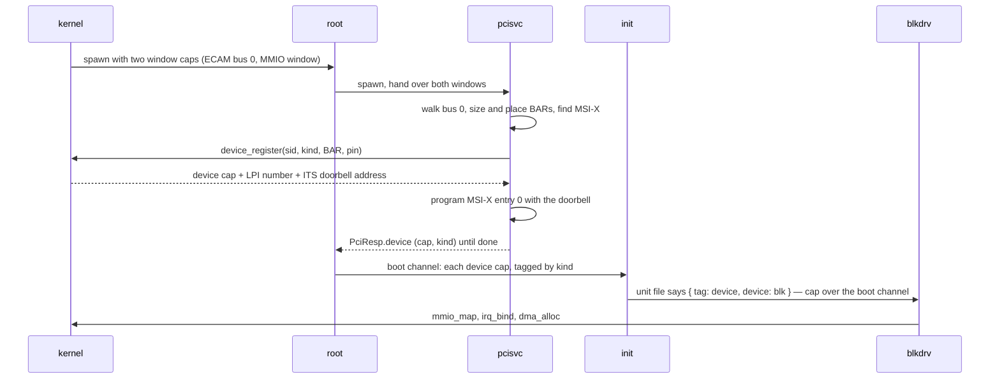
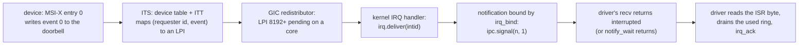
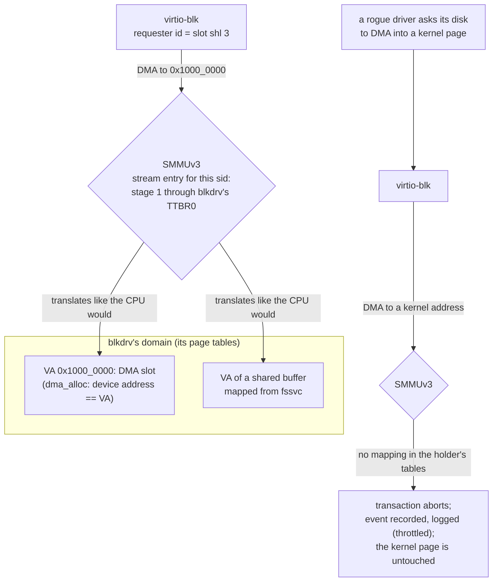
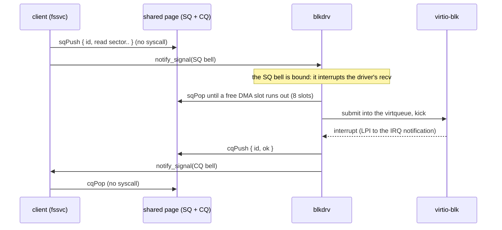

# Devices and drivers

## In one breath

In moss a device driver is an ordinary program. It is not part of the
kernel, it has no special powers, and it can be sandboxed, restarted, or
revoked like anything else. What makes it a driver is one capability it
is handed: a **device capability**, which stands for exactly three things
— the device's registers, its interrupt line, and its identity on the
memory bus. With that capability the program can talk to the device;
without it, it cannot even find it. The device, for its part, can only
read and write memory that the driver itself can see, because an IOMMU
translates every access the device makes through the driver's own page
tables. A driver that is confused or malicious can corrupt its own memory
and nothing else.

## How it works

### From the bus to a driver

On QEMU's `virt` machine every device is virtio over PCI. The kernel does
not walk the PCI bus. It reads the devicetree, finds the PCI host bridge,
and mints two **window capabilities**: the ECAM window (configuration
space of bus 0) and the 32-bit MMIO window where device registers will
be placed. It hands both to root. Root hands them to `pcisvc`, a program
that does what firmware would do: walk bus 0, size and place every BAR,
enable decoding and bus mastering, find the BAR holding the virtio
structures and the MSI-X capability, and **register** each endpoint with
the kernel. The kernel answers with a device capability, the interrupt
number it routed for the device, and the doorbell address the device's
MSI-X entry must target; pcisvc programs that entry itself.

pcisvc then serves the device capabilities to root, which forwards them
to init, which files each by kind and hands it to whichever unit file
asks for it: `give: [ { tag: device, device: blk } ]`.

The boot channel is the one setup handshake every program starts with.
A device capability travels on it like any other capability; whoever
holds it can give it away, and delegation is copying. The kernel's own
manifest never needs to name a device.

### What a device capability lets a driver do

A device capability is an index into a small kernel table (16 entries).
Through it a driver can:

- `mmio_map` — map the device's BAR and its 4 KB PCI configuration page,
  and learn the BAR index. The driver reads the PCI capability list
  itself to find the virtio common configuration, notification area,
  ISR byte, and device-specific configuration.
- `irq_bind` — route the device's interrupt to a notification the driver
  holds. `irq_ack` re-enables a level-triggered line after the driver
  has serviced the device.
- `dma_alloc` — get physically contiguous zeroed pages (up to 16 per
  call) with a virtual address and a device address.
- `device_info` — learn the device kind, its requester id, and the BAR
  length.

Kinds are the virtio device ids: net (1), blk (2), console (3), rng
(4). The transport all four drivers share is `user/virtio.zig`: modern
virtio-pci only (VERSION_1 always negotiated, ACCESS_PLATFORM whenever
offered), split virtqueues, doorbells rung by writing the notification
area, the ISR byte read to acknowledge. Virtqueue layouts stay in each
driver.

### Interrupts are messages

A device's interrupt arrives at the driver as a **notification signal**,
never as a handler in the driver's address space. With MSI-X the device
writes a message to the GIC's ITS doorbell; the ITS translates it to an
LPI; the kernel's interrupt handler finds the notification bound to that
LPI and signals it. If the driver is parked in `recv` serving its
channel, the notification interrupts that recv (`Errno.interrupted`):
one thread serves both clients and hardware.

The MSI write is itself DMA, so it passes through the IOMMU. The
doorbell page is mapped into the holding domain's page tables at its own
address, privileged-only: the device can ring it (its transactions are
marked privileged), the driver's code cannot.

INTx remains the fallback for a device without MSI-X or a machine
without an ITS. Level-triggered lines are masked on delivery and
re-enabled by `irq_ack`; LPIs are edges, delivered and forgotten, and
`irq_ack` on one is a no-op.

### DMA through the driver's own page tables

An SMMUv3 sits in front of the PCIe bus, and every moss boot runs with
it. The IOMMU page table of a device **is the page table of the domain
holding its capability**: the same TTBR0, the same ASID, the same
memory attributes the CPU uses. Two consequences follow. A device sees
exactly what its driver sees, and `dma_alloc` returns the driver's
virtual address as the device address — there is no separate address
space to reason about. And a device whose capability nobody holds has
no valid stream table entry at all, so it cannot DMA anywhere.

Binding follows the capability. When a domain receives a device
capability, the kernel attaches the device's stream to that domain: the
**last holder wins**, so root, then init, then the driver, ends with the
driver. Dropping the capability or tearing the domain down detaches the
stream and invalidates its translations *before* the domain's page
tables are freed. A translation fault terminates the transaction, is
recorded on the SMMU's event queue, and is logged by the kernel — the
first few in full, then counted. The driver learns nothing; the memory
it was not given is untouched. The `smmu` drill hands a rogue program a
disk and has it request a DMA into a kernel page: refused, recorded,
canary intact.

For a guest virtual machine that is handed a device, the same stream is
bound instead to **stage-2** translation through the guest's tables:
the guest's DMA addresses are intermediate physical addresses, and only
the guest's memory is reachable.

### The block driver: two transports

The block driver serves the block protocol two ways over one thread.
The **sync channel** is call/reply: `read`, `write`, `flush`,
`capacity`, each up to 64 sectors (32 KB), with data in a shared buffer
the client attached at `setup`. The **ring** is io_uring-shaped: a
submission ring and a completion ring in one shared page, 16 entries
each, single-producer single-consumer, with two notifications as
doorbells. Entries carry the same typed message words as the channel
plus a correlation id. The data plane costs no syscalls; only the
doorbells do.

The driver keeps 8 requests in flight, each with its own 32 KB DMA
slot; a virtqueue of 32 descriptors carries up to 3 per request. The
ring's submission bell is bound to the driver thread, so a submission
wakes a driver parked in `recv`; a completion is signaled on the
client's bell. Measured at queue depth 8 the ring runs the sync channel
several times over (see DESIGN "IPC" for the numbers).

### The console driver and seats

The console driver drives virtio-console (device id 3): queue 0 receives,
queue 1 transmits, no MULTIPORT. It serves one client at a time over a
channel: `setup` attaches the client's byte buffer, `read` blocks the
driver until at least one byte has arrived (single client, so blocking
the serve loop is correct), `write` is synchronous. It is a raw byte
pipe; echo and line editing live in the client (msh). A **seat** is one
virtio-console device: a second device is a second console driver
instance, picked by a unit file with `index: 1`, and the session manager
puts a login prompt on each.

### The entropy driver and the kernel pool

The kernel keeps a ChaCha8 fast-key-erasure CSPRNG that it never seeds
itself: no cycle-counter mixing, no boot-time guesswork. Bytes enter only
through `rng_seed`, gated by the **entropy capability**, which exactly
one program holds — `rngd`, the virtio-rng driver (device id 4). It
harvests 64 bytes at boot to key the pool, wipes its landing buffer after
every copy, and reseeds with 32 bytes every 30 seconds on its own clock.
It serves no channel: consumers call `getrandom`, which needs no
capability (random bytes are authority over nothing) and is
**fail-closed** — `bad_state` until the boot seed has landed, so a
service that starts too early gets an honest error, never a weak number.

## In detail

- **Windows.** The ECAM window covers 1 MB (bus 0); the MMIO window is
  the devicetree's 32-bit range. `window_map(window, page offset, pages)`
  maps up to 4096 pages of a window and, with 0 pages, just reports the
  window's base and size. Only the ECAM holder may `device_register`
  (a `window` cap for index 0).
- **Registration.** `device_register(ecam, requester id, kind, BAR pa,
  BAR len, pin | BAR index shl 8)` returns the device cap, the routed
  LPI (0 without an ITS), and the ITS doorbell address. The requester id
  is `bus shl 8 | slot shl 3 | function`; on bus 0 that is `slot shl 3`.
  Registering a requester id twice returns the existing entry. The
  device table holds 16 entries.
- **Interrupt numbers.** LPIs start at 8192 and the kernel routes up to
  64 of them; a device with MSI-X gets entry 0 of its table pointed at
  the ITS translater with event 0. Without MSI-X the INTx pin maps to an
  SPI: `32 + intx_base + (slot + pin - 1) mod 4` (QEMU virt: INTA..D from
  SPI 3). The kernel binds up to 256 SPIs and 64 LPIs, each to at most
  one notification; a binding is severed when the notification dies, and
  an unbound level line is masked so it cannot storm.
- **DMA.** `dma_alloc(pages)` allocates 1 to 16 physically contiguous
  zeroed pages, charged to the domain's user-memory budget, mapped into
  its window; the device address is the VA when the SMMU is active,
  the physical address on a machine without one. Every boot in the
  check runs with `iommu=smmuv3` and `iommu_platform=on` on each device.
- **The SMMU.** Stage-1 only for drivers; a linear stream table of 256
  entries (bus 0's requester ids), one context descriptor per device
  table index, a command queue of 256 entries and an event queue of
  128. The context descriptor uses a 39-bit VA (T0SZ 25), 4 KB granule,
  the domain's ASID, and MAIR as the CPU programs it; faults terminate
  (S=0) and are recorded (R=1). The stream entry marks transactions
  privileged so the device can reach the doorbell page. Attach writes
  the CD, then the STE, then invalidates the STE's cached configuration
  and syncs; detach clears the STE and invalidates the ASID's TLB
  entries. The first 4 refused transactions are logged, later ones only
  counted (`fault_count`); QEMU retries a refused burst word by word, so
  one rogue sector is about 128 events. Guest passthrough
  (`vm_attach_device`) binds the stream to stage 2 through the VM's
  tables (39-bit IPA, 40-bit PA), maps the BAR at the given IPA, and
  injects the device's LPI as a virtual SPI in 32..95.
- **virtio transport.** Capabilities found by walking the PCI capability
  list: common configuration (type 1), notification (2), ISR (3), device
  configuration (4); MSI-X is capability id 0x11. The transport points
  the configuration and every queue at MSI-X vector 0.
- **Block.** Queue of 32 descriptors, 8 concurrent requests, 32 KB per
  slot (one 64-sector request, `blk_max_sectors`), 512-byte sectors.
  `ring_setup`, `ring_sq_bell`, `ring_cq_bell` set up the ring over the
  sync channel, one capability each. A request's offset and count are
  bounded by the client's actually mapped window, so a client granting
  one page cannot steer the driver past it.
- **Console.** Per queue 8 descriptors; 8 receive buffers of 64 bytes; a
  2 KB transmit buffer. A write longer than the client's buffer or the
  transmit buffer is refused.
- **Entropy.** `rng_seed` accepts 32 to 256 bytes; `getrandom` 1 to 256
  bytes per call, into user-writable memory only (text and the boot
  archive are refused). The pool has its own lock, outside the
  scheduler's. rngd's default reseed period is 300 ticks of 100 ms.
- **Unit files.** `{ tag: device, device: blk }` hands a driver the first
  device of that kind; `index: 1` the second (`cons1`). The rng unit also
  gives `{ tag: entropy, device: entropy }`; drivers are activated
  lazily by whoever needs them (`{ tag: disk, unit: blk }` in the
  filesystem's unit starts the block driver).

## Known limits and bugs

- Only bus 0 is enumerated; no bridges, no 64-bit BARs placed outside
  the 32-bit window.
- A driver's interrupt is one line: `irq_bind` accepts only offset 0,
  and a device gets one LPI (MSI-X entry 0) — no per-queue vectors.
- Guest passthrough needs a device with MSI-X; a wired-INTx device would
  need level emulation the hypervisor does not have.
- The console driver has no MULTIPORT: more seats mean more devices.
- Legacy and transitional virtio devices are not supported; boots pass
  `-nic none` so QEMU does not add a transitional virtio-net.
- `dma_alloc` memory is never freed back until the domain dies.
- `getrandom` is not interposable: a domain that must see deterministic
  randomness would need a manifest option, not a proxy.
- The device table is 16 entries, the LPI pool 64, both static.

## Dig deeper

- DESIGN.md — "Drivers" (PCI and device capabilities, the ITS, the boot
  protocol), "The SMMU (as built)", "Entropy", "IPC" (rings), "Virtual
  machines" (passthrough).
- HACKING.md — "A program that needs more than log + one channel", the
  QEMU notes on the SMMU and virtio models.
- Source — `kernel/pci.zig` (the device table), `kernel/arch/aarch64/its.zig`,
  `kernel/irq.zig`, `kernel/arch/aarch64/smmu.zig`, `kernel/rng.zig`,
  `kernel/syscall.zig` (`mmio_map`, `irq_bind`, `irq_ack`, `dma_alloc`,
  `device_register`, `device_info`, `window_map`), `user/pcisvc.zig`,
  `user/virtio.zig`, `user/blk.zig`, `user/cons.zig`, `user/rng.zig`,
  `shared/lib.zig` (`DeviceKind`, `BlkReq`, `ConsReq`, `RingBuf`).
