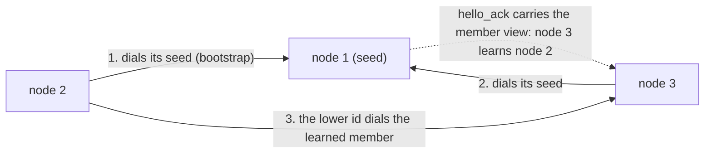
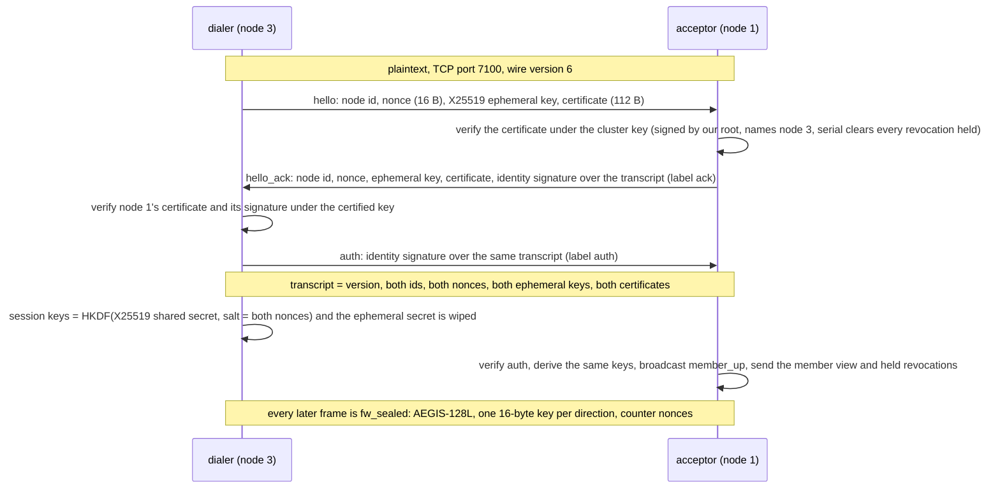
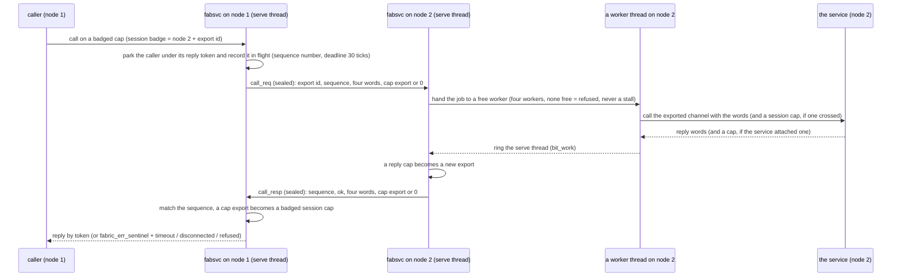

# The fabric

## In one breath

Several moss machines can pool themselves into one *fabric*. Each machine
is a **node** with its own cryptographic identity, certified by one root
of trust for the whole cluster. A node joins by dialing any member it
knows; the rest of the mesh learns of it by gossip, and every member
keeps its own opinion of who is alive from the heartbeats it hears —
there is no shared clock and no leader. Across the fabric, a channel to
a service on another machine is just a slower channel: the same typed
messages, the same capabilities, so a service never knows whether its
caller is local. A program can be started on the least-loaded member
with one request. A node that misbehaves is not a reason to re-key the
cluster; its identity is revoked and the revocation gossips through the
mesh, and it can only return with a fresh identity the root has signed.

## How it works

### Nodes, identities, and the root of trust

A node has a small integer id, `N`, and a fixed address, `10.77.0.N`
(and `fdcc::N`). Its fabric service listens on TCP port 7100. It holds
an Ed25519 **identity** keypair and a **certificate** the cluster's
root of trust signed over {node id, identity public key, authorization
flags, image mask, serial}. The root's public key — the *cluster key* —
is configured on every node and is public material; there is no shared
secret anywhere in the fabric.

The root's private key lives only in **fabroot**, a separate service
with one job: sign things. It certifies identity *public* keys handed
to it and signs revocations; it never sees a node's identity seed, and
the fabric service never sees the root key. Init is the courier between
the two at boot.



### Joining: a signed handshake, then a sealed link

Joining is a signed ephemeral Diffie-Hellman exchange. The dialer's
`hello` carries its node id, a fresh nonce, a fresh X25519 ephemeral
key, and its certificate. The acceptor checks the certificate *before
anything else changes* — signed by our root, naming the id it claims,
serial clearing every revocation we hold — so a stranger claiming a
live peer's id cannot evict it. The acceptor answers with its own
nonce, ephemeral key and certificate plus a signature by its identity
key over the whole transcript; the dialer verifies and proves itself
the same way with `auth`. Session keys come from the Diffie-Hellman
secret, so identity keys only ever sign: a stolen identity key cannot
decrypt a past session. From then on every frame travels sealed.



### Membership without a clock

Every node keeps a **member table**: for each node it has heard of,
whether it believes it up, its advertised free memory, and the local
tick at which it last heard from it. Three things feed the table:

- The acceptor's reply to a join carries its whole member view — gossip
  at join — and `member_up` / `member_down` frames broadcast every
  change. Gossip is believed only from a peer whose certificate carries
  the *gossip* flag; a peer's own liveness and load are always taken,
  since it speaks for itself.
- Heartbeats: every 5 ticks a node pings each authenticated peer with
  its free memory. Every frame heard refreshes the sender's timestamp.
- Silence: a peer not heard from for 40 ticks (4 s) is declared down, as
  is one whose socket errors or to whom a frame cannot be sent. The
  news is broadcast at once.

All counting is on the node's own tick, which is the kernel's 100 ms
timer delivered as a notification. The mesh converges without
coordination by one rule: **the lower node id dials a learned member it
has no connection to**, one attempt per tick. A fresh, authenticated
`hello` from a node already tracked replaces the stale entry — that is
the whole rejoin path.

```mermaid
stateDiagram-v2
  [*] --> handshaking: accepted on port 7100, or dialed (lower id dials a learned member; a joiner dials its seed)
  handshaking --> up: certificate and transcript signature verified, session keys derived
  handshaking --> [*]: certificate refused (wrong root, wrong id, revoked), bad signature, or silent for 40 ticks
  up --> down: silent for 40 ticks, a send fails, the socket errors, or plaintext outside the handshake
  up --> down: a root-signed revocation below its serial arrives
  down --> [*]: member_down broadcast; every exchange in flight fails with disconnected
  up --> up: a fresh authenticated hello from the same node replaces this entry (rejoin)
```



### A channel across the network is a slower channel

The fabric service serves one channel. A call on it with badge 0 is a
control request (join, spawn, list members). A call on a **badged** cap
is a *remote channel*: the badge names a **session** — (node, export
id) — and the four message words forward verbatim as a `call_req`
frame. On the far side an **export** is a local channel the fabric has
made reachable under a small id: a remotely spawned child's serving
channel, or any channel cap that crossed the wire attached to a call or
a reply. A worker there calls the exported channel with the words; the
reply comes back as `call_resp`, matched by sequence number, and the
caller — parked in the kernel under its reply token all this time — is
answered. Services on either end run unmodified: the drill's remote
echo server is an ordinary `CalcRequest` server.



Capabilities cross in both directions: a channel cap attached to a call
becomes an export on the caller's node and a session on the callee's,
so the callee holds an ordinary channel cap that calls *back* through
the reverse proxy — the drill hands a local service to a remote child,
which calls it and returns the sum. Shared-memory caps do not cross,
by design: there is no cross-machine shared memory. What crosses
instead is their *contents* — see the bulk transport below.

### The bulk transport: a buffer's contents cross, the buffer does not

Most of moss's protocols move bytes through a buffer the client
attaches to the channel (the filesystem view's paths and data, a
script's input and value). Since wire version 6 such a buffer works
across the fabric: a shared-memory cap attached to a badged call does
not cross, but the fabric maps it as the **session's buffer**, tells
the peer how many pages (`call_req` carries `buf_pages`), and the peer
makes a **twin** — its own pages, attached to the exported channel with
the caller's very words, so the service sees an ordinary `attach_buf`.
From then on the two are kept alike by *diffing*: before every
forwarded call the caller's fabric ships what changed in its buffer
since the last exchange (`fw_bulk` frames, before the `call_req`), and
after the service answers the callee's fabric ships what the service
changed in the twin (`fw_bulk_resp` frames, before the `call_resp`).
Each side keeps a **shadow** of what the other holds — pages made when
the buffer is attached and freed with it — so a call costs the bytes
that actually moved, not the buffer. Runs of changed bytes closer than
16 apart are shipped as one; a frame carries up to 4000 bytes; a
buffer is at most 8 pages (32 KB), a view's size.

```mermaid
sequenceDiagram
  participant C as caller (node 2)
  participant L as fabsvc node 2
  participant R as fabsvc node 1
  participant S as the service (node 1)
  C->>L: call with a shm cap attached (attach_buf)
  L->>L: map it: the session's buffer; a shadow of its size
  L->>R: call_req … buf_pages = 8
  R->>R: create the twin (8 pages) and a shadow
  R->>S: attach_buf with the twin's cap
  S-->>R: ok
  R-->>L: call_resp
  L-->>C: ok
  C->>C: writes a script and its input into the buffer
  C->>L: call run{…}
  L->>R: fw_bulk (the bytes that differ from the shadow) …
  L->>R: call_req run{…}
  R->>R: apply the runs to the twin and the shadow
  R->>S: run{…} — the service reads the twin
  S-->>R: value{len} — written into the twin
  R->>L: fw_bulk_resp (what the service changed) …
  R->>L: call_resp
  L->>L: apply to the caller's buffer and the shadow
  L-->>C: value{len} — the caller reads its own buffer
```

A remote channel's death crosses too: when the holder of a session dies
(`client_dead`), its fabric unmaps the buffer and sends `fw_release`,
and the peer drops the export behind it — the channel cap, the twin,
and, for a remotely spawned child, its control cap, so the child is
torn down and its memory returned. A published service's export is
never released this way.

### Remote stages: a function's body on another node

The language reaches the fabric through one command: `x | remote NODE
{ … }` runs the block on that node with `$in` bound to `x` and gives
the block's last value back — a **remote pipeline stage**. The host
asks the fabric to spawn `mshrun` there in its remote-stage role,
attaches a buffer to the channel it gets back (which the bulk transport
proxies), writes the function's source and the input as a data literal
into it, asks for `run`, and reads the value back as a data literal.
The stage sees `$in` and nothing else of the caller — no captures, no
files, no network, no caps beyond a log: pure computation placed
elsewhere — answers once, and exits; the caller's session cap drops,
the release crosses, and the child's export and budget are freed.
Every outcome the fabric decides is a result (`err "no such member"`,
`err "denied: …"`), and a stage that fails is `err` with its message.
The fabric-login drill's node 2 runs `scripts/fab-drill.msh` at boot:
a list to node 1 and back (`map`, `reduce`), a table to node 1 and
back as a table (`where`, `select`), and a stage that fails.

Many exchanges are in flight per link at once; the kernel's deferred
replies let the fabric park each caller under a token and carry on. A
peer's death fails every exchange to it with `disconnected`; an
exchange older than 30 ticks fails with `timeout` and drops the peer.
Failures come back through the same channel as a reply whose first
word is the error sentinel and whose second is the error code.

Why threads: the first fabric served inbound calls inline, and the
moment a capability crossed the wire, the remote callee called back
through the fabric that was blocked calling it — a deadlock. Inbound
calls now run on a pool of four worker threads; the serve thread alone
touches peers and the wire, and a worker rings it when a result is in.

### Placement and remote spawn

`remote_spawn{node, image, arg}` ships an image id and an argument to a
peer, which loads the image from its own boot archive, spawns it under
a fixed budget, and proxies the child's channel back as an export; the
requester receives a badged session cap and the node it landed on.
`node = 0` means *place it*: the least-loaded live member by advertised
free memory, never the requester itself. The peer honors the request
only if the requester's certificate carries the *spawn* flag and the
bit for that image in its image mask; otherwise the answer is a typed
`denied`, not a timeout.

### Published services

A remote channel used to arise only from a remote spawn. `publish
{service}` with a channel cap attached offers that channel to the pool
under a `ServiceId` (the cap becomes an export, remembered under the
id; only a local holder of the fabric channel may publish — a request
from the wire arrives badged and is forwarded, never interpreted).
`lookup{node, service}` on any member sends `lookup_req` to that node,
which answers with the export id behind the service, or nothing; the
requester binds a session badge to it and hands back an ordinary
channel cap — the same shape as a remote spawn's answer. Looking up a
service on one's own node answers with a copy of the export itself.
Any certified member may look a service up: the service is the
authority boundary, and it sees the caller by badge. The fabric drill
has node 1 publish its calc service and node 3 — which holds no spawn
authority at all — reach it and get 42 back; the session manager uses
the same path to fetch a user's record from the node that has it
(see [Users and sessions](users.md)).

### Revocation, not rekeying

A revocation is a root-signed record {node, minimum serial}. Wherever it
lands it is verified under the cluster key, applied (a live peer whose
certificate serial is below the bar is dropped and gossiped down),
kept, and gossiped once to every peer — a record already held is not
re-broadcast, which bounds the flood — and enforced at every later
handshake. Both sides of a join hand the newcomer every record they
hold, so a node that was down while one circulated learns it before it
can be fooled. A revoked node returns only with a fresh identity and a
certificate at a serial that clears the bar.

### Identity across boots

Under the system boot, init looks for `state/fabric/identity.seed`
through the root-of-trust view. Absent, a seed is born from the kernel
entropy pool and written there, fabroot certifies the public key, and
the certificate is kept beside it as `identity.cert`; present, both are
restored and fabroot is not consulted at all. The fabric keeps the
revocations it accepts in `state/fabric/revocations` (a file of
records, rewritten whole) and reloads them at boot. Re-enrolling a
node is deleting its state.

### From the shell

`nodes` lists the member table (node, up, free MB) as a table. `rspawn
NODE IMAGE` asks for a remote spawn and reports where it landed.
`x | remote NODE { … }` runs a block there (above); `mshrun` offers the
same when its unit gives it a `fabric` cap.

### The evidence: the fabric drill

The check boots three nodes in three QEMU instances on one virtual
segment (node 1 hosts a hub with socket listeners; multicast does not
cross processes on this host), plus an imposter, and proves from the
nodes' own logs, in order: nodes 2 and 3 join through seed 1 and node 3
learns node 2 by gossip alone (it joins late on purpose); a placement
spawn lands on a live member and answers an RPC; a local service's
channel crosses the wire to the remote child, which calls back and
returns 1+2=3; three callers hammer one link at once and more than one
exchange is in flight; node 2 powers off mid-life and its death is
detected by heartbeats alone, with no call in flight; the runner
relaunches node 2 and it rejoins, then hosts work again; the imposter,
whose certificate comes from a different root, is refused at the
handshake; node 3's certificate has no spawn authority and its spawn is
refused on certificate grounds; node 1 revokes node 3, node 2 learns it
by gossip and cuts its own link, and node 3's every rejoin attempt is
refused.

## In detail

- **Wire.** Frames are `[len u16][type u8][ver u8][payload]`,
  little-endian; version 6. A version-mismatched peer is dropped
  loudly. Frame types: hello, hello_ack, spawn_req, spawn_ack, call_req
  (`[export u32][seq u32][4 × u64][cap export u32][buf_pages u16]`),
  call_resp, ping, pong, member_up, member_down, auth, sealed, members,
  revoke, lookup_req, lookup_ack, bulk (`[export u32][off u32][len
  u16][bytes]`), bulk_resp (`[seq u32][off u32][len u16][bytes]`),
  release (`[export u32]`). After the handshake only `sealed` frames are
  accepted from a peer; plaintext outside the handshake, or a handshake
  replay after authentication, drops the peer. A frame is at most 4096
  bytes sealed (the network view's one-page send buffer); the per-peer
  receive buffer is 8 KB.
- **Peer loss is named.** Every `peer lost` line says why: silent,
  socket error, send failed, send retries exhausted, ping failed, call
  timed out, frame buffer overrun, malformed frame, wire version
  mismatch, sealed frame failed authentication, inner frame mismatch,
  plaintext outside the handshake, sealed frame before the handshake,
  certificate refused, node id mismatch, key derivation failed, revoked.
- **Handshake sizes.** Nonces 16 bytes and ephemeral keys 32 bytes, both
  from `getrandom` (the network is refused with `no_entropy` while the
  kernel pool is unseeded). Certificate 112 bytes: a 48-byte body
  {version, node id, flags, image mask, serial, public key} plus a
  64-byte Ed25519 signature. Revocation 72 bytes: an 8-byte body plus
  the signature. Signatures are domain-separated by label (certificate,
  revocation, ack, auth) so no artifact can be replayed as another. The
  transcript is version, dialer id, acceptor id, dialer nonce, acceptor
  nonce, dialer ephemeral, acceptor ephemeral, dialer certificate,
  acceptor certificate — dialer-first on both sides.
- **Session keys.** HKDF-extract over the X25519 shared secret with
  salt = dialer nonce ‖ acceptor nonce; two 16-byte expansions,
  `moss-fabric-d2a` and `moss-fabric-a2d`, one per direction. Sealing is
  AEGIS-128L with a counter nonce per direction; a counter burned on a
  ping that could not be sent is rolled back so the streams never
  desync. The ephemeral secret is wiped once the keys exist.
- **Tables.** 6 peers (connections), 8 members, 8 sessions, 8 exports,
  8 exchanges in flight (the kernel's pending-reply slots per channel),
  4 workers with 16 KB stacks, 8 held revocations. A session or export
  with a buffer holds 8 pages of it and 8 of shadow, as shared memory,
  while the buffer is attached.
- **Budget.** Memory accounts nest, so the children a fabric service
  spawns for its peers are paid from its own budget: the unit gives it
  4 MB of kernel objects and 16 MB of user memory, and the drill's
  kernel driver the same; a remotely spawned child gets 1 MB and 4 MB
  of that. Sessions are keyed
  by node id, never by peer slot, so a slot recycled by a rejoin cannot
  misroute a stale remote channel — calls to a rebooted node fail
  cleanly instead.
- **Clocks.** One timer notification per kernel tick (100 ms).
  Heartbeat every 5 ticks; dead after 40 silent ticks (a stranger that
  never completes a handshake is reaped on the same deadline); a
  forwarded call times out after 30 ticks. Nothing pumps the fabric:
  socket doorbells (`NetReq.watch`) and the timer share one bound
  notification that interrupts its `recv`.
- **Control protocol** (badge 0): `identity_key` (hand the public key
  back for certification), `set_cert` (verified under the cluster key
  and checked to name this node and this key — a mis-issued certificate
  fails here, and accepting it opens the network), `connect_peer`,
  `remote_spawn`, `attach_buf`, `revoke`, `members` (8-byte records
  {node, up, self, free MB}), `stats` (the most exchanges ever in
  flight), `publish{service}` (+ a channel cap; 8 service slots) and
  `lookup{node, service}` (answers `found{node}` + a channel cap).
  Wire frames `lookup_req` [service u16][req u32] and `lookup_ack`
  [req u32][export u32][code u8]; wire version 6 (v5 added them).
  Errors: `no_peer`, `timeout`, `disconnected`, `refused`, `no_space`,
  `no_identity`, `no_entropy`, `denied`.
- **Remote spawn.** Request `[image u16][arg u64][req u32]`; the child
  gets a log cap and the serving side of a fresh channel, 1 MB of
  kernel-object budget and 4 MB of user memory; the ack carries the
  export id and a code: spawned, unauthorized, or failed (a failed
  spawn's cause is on the spawning node's kernel log: `spawn by fabsvc
  refused: QuotaExceeded`). Image ids are the shared catalog's
  numbering (a 64-bit mask, so ids below 64). The export keeps the
  child's control cap and drops it on release.
- **Remote stage protocol** (`RunReq`/`RunResp`, served by `mshrun`
  with arg 1): `attach_buf` (+ shm cap), `run{script_len, input_len}`
  with the script at `buf[0..]` and the input's data literal after it;
  `value{len}` or `failed{len}` with the text at `buf[0..len]`. One
  `run`, then the stage exits.
- **Authorization flags.** `gossip` (1): membership news is believed.
  `spawn` (2): may request spawns, per the image mask. The check
  certifies node 1 with both and every image; node 3 without spawn.
- **Fail-closed order.** Identity staged (secret over the boot channel:
  seed 32 ‖ cluster key 32, wiped after use) → public key certified →
  certificate installed → network opened. Missing any step, the fabric
  refuses to listen or dial.

## Known limits and bugs

- Addressing is static: node `N` is `10.77.0.N`; dynamic addressing is a
  separate concern not yet built.
- Shared-memory caps do not cross nodes (by design); their contents do,
  through the bulk transport, for buffers of up to 8 pages attached to
  a badged call. Notifications do not cross yet. A fabric login still
  copies the user's record rather than mounting a remote home: the
  transport is there, the session manager does not use it yet.
- A session has one buffer; a protocol that attaches more than one
  (the block service's windows) is not proxied. Every forwarded call
  ships the bytes that changed — a protocol that rewrites its whole
  buffer every call pays for the whole buffer every call.
- A remote stage is pure: it sees `$in` and nothing else — no captured
  locals, no files, no network — and its value must be data (no
  functions, results, handles or bytes). Script plus input, and the
  value, must each fit the 32 KB buffer.
- `publish` and `lookup` have no language surface: a script serves no
  channel, so it has nothing to publish, and a looked-up channel would
  be untyped in its hands.
- A `lookup` is one exchange in flight per node at a time (the same
  shape as a remote spawn), and a published service is unpublished only
  by its node's restart.
- Certificates carry no expiry: with no shared clock, revocation serials
  are the only clock. Revocations live in each node's state and in
  memory; a whole cluster restarted from blank state forgets them until
  the root re-issues.
- The multi-node drill's nodes have no disk: their identity seeds are
  composed by the kernel test driver each boot from fixed test
  material, and the root seed in the archive is a fixed constant — test
  artifacts. Under the system boot the identity is born on the node and
  persisted; the root seed is still test material.
- One outstanding remote spawn at a time per node (the spawn
  acknowledgement is a single slot); calls pipeline, spawns do not.
- A remote-spawned child's budget is fixed; the request carries no
  manifest beyond image and argument.
- The tables are small and static (6 peers, 8 members); a fabric larger
  than that is not representable.
- ML-DSA is a drop-in for the signatures if post-quantum ever matters;
  nothing does that today.

## Dig deeper

- DESIGN.md — "Distribution: the fabric" (as built, security v4, the
  promise kept, identity across boots, lessons paid for).
- ROADMAP.md — Phase 11 and the Phase 12 entries "Dynamic fabric
  membership", "Fabric security v1/v2", "The fabric's promise kept",
  "Identities persist".
- HACKING.md — the cluster boot (`run-cluster`), pcap capture per NIC,
  and the service conventions (badges, bound notifications).
- Source — `user/fabric.zig` (the service, handshake, gossip, proxying,
  workers, the bulk transport: `shipDiff`, `fw_bulk`, `fw_release`),
  `user/fabcmds.zig` (`remote`), `user/mshrun.zig` (`serveRemote`),
  `boot/scripts/fab-drill.msh` and `boot/conf/units/fab-script.msh`, `lib/fabcert.zig` (certificates and revocations, host-tested),
  `shared/lib.zig` (FabReq/FabResp, RootReq, frame types),
  `boot/conf/units/fabsvc.msh` and `fabroot.msh`, `kernel/main.zig`
  (`fabricTestWorker`), `tools/runner.zig` (`runCluster`).
