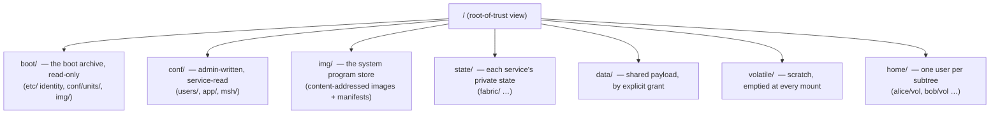
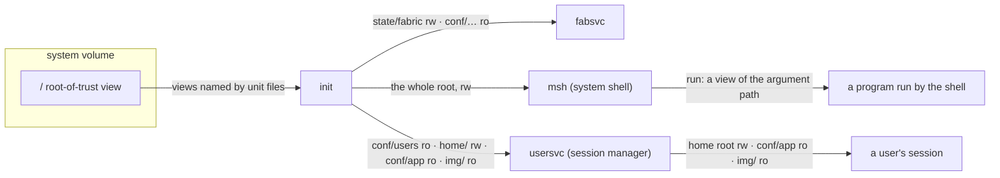
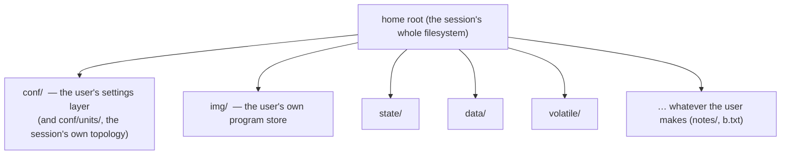
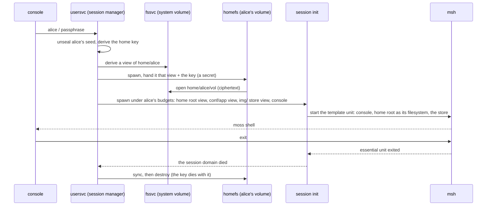
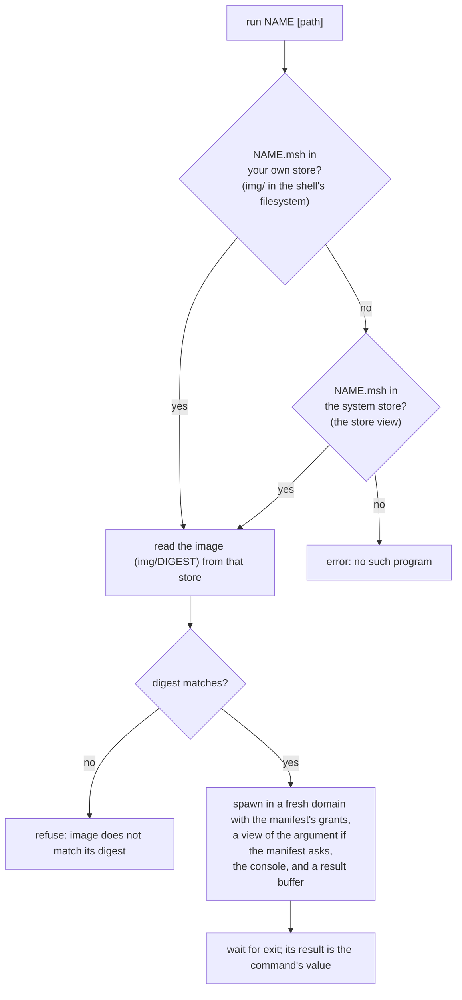

# Filesystems and views

## In one breath

moss has no single filesystem that everything can see. Every program is
handed one or more **views** — a view is a capability whose root is some
directory, and the program can name nothing outside it. There is no `..`
that climbs out; the parent simply has no name. The system's disk is laid
out by *who owns a thing and how long it lives*, not by file type. A
user's home is a separate encrypted disk of its own, kept as one file on
the system disk, and a logged-in session sees that home as its entire
world. Programs are files too: they live in a **store**, each one beside
a small manifest that says what it is allowed to touch when it runs.

## How it works

### The system volume

The filesystem service (`fssvc`) serves one namespace. `boot/` is the
boot archive — an immutable bundle of programs and configuration the
kernel was built with — and everything else is a mossfs volume on the
disk. The top-level directories are *tiers*, fixed at format time and
never created or removed through the protocol:



| Tier | Lifecycle | Who writes | Who reads |
|---|---|---|---|
| `boot/` | immutable, from the boot archive | nobody (built in) | init, and whoever is granted it |
| `conf/` | survives reboot | the admin, and `apply` from `conf/system.msh` | the service the file is for |
| `img/` | immutable content, survives reboot | init at boot (the installer) | shells, to run programs |
| `state/` | survives reboot | the owning service | the owning service |
| `data/` | survives reboot | granted case by case | granted case by case |
| `volatile/` | cleared at every mount | the owning service | the owning service |
| `home/` | survives reboot | the session manager and each user's own session | the user's session only |

### What a view is

A view is a badged channel capability into the filesystem service. The
badge selects, server-side, a *root directory* and a *read-only* flag;
the holder cannot change either. Paths resolve strictly downward from
that root: `.` and `..` are rejected, absolute paths do not exist, and a
symlink resolves relative to its own directory under the same rules, so
a link cannot point out of the view either. A view can **derive** a
narrower view — a subdirectory, or the same root read-only — and
privilege only ever shrinks: deriving read-write from a read-only view
yields a read-only one. A view can also be **revoked** by the view that
derived it (or by the root): from then on every call through it fails,
whoever holds a copy, and the service reuses the slot only once the
last copy has died.

The hierarchy is therefore also the default *capability topology*. Init
hands each service the views its unit file names, and by convention a
service called X gets `state/X` and `volatile/X` read-write and `conf/X`
read-only, each as its own view. Services cannot see each other's state
not because a rule forbids it, but because no name for it exists in
their domain.



### A user's home is a volume of its own

`home/alice/vol` is one file on the system volume. Inside it is a
complete, separately encrypted mossfs volume, keyed from alice's
identity: the key is derived from the seed her passphrase unseals at
login, so the same identity always opens the same volume and nothing
else can. The system volume only ever holds the ciphertext of that
file.

At login the session manager spawns a *home filesystem service* for the
session — the same filesystem program, serving the volume file through
a view of `home/alice` — and hands the session a view of that service's
root. When the session ends the service is destroyed with it, after a
final sync. The home has its own tiers, at the user's radius:



A session is an init instance running under the user's budgets. Its
units come from `conf/units/` in the home, or, when there are none, the
archive's session template: msh on the session's console with the home
as its entire filesystem. Settings a program reads are two layers
merged: the system layer in `conf/app/<program>.msh` (read-only to the
session) and the user layer in the home's `conf/<program>.msh`; a key
the system layer marks *locked* cannot be overridden.



### Programs are files in a store

A store is a directory laid out like `img/`: each program is a file
named by the hex of the first sixteen bytes of its SHA-256 (32
characters — the name *is* the content), and beside it a manifest
`img/<name>.msh`, an mshl record:

```
{ image: "3f1c…", grant: [log, introspect] }
{ image: "a90e…", grant: [log], give: [ { tag: view, fs: arg, ro: true } ] }
```

`image` is the digest; `grant` lists kernel authorities the program is
handed (`introspect` lets `ps` read the domain ledger without spawn
authority; `bootfs` the boot archive); `give` lists views, where the
path `arg` means "the argument the user typed"; `arg` is the role the
image is started with. A unit file that says `run: true` gets a
manifest under the unit's name too (`apply` is the users image's role
2 that way). The `mshrun` manifest gives a script the shell's whole
filesystem (`fs: ""`), so `run mshrun PATH` runs the script at PATH
with the authority of the shell over files, and nothing else. Init installs the system store at boot from
the boot archive, writing each image once (present ones are skipped)
and a manifest built from the program's unit file, when it has one.

A shell consults two stores in order:



In the system shell both stores are the system volume's `img/`. In a
session the shell's own store is the home's `img/` (empty until the
user fills it) and the system store arrives as a separate read-only
capability from the session manager. `install NAME` copies a program —
image and manifest, verified against the digest — from the system store
into the user's own, after which `run NAME` finds the user's copy first.

## In detail

- **Tiers.** The system volume is formatted with `conf`, `img`, `state`,
  `data`, `volatile`, `home`; a home volume with the same minus `home`.
  A volume formatted under an older hierarchy gains missing tiers at
  mount. Top-level creation and deletion through the protocol are
  refused on the system volume; a home volume's root is the user's to
  shape.
- **The archive.** `boot/` is a read-only MARC archive granted to init at
  spawn: `boot/etc/` (identity, motd), `boot/conf/units/*.msh` (unit
  files), `boot/conf/session/` (the session template), `boot/img/`
  (every program image), and test key material. A write under `boot/`
  is refused.
- **Views.** One channel serves every view; the badge is the view's slot
  in the service (32 views per service today). Each view carries its
  own shared buffer for paths and data (8 pages; one read or write moves
  up to 32 KB). Up to 8 open files per view. When the last capability
  carrying a view's badge dies the service is told (`client_dead`),
  unmaps the buffer and frees the slot.
- **Path rules.** Components are matched exactly; `.` and `..` are
  rejected as `bad_path`; at most 8 symlinks are followed per
  resolution; `stat`, `delete` and `readlink` do not follow a final
  symlink. Rename is atomic within one view and refused across parent
  directories.
- **Home volumes.** `home/<user>/vol` is served by fs role 4 over a
  file-backed block device (reads past the end are zeros, so a fresh
  file is a blank disk that formats itself). The key is
  `HKDF(identity seed)`; the service receives it as a secret over its
  boot channel and never writes it anywhere. The volume reports a
  capacity of 8 MB; the file grows on demand within the system volume.
- **Encryption.** Both volumes are mossfs v3/v4: per-block LZ4 where it
  saves space, AES-256-XTS over object data, indirect blocks and the
  object map, keyed MACs as block checksums; allocation metadata stays
  in plaintext so mounting is keyless. Durability is by transaction
  group; `sync` is a barrier; logout syncs before the home service goes.
- **Stores.** Digest names are 32 hex characters (SHA-256 truncated to
  16 bytes). The manifest record's `image` must be exactly that; `grant`
  may contain `introspect`; `give` entries with `fs: arg` derive a view
  of the run argument from the shell's own filesystem, `ro` defaulting
  to true. A program is staged into a 512 KB buffer, verified, and
  spawned with a 512 KB kernel-object and 2 MB user-memory budget. The
  run argument is 24 bytes of text.
- **Settings.** `lib/settings.zig` merges the system layer
  (`conf/app/<name>.msh`, handed to a session as the `conf` view) under
  the user layer (`conf/<name>.msh` in the home); keys the schema marks
  locked take the system value regardless.

## Known limits and bugs

- A home volume's 8 MB capacity is reported, not enforced.
- Sharing between users is per session and in memory: a view of one
  home reaches another user's shell through the session manager
  (`share`, `accept`, `@name/…`, `unshare` — see docs/users.md) and is
  revoked at the source; nothing about an offer survives the owner's
  logout.
- A user's own store is filled only by `install` from the system store;
  there is no other source of programs (no download, no build).
- Hard links are deferred until the view-exclusivity design answers how
  one file may appear under two views. Cross-parent rename is refused.
- A directory holds at most 512 hash buckets (about 32 K entries).
- `save` writes rendered text; use `to-data` for a data file.
- The run argument is 24 bytes; longer paths cannot be passed to a
  program.
- Rollback of up to eight transaction groups by superblock-slot zeroing
  is possible for someone with the disk (no external anti-rollback
  state); MAC tags are 64-bit by format.

## Dig deeper

- DESIGN.md — "Filesystems and namespaces" (the system namespace, mossfs
  v2/v3, hashed directories), "Users and sessions" (home volumes as
  built, console login), "Developer tooling" (msh and `run`).
- HACKING.md — adding a unit file, `give` lines, and the sharp-edge list.
- Source — `user/fs.zig` (the service, tiers, views, home volumes),
  `user/mossfs.zig` (the on-disk format), `user/init.zig` (unit files,
  the store installer), `user/shell.zig` (`run`, `install`),
  `user/users.zig` (login, home volumes, sessions), `lib/settings.zig`.
