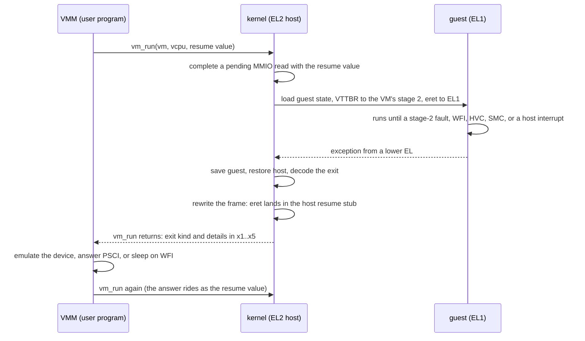
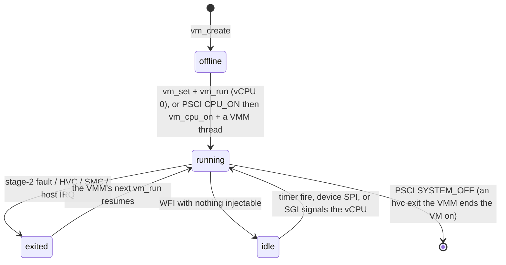
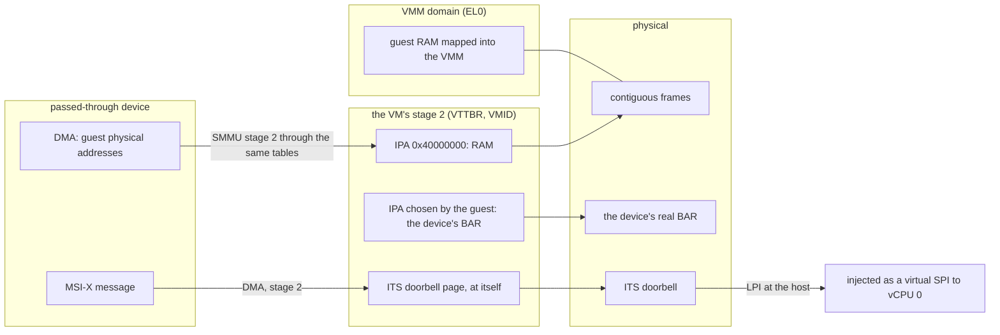
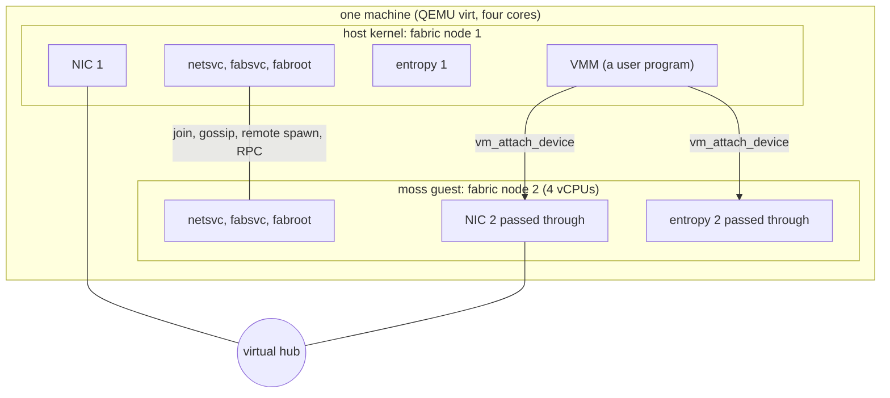

# The hypervisor

## In one breath

moss can run another operating system inside itself — including another
copy of moss — and the program that owns that guest is an ordinary
sandboxed process called a **VMM**, not a piece of the kernel. The
kernel does one small thing: it lets a guest run at a lower privilege
level in a memory world of its own, and every time the guest touches
something it does not have, the kernel stops it and hands the event to
the VMM as the answer to a system call. The VMM decides what a device,
a firmware call, or a second processor means. With a real device handed
through and an IOMMU keeping its DMA inside the guest's memory, a guest
becomes a full member of the machine pool: one box, two nodes.

This page describes the aarch64 hypervisor (the EL2 host, the vGIC).
The x86_64 port has the same design on AMD-V — nested paging as the
guest's world, the guest's local APIC emulated in the kernel through
its x2APIC registers where aarch64 has the vGIC, port I/O and
hypercalls as exits beside MMIO, the VMM speaking the Limine protocol
to a moss guest where it hands the aarch64 one a devicetree — and runs
the bare-metal guest, the moss guest and the two-node vmnode drill with
devices passed through (DESIGN.md, "The x86_64 port, stage 6a" and
"6b").

## How it works

### The kernel boots as a host

On QEMU with `virtualization=on` the kernel is entered at EL2 and makes
the core a **VHE host** (`HCR_EL2.E2H|TGE|RW`). Under E2H every
EL1-named register the kernel already writes reaches its EL2
counterpart, user programs trap straight to EL2, and nothing else in the
kernel changes. Two things are decided at run time: the PSCI conduit
(HVC when running at EL1, SMC as the host) and the tick's interrupt line
(PPI 30 at EL1, PPI 26 for the hypervisor physical timer at EL2). The
whole test gate runs this way under TCG with `-cpu cortex-a76`, a model
that has VHE.

### A VM is a capability

A program with the **hypervisor** capability (the VMM) creates a VM with
`vm_create`, which allocates the guest's RAM as contiguous frames
charged to the VMM's own memory budget, builds a stage-2 page table for
it (charged to the VMM's kernel-object budget), maps the RAM at guest
address `0x40000000`, and maps the same frames into the VMM so it can
load an image. `vm_set` names the first vCPU's entry point and `x0`.
`vm_run` runs a vCPU until the guest does something the hypervisor does
not handle, and returns that **exit** to the VMM. The VM is a
capability; dropping the last copy, or teardown, returns RAM and tables.

Everything the guest cannot do arrives at the kernel's ordinary
exception vectors as an exception from a lower level. The trap handler
sees the core is in a guest, saves the guest, restores the host, decides
the exit, and **rewrites the exception frame** so the trap's own return
lands in a host resume stub rather than back in the guest — which
returns from the VMM's `vm_run` syscall with the exit in registers.

The exits `vm_run` reports:

| Exit | Meaning | What the VMM does |
|---|---|---|
| `mmio_read` / `mmio_write` | a stage-2 fault with a decodable syndrome: address, size, register or value | emulates the register; a read's value comes back as the next `vm_run`'s resume value |
| `wfi` | the guest idled — but only when nothing is injectable (see the timer); otherwise the kernel waits inside `vm_run` | sleeps a tick and runs again |
| `hvc`, `smc` | a hypercall or a trapped SMC with the guest's `x0..x3` | answers it (PSCI); the answer becomes the guest's `x0` through the resume value |
| `interrupted` | a host interrupt was taken on the VMM thread's stack and handled | runs again |
| `fault` | something the hypervisor does not handle, with the guest's own ELR and ESR | kills the VM |

### The guest's time and interrupts

The guest keeps the **virtual timer** (offset zero) and the GICv3
system-register CPU interface, virtual under `HCR.IMO`. The timer's
interrupt (PPI 27) fires physically at the host, which masks it with
IMASK so the line drops, notes the vCPU has a timer pending, and at the
next entry puts a pending virtual PPI 27 into a free **list register**
(the vCPU has four). The host lifts the mask once the guest has moved
its compare value, at exit and on the core the timer lives on. No
distributor is emulated for this: list-register injection needs none.
A vCPU that executes WFI with nothing injectable sleeps inside the
kernel on the VM's notification until a timer fire, a device interrupt,
or another vCPU's SGI signals it; the VMM sees `wfi` only when the wait
is not worth it.

### Several vCPUs

A VM has up to **four** vCPUs, each with its own registers, EL1 state,
vGIC state, pending bits, notification, and vector registers; `vm_run`
names the vCPU, and vCPU 0 runs first. A guest brings another core up
with PSCI `CPU_ON`, which reaches the VMM as an `hvc` exit; the VMM asks
the kernel to reset that vCPU at the requested entry with a context in
`x0` (`vm_cpu_on`), answers SUCCESS, and starts a thread of its own that
runs `vm_run` for the new vCPU. Each vCPU reads its index as MPIDR
affinity 0. A guest's SGI writes trap (the virtual CPU interface cannot
generate them); the hypervisor decodes the target list, pends the SGI on
each targeted vCPU, wakes an idle one, and kicks a running one with a
host SGI.

### The VMM: the guest's whole world is a program

`user/vmm.zig` is handed the hypervisor capability and the boot archive
and knows two guests. The bare-metal one (`img/guest-hello`) gets 8 MB,
one vCPU, and a UART at `0x09000000` whose stores become `guest>` log
lines; it says hello, counts three timer ticks, and asks PSCI to power
off. The moss guest (`img/moss-guest`) gets 128 MB and four vCPUs: the
VMM loads it by the Linux Image protocol at RAM + `0x80000`, writes it a
flattened devicetree in the last 64 KB of RAM (memory, `chosen`
bootargs with the profile, PSCI with `method = "hvc"`), and emulates
what a kernel boot touches — a PL011 at `0x09000000` whose data register
becomes `guest|` log lines, and a GICv3 distributor at `0x08000000` and
one redistributor per vCPU from `0x080a0000` as a plain register file
(writes remembered, reads given back, WAKER reporting the core awake).
PSCI is the VMM's: `VERSION` answers 1.2, `SYSTEM_OFF` and
`SYSTEM_RESET` end the VM, `CPU_ON` starts a vCPU as above, everything
else is NOT_SUPPORTED. The kernel speaks none of it.

### Device passthrough

For a pool node the VMM is also handed real devices over its boot
channel and presents them to the guest on an emulated PCIe bus: ECAM at
`0x3f000000`, a 32-bit MMIO window, INTx starting at SPI 3. Config
space reads come from the real device's config page; only the virtio
BAR exists, sized from the real one and placed by the guest. When the
guest writes the BAR's address the VMM calls `vm_attach_device`, and
the kernel maps the BAR's pages into the guest's stage 2, binds the
device's SMMU stream to **stage-2 translation through the VM's tables**
— the guest's DMA addresses are guest physical addresses, and nothing
outside the guest's memory is reachable — and routes the device's LPI
into the guest as a virtual SPI (a pending bit, the VM's notification,
a kick to the core running vCPU 0, a list register at the next entry).
The guest sees wired INTx; the real device keeps the host's MSI-X, and
its doorbell page is mapped into every VM's stage 2 at itself because
the MSI write is DMA too.

### The pooling story

The moss guest is this very kernel, built to boot the `guest` profile
with its own archive embedded (the same tree minus the guest kernel
itself), packed into the host's archive as `img/moss-guest`. Told
`node=2` and given the machine's second NIC and second entropy device,
it runs the same joiner path a physical node does — entropy driver,
network service in cluster mode, root of trust, fabric service — joins
node 1 as node 2, and a remote spawn placed on it answers an RPC.

### The drills

- `vm`: the VMM runs the bare-metal guest — trapped UART, three
  injected timer ticks, PSCI power-off — and the leak bar holds.
- `guest`: the VMM boots the moss kernel as a guest on four vCPUs from a
  devicetree it wrote, with the PL011 and GIC emulated and PSCI over
  HVC; the guest's userspace runs one program that says hello from EL0,
  and the guest powers off cleanly.
- `vmnode`: node 1 on the first NIC and entropy device, the guest on the
  second of each, the join and a remote spawn on the guest node. The VM
  stays up, so this drill holds no leak bar.

## In detail

- **Host mode.** `HCR_EL2 = E2H|TGE|RW` plus `ICC_SRE_EL2` at boot on
  every core. Entering a guest drops TGE and raises VM, IMO, FMO, AMO,
  DC (memory stays cacheable with the guest's stage 1 off), TWI and
  TSC. The guest's EL1 state is loaded through the `_EL12`/`_EL02`
  register names, spelled by encoding. The host's per-core pointer lives
  in TPIDR_EL2 because TPIDR_EL1 is the one register VHE does not
  redirect and a guest owns it. VMPIDR_EL2 is `0x80000000 | vcpu`.
- **Stage 2.** VTCR: 39-bit IPA (T0SZ 25), three levels from level 1,
  4 KB granule, 40-bit PA. RAM pages are normal write-back, RW, inner
  shareable, executable; device pages are Device-nGnRnE and
  execute-never. Up to 4 VMs, 128 MB of RAM each (32768 pages), up to 4
  passed-through devices per VM. The VMID is the VM's slot plus one;
  the first entry invalidates the VMID's TLB entries.
- **Exits.** A data abort with a decodable syndrome becomes an MMIO
  exit with the IPA from HPFAR and FAR, the size, and the register; a
  write advances the PC at once, a read is completed by the next
  `vm_run`. `WFI`/`WFE` (EC 0x01), `HVC` (0x16), `SMC` (0x17, trapped by
  TSC), and a write to `ICC_SGI1R_EL1` (0x18) are decoded; anything else
  is a `fault` exit carrying the guest's ELR_EL1 and ESR_EL1. A host
  interrupt is handled on the VMM thread's kernel stack before the
  `interrupted` exit is reported.
- **vGIC.** Four list registers per vCPU; group 1, state pending. A
  pending timer, SGI, or SPI takes a free list register at entry, never
  a second one while the guest still holds that interrupt. Device SPIs
  go to vCPU 0, as a moss guest routes them (virtual INTIDs 32..95).
- **Timer.** `CNTVOFF_EL2 = 0`. The fire is handled by masking (IMASK)
  and recording the compare value; the mask is lifted at exit when the
  compare value has moved, and the timekeeper's tick watches every
  descheduled vCPU's deadline, since another vCPU may have taken the
  core whose hardware timer it was loaded into. `CNTHCTL_EL2` sets
  EL1PCTEN so the guest's EL0 can read the physical counter.
- **Passthrough.** `vm_attach_device(vm, device, bar_ipa, vintid)`:
  `bar_ipa` page-aligned, `vintid` in 32..95. The SMMU stream table
  entry is set to stage-2-only translation with the VM's tables and
  VMID, faults recorded; the device's LPI is bound to the VM and
  injected as the virtual SPI. Teardown unbinds the interrupt and
  detaches the stream before tables are freed.
- **The VMM's grants.** Log, its boot channel (side A), the hypervisor
  capability (cap slot 2), the boot archive; for a pool node the second
  entropy device and NIC arrive over the boot channel. Budgets: 8 MB of
  kernel objects, 192 MB of user memory (the guest's RAM is charged
  there).
- **The guest kernel.** Built by `build.zig` from the same sources with
  `guest_kernel` set, its archive packed without `img/moss-guest`; its
  `guest` profile runs one unit (`guest-hello`: the `services` image,
  arg 5, essential), and it powers off through PSCI when that exits.
  The devicetree the VMM writes carries `memory`, `chosen` (bootargs
  with `profile=guest` and, for a pool node, `node=2`), a PSCI node with
  `method = "hvc"`, and for a pool node a `pci-host-ecam-generic` node
  with one 32-bit memory range and INTx mapping from SPI 3.
- **Counters.** `vm.stat_*` (entries, WFI, waits, timer fires and
  injections, unmasks, SPIs injected and delivered) are printed by the
  drills when a guest never powers off.

## Known limits and bugs

- **TCG only.** Apple's Hypervisor.framework exposes a nested EL2
  without VHE, and a high-half kernel has no TTBR1 there, so `run-hvf`
  boots at EL1 and cannot run guests. Real hardware is the way out.
- The emulated GIC is a register file with no distributor semantics:
  enables, priorities and routing written by the guest are remembered
  and read back, not acted on. Every device SPI goes to vCPU 0.
- A passed-through device must use MSI-X; a device that signals by a
  wired line would need level-triggered emulation the VMM does not have.
- The guest gets exactly what the VMM emulates: a UART data register
  (input is never delivered), and no other device unless passed through.
- A VM has at most four vCPUs and 128 MB; at most four VMs exist at
  once; four passed-through devices per VM.
- The bare-metal guest's UART and the moss guest's PL011 are write-only
  as emulated; a `mmio_read` of the flag register reports "TX not full,
  RX empty" and every other register reads as zero.
- **x86_64 (AMD-V):** a guest's TSC-deadline timer is watched at the
  host's tick, so its period is at best the host's (100 ms). The guest
  has no I/O APIC and no MSI-X for its devices: a passed-through
  device's interrupt (its MSI-X vector on the host) arrives as the
  guest's INTx vector for the slot, one line per device, and the
  guest's line masks are no-ops. The MMIO decoder knows moves,
  extending loads, `test`/`cmp` and ALU read-modify-writes on memory;
  an instruction outside that set is logged with its bytes and the
  guest is stopped with a fault exit.

## Dig deeper

- DESIGN.md — "Virtual machines" (first cut, the moss guest, device
  passthrough and the pool node, several vCPUs, PSCI as the VMM's, and
  six paid-for lessons), "Platform and boot" (the EL2 host), "The SMMU".
- ROADMAP.md — "EL2: Moss as hypervisor", "The pooling story", "Several
  vCPUs", "PSCI is the VMM's".
- Source — `kernel/arch/aarch64/vm.zig` (entry, exits, vGIC, timer, stage 2,
  passthrough), `kernel/syscall.zig` (`vm_create`, `vm_run`, `vm_set`,
  `vm_attach_device`, `vm_cpu_on`), `shared/lib.zig` (`VmExit`,
  `vm_ram_ipa`), `user/vmm.zig` (the monitor: loading, emulation, the
  devicetree, PSCI, the emulated bus), `guest/hello.zig` (the bare-metal
  guest), `kernel/main.zig` (the `vm`, `guest`, `vmnode` drivers),
  `build.zig` (the guest kernel and its archive).
