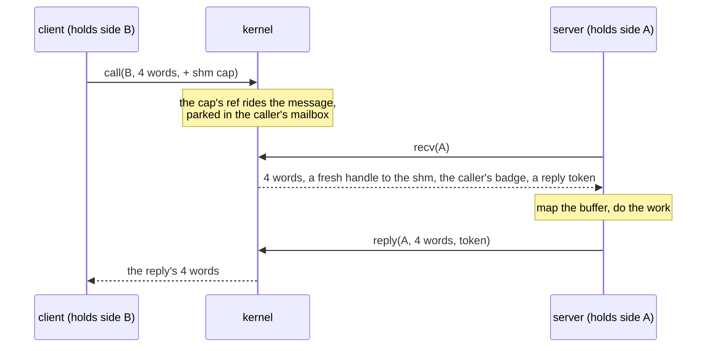
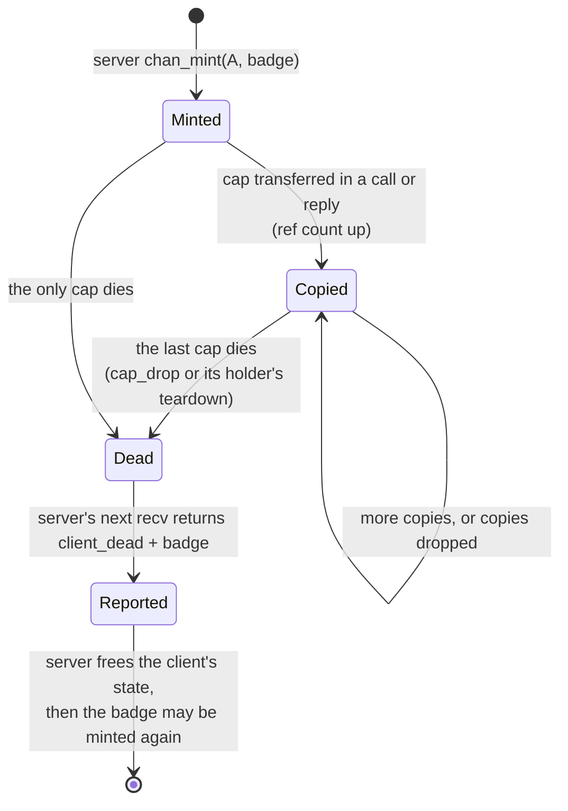
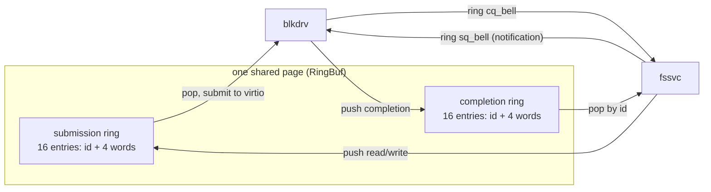
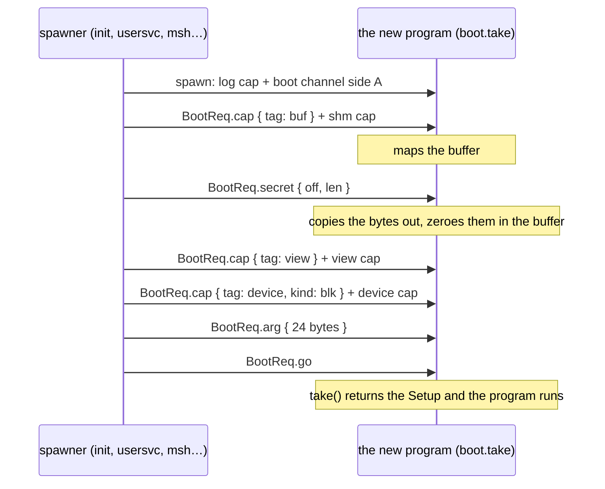

# IPC: channels, notifications, and how services are reached

## In one breath

Programs in moss cannot see each other's memory and cannot name each
other. The only way one program reaches another is a **channel**: a
capability it was handed, over which it sends a small message and waits
for the answer. Every service — the filesystem, the network, the session
manager, a device driver — is just a program at the other end of a
channel. A message is four numbers and, optionally, one capability, so
anything bigger travels through a shared buffer that was itself handed
over as a capability first. When the other end dies, the survivor is
told, every time, with a distinct error; nothing ever hangs on a
corpse. And because every interaction is a channel, any channel can be
quietly replaced by a proxy that filters, records, or forwards it — the
program on the other side cannot tell the difference.

## How it works

### A channel has two sides

A channel is a kernel object with side **A**, which serves, and side
**B**, which calls. A program holding a B cap does `call`: four words
go out, the caller sleeps, and the reply's four words come back. A
program holding the A cap does `recv` to take the next call and `reply`
to answer it. Each message may carry one capability with it; that is how
a client hands a service the buffer it should read from, or how a
service hands back a narrower capability it minted.

Each side is reference-counted by the capabilities that name it. When
the last cap naming a side dies — dropped, or its holder torn down — the
side closes and every operation on the other side, in flight or future,
completes with `peer_dead`. There is no way to be left waiting on a
service that no longer exists.

A server may take a second call before answering the first: `recv`
returns a **reply token** naming the caller, and `reply` can be told
which one to answer. Up to eight callers can be parked this way. A
one-at-a-time server never notices — token 0 means "the oldest".

### Notifications: bits, not messages

A notification is the other kernel object: a word of bits that anyone
holding a cap to it may signal, and that one thread at a time may wait
on. Waiting returns the accumulated bits and clears them. A thread can
also **bind** a notification to itself, so that a signal arriving while
it sits in `recv` interrupts the recv with `interrupted`; the thread
drains the bits and goes back to serving. That one mechanism carries
device interrupts, ring doorbells, socket doorbells, timers (a period and
the bits to signal, from the 100 ms tick) and death watches (the deaths
of domains a program spawned) — one serving thread learns of all of them
without polling.

### Shared buffers carry the bulk

Out-of-line data travels through **shared buffers**: a program creates
one (up to 128 pages), maps it into its own window, and attaches the cap
to a call; the service maps it too. Both mappings hold a reference, so
the frames outlive either side's cap and are freed only when the last
mapping is unmapped or torn down. A filesystem view's path and data
buffer, a console's byte buffer, a program's staged image, a driver's
DMA window — all are shared buffers handed over this way.

### Badges: one channel, many clients

A service serving many clients does not hold a channel per client. It
**mints** copies of its own B side stamped with a *badge* — an integer
of its choosing — and hands those out. Every call on a badged cap
delivers the badge with it, so the service knows which client is
speaking, and the client cannot forge or change it. A filesystem view is
exactly this: a badged cap whose badge selects the root directory and
read-only flag on the service side.

Each badge is a client identity the kernel counts on its own. When the
last cap carrying a badge dies, the service's next `recv` returns
`client_dead` naming that badge, before any caller is served, so the
service can free whatever it kept for that client — its mapped buffer
above all — and only then reuse the badge.

### Rings: the bulk transport

For streams of requests — disk reads and writes — a channel round trip
per request is the wrong shape. A **ring** is a shared page holding a
submission queue and a completion queue, each single-producer single-
consumer, with a notification as the doorbell on each side. Entries
carry the same four typed words a channel message would, plus a
correlation id. The data plane costs no syscalls at all; only ringing a
doorbell does. The server binds the submission doorbell to its serving
thread, so one thread serves both the ring and the channel.

### Threads, and why a service has them

A domain may create more threads (`thread_create`, with a stack from its
own memory; `thread_exit` ends one thread), all sharing its cap table.
A service whose serving thread must itself call other services on a
client's behalf runs that work on worker threads, so the thread that
does `recv` never blocks inside someone else's call — the fabric learned
this when a remote callee called back through a proxy that was waiting
on it.

### The boot protocol: how a program gets its world

A program starts with nothing but a log cap and side A of its *boot
channel*. Whoever spawned it — init, the session manager, msh, a kernel
driver — then calls it with `BootReq` messages: `cap` (one capability,
with a tag saying what it is for: console, view, device, buffer, store
…), `secret` and `data` (bytes staged in the buffer cap), `arg` (up to
24 bytes of text), and finally `go`. The program's `boot.take` serves
that channel until `go` and returns a `Setup` with every cap filed by
tag. The spawner decides what the program gets; the program learns only
what each thing is for. There is no other way to start, and no ambient
authority to fall back on.

### Protocols are types

Every protocol is a Zig `union(enum)` in `shared/lib.zig` — `FsReq`,
`NetReq`, `BlkReq`, `SessReq`, `BootReq` and the rest — and one pair of
comptime functions encodes a value into the four message words (the tag,
then up to three `u64` fields) and decodes it back. Kernel, userspace,
and the host tests compile the same file, so both ends of every channel
are checked against one definition. There is no IDL compiler and no
text to parse.

### The interposition invariant

Any capability can be replaced by a proxy its holder cannot distinguish:
the sandbox drill wraps a service behind a filtering proxy, the fabric
turns a channel into one that crosses the network. For that to remain
a guarantee, **no kernel fast path may bypass a channel**. The moment a
service had a kernel shortcut, filtering, auditing, and virtualization
would stop being guarantees and become special cases.

## In detail

- **Objects and pools.** 64 channels, 64 notifications, 64 shared
  buffers, 256 badge entries, 16 timers, 64 threads, 16 domains
  (`kernel/ipc.zig`, `kernel/sched.zig`, `kernel/domain.zig`). A pool
  exhausted answers `no_space`.
- **Messages.** Four `u64` words plus at most one cap. `call` blocks
  until the reply or `peer_dead`; `recv` blocks until a call or
  `peer_dead` (side B closed) or `interrupted` (a bound notification)
  or `client_dead` (a badge's last cap died; the badge is in x6); it
  answers `busy` when all 8 pending slots are taken. `reply` names a
  caller by the token `recv` returned (slot + serial, so a stale token
  cannot answer a later caller in a reused slot); token 0 is the oldest
  pending caller. A reply to a caller that died mid-call reports
  `peer_dead`; an unknown token, `bad_state`.
- **Cap transfer.** Attaching a cap takes a reference for the receiver;
  the reference rides the message. Refcounted objects (channel sides,
  notifications, shared buffers) are ref'd; authority caps (log,
  spawner, device, entropy, introspect, hypervisor, window) are copied
  as plain words. A receiver whose cap table is full (128 entries)
  drops the attachment; a caller whose call fails, or whose reply
  never came, gets its own attachment back to deliver or drop; thread
  teardown releases whatever is still in the mailbox.
- **Badges.** `chan_mint(A, badge)` returns a badged B cap; badge 0 is
  unbadged and untracked. A badge entry counts every copy; the last
  release marks it dead and wakes a server parked in `recv`. Deaths are
  reported one per `recv`, before callers, and all of them before the
  side's own `peer_dead`. Minting a badge that is dead-but-unreported
  creates a new identity; the contract is to free and only then remint.
- **Notifications.** `notify_wait` returns and clears the bits, or
  blocks; a second waiter gets `busy`. `notify_signal` needs a cap.
  `notify_bind` binds the calling thread; `watch_deaths(n)` binds it
  and registers `n` as the death watch for every domain the caller
  spawns from then on — a death sets bit `1 << slot` of the dead
  domain. `timer_arm(n, period, bits)` signals every `period` ticks of
  100 ms (0 disarms; one timer per notification; 16 timers). Signals to
  a notification with nobody waiting and nobody bound simply latch.
- **Shared buffers.** `shm_create(pages)` (1 to 128 pages, charged to
  the kernel's shared-buffer account, 16 MB); `shm_map` returns the
  address and the page count; `shm_unmap(va)` undoes it. A domain's
  window holds 64 mappings. Kernel copies into a window (log,
  domain_list, getrandom) are checked against the live mappings and
  pinned against a concurrent unmap.
- **Rings.** `RingBuf` fits one page: two 16-entry rings of `{ id, 4
  words }` with acquire/release head and tail indices. The block driver
  takes the ring page and the two bells over its sync channel
  (`BlkReq.ring_setup`, `ring_sq_bell`, `ring_cq_bell`), binds the
  submission bell, drains the queue on each doorbell, and posts
  completions by id; `flush` still goes over the channel. Measured at
  queue depth 8: about six times the sync channel's throughput.
- **Threads.** `thread_create(entry, x0, x1, stack_top)`: the entry must
  lie in the image, the stack in the domain's writable memory; the
  thread shares the cap table and counts in teardown. `thread_exit`
  ends only that thread. The fabric runs inbound remote calls on a
  worker pool; the session manager runs one thread per console.
- **Boot protocol.** `BootReq.cap { tag, kind }` files the attached cap
  by tag (up to 4 of one tag; devices by `DeviceKind`, in arrival
  order), a `buf` cap is mapped as it arrives; `secret` bytes are copied
  out and zeroed in the buffer (at most 256); `data` likewise, unzeroed;
  `arg` is 24 bytes; `go` ends the handshake. A malformed request is
  answered `refused`; a program that cannot be handed its world exits.
- **Faults.** A supervised domain's fault (ESR, FAR, ELR) is delivered
  as a `FaultMsg` call on its supervisor's channel; the supervisor
  decides its fate. An unsupervised domain is killed outright.
- **Syscalls.** `call`, `recv`, `reply`, `notify_create/signal/wait/
  bind`, `shm_create/map/unmap`, `chan_create` (both sides to the
  caller), `chan_mint`, `cap_drop`, `watch_deaths`, `timer_arm`,
  `thread_create/exit` (`shared/lib.zig`, the `Syscall` enum, is the
  authoritative list with each one's registers).

## Known limits and bugs

- Notifications and shared buffers do not cross the fabric: a channel
  proxied to another node carries words and channel caps only. Shared
  memory across machines is out by design; notifications are a
  residual.
- A message carries at most three `u64` payload fields after the tag;
  protocols pack strings into words (24 bytes) or go through a buffer.
- A caller is parked per call; there is no way to cancel a call except
  the death of a side.
- A server's `recv` cannot wait on more than one channel; a service
  that serves several things binds notifications instead.
- One thread may wait on a notification at a time; a second waiter is
  refused with `busy`.
- Pools are static and global (64 of each object); a domain that
  exhausts one affects everyone. Per-domain accounting of these objects
  is not built.
- The ring transport exists for the block path only; filesystem views
  and the network still use the sync channel per operation.

## Dig deeper

- DESIGN.md — "IPC" (transports, deferred replies, threads, rings,
  in-transit caps, client identities), "Locking" (the discipline under
  channels and notifications), "Init and supervision" (the boot
  protocol as init speaks it), "Distribution: the fabric" (a channel
  across the network).
- HACKING.md — "A syscall", "A service" (badges, bound notifications,
  the rules for a serve loop), the sharp-edge list.
- Source — `kernel/ipc.zig` (objects, call/recv/reply, badges,
  notifications, timers, shared buffers), `kernel/syscall.zig` (the
  ABI, cap attachment and delivery), `shared/lib.zig` (every protocol
  type, `encodeMsg`/`decodeMsg`, `RingBuf`, `BootReq`), `user/boot.zig`
  (`take`), `user/usys.zig` (the wrappers), `user/blk.zig` and
  `user/fs.zig` (the ring in use), `user/fabric.zig` (proxied channels).
