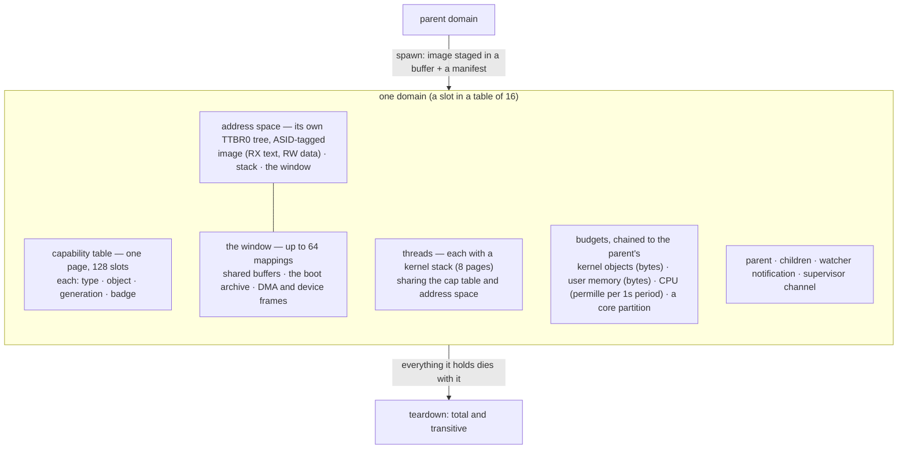
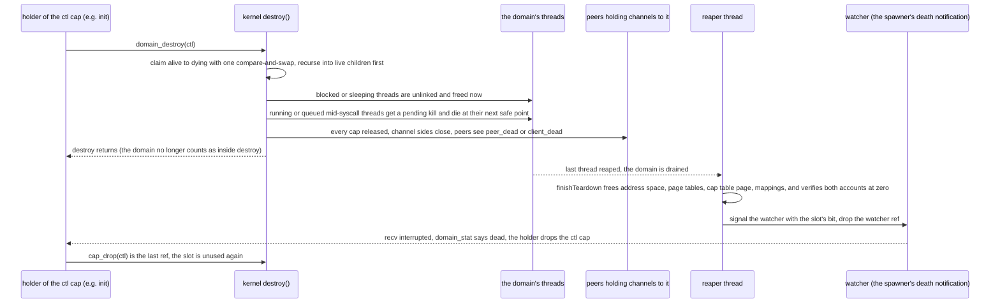
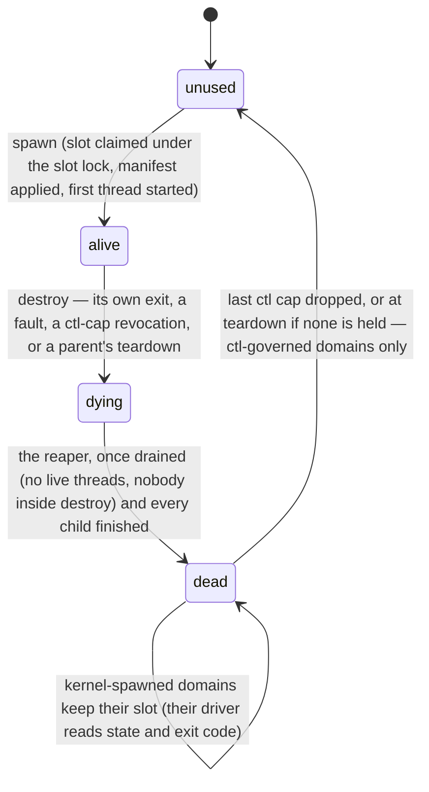

# The kernel model

## In one breath

The moss kernel is small on purpose. It knows how to give a program its
own memory, run its threads, let programs send each other messages, and
tell a program when a device or a fault needs attention. That is all.
Everything else — disks, networks, filesystems, the login prompt, the
shell — is an ordinary program running in its own sealed box, called a
**domain**, reached only through messages.

A domain starts with nothing. It cannot open a file, see a process list,
or talk to anyone unless the program that created it handed over a
**capability**: an unforgeable token that names exactly one thing and
one right over it. Power is something you are given, never something
you find lying around. When a domain is torn down, everything it held —
its threads, its memory, every token, every message in flight — goes
with it, and the kernel checks its own ledger afterwards to be sure
nothing was left behind.

## How it works

### What the kernel provides, and nothing more

The kernel implements exactly: address spaces, threads, domains,
capability tables, synchronous channels and notifications (IPC), and
the delivery of interrupts and faults as messages. There is no file
system, no network stack, no driver, no process table anyone can read
by name. Discovery is a userspace protocol conducted over capabilities
that were explicitly granted; the kernel has no global namespace of
anything.

Three consequences shape the whole system:

- **No ambient authority.** A freshly spawned domain holds only what
  its manifest granted. The empty sandbox is the zero value —
  sandboxing is not a mode, it is the absence of grants.
- **No channel bypass.** Every service interaction is a message on a
  channel, so any capability can be replaced by a proxy the holder
  cannot distinguish. Filtering, auditing and virtualization are small
  userspace programs, not kernel features.
- **Failure is in the vocabulary.** A channel whose other end died says
  so; an in-flight call completes with a distinct error; a fault is a
  message to a supervisor. Nothing assumes a shared clock.

### A domain

A domain is the unit of spawn, quota, sandboxing and teardown. It owns
an address space, a capability table, its threads, and three budgets;
it sits in a tree under the domain that spawned it, and its budgets are
carved out of its parent's.

**Spawn** takes two things: a program image the spawner has staged in
a shared buffer, and a **manifest** — budgets plus the exact list of
capabilities the child starts with. The kernel copies the image into
fresh pages (static linking makes a copy the whole loader), maps text
read-only and executable and data read-write and never executable,
builds a stack, fills the capability table with the grants, and starts
one thread at the image's entry. The image is self-describing: its
header carries the program's name, which becomes the domain's name.
There is no `fork`.

**Budgets** are hierarchical accounts. Every charge for kernel objects
(page tables, the cap table page, kernel stacks) or user memory (image
and stack pages) walks up the chain, so a parent's limit bounds its
whole subtree, and the limit named at spawn is a local cap within that
bound. The CPU budget is a permille of one core per one-second period,
charged from the cycle counter; a domain over its limit has its threads
parked until the period resets, and an overrun is carried into the next
period as debt. A **partition** reserves a mask of cores for one domain
alone: its threads run only there and nothing else is placed there.
Both are caps, not guarantees.

### Capabilities

A capability is an entry in the domain's table: a type, a reference to
a kernel object, a generation counter, and for channel ends an optional
**badge**. What a program holds is a **handle** — a slot number and the
generation — and a handle whose generation no longer matches is simply
invalid, so a stale handle can never resurrect authority after the slot
is reused. Raw kernel pointers never cross into userspace.

The types, from `kernel/cap.zig`: the debug log; the two ends of a
channel (`channel_a` serves, `channel_b` calls); a notification; a
shared-memory buffer; spawn authority; control over one spawned domain
(`domain_ctl`); a platform window and a device, for drivers; the right
to seed the entropy pool; read-only introspection of the domain ledger;
the right to create virtual machines; and one virtual machine.

Capabilities travel in exactly two ways: named in a manifest at spawn,
or attached to a message. A call or a reply can carry one capability;
the receiver gets a fresh handle in its own table, the sender keeps
its own unless it drops it. That is how a filesystem view, a buffer, a
device, or a channel to a service reaches a program — and how a proxy
in between can substitute its own.

A **badge** is a server-chosen identity minted into a `channel_b`
capability by the serving side and delivered with every call, so one
channel can serve many scoped clients — a filesystem view is a badged
channel to the filesystem service. Badges are refcounted on their own:
when the last capability carrying one dies, the server's next `recv`
returns `client_dead` with the badge, before serving anyone, so a
service releases what it kept for that client.

### Threads and scheduling

Each core has its own run queue, its own idle thread, and its own lock.
A 100 ms timer tick on every core drives preemption; a thread that is
made runnable on another core kicks that core out of idle. A thread is
in exactly one of six states:

```mermaid
stateDiagram-v2
  [*] --> ready: spawned (or thread_create)
  ready --> running: picked by its core
  running --> ready: preempted at a tick, or yield
  running --> blocked: call / recv / notify_wait with nothing to deliver
  running --> sleeping: sleep(ticks)
  blocked --> ready: woken by a reply, a caller, a signal, or client death
  sleeping --> ready: the timekeeper's tick reaches its wake tick
  running --> exited: exit, thread_exit, a fault — or a pending kill at a safe point
  blocked --> exited: teardown unlinks it (or a pending kill as it tries to park)
  sleeping --> exited: teardown removes it (or a pending kill as it tries to sleep)
  ready --> exited: teardown dequeues it (unless mid-syscall — then it runs to the syscall's end first)
  exited --> [*]: reaped by the next thread on that core; its domain's count drops
```

Blocking is a handshake: the thread is marked blocked under its own
lock and its core's lock before the object's lock is released, so a
waker on another core can find it the instant it is parked and never
before. A thread being switched away carries a `switching` flag until
the incoming thread clears it, so a thread woken on one core while
still saving registers on another is never run — or reaped — early.

A **kill** from another core never lands in the middle of kernel work.
Teardown marks a running thread `kill_pending`; the thread dies at its
next safe point — the end of its syscall, an interrupt that finds it in
user code, or the moment it tries to block or sleep. A thread preempted
mid-syscall is left on its queue to finish first. This matters because
a syscall may hold an object between allocating it and publishing it;
reaping it there would leak the object.

Domains may create more threads (`thread_create`, on a stack the domain
supplies); they share the capability table and count toward the
domain's teardown.

### Teardown: one revocation

Destroying a domain is one operation and it is total: every thread,
every page, every capability, every in-flight message, and every child
domain, transitively.

A domain reaches its end by one of four roads: its own `exit`, a fault
with no supervisor to decide otherwise, a `domain_destroy` by the
holder of its control capability, or its parent's teardown. All four
go through the same `destroy`. A domain is **drained** when no thread
of it lives and nobody is still inside `destroy`; only then does the
**reaper** — a kernel thread that wakes every tick — finish the
teardown: address space and page tables returned, the capability table
page freed, every mapped buffer's reference released, and both memory
accounts verified back to zero. A non-zero balance is a kernel panic,
not a warning: leak-freedom is checked, not hoped for. Then the
spawner's death-watch notification is signaled.

Children finish before their parent so their credits cascade home
before the parent's balance is checked. A dead domain's slot is reused
only once nothing names it: a domain that was ever governed by a
control capability becomes `unused` when the last such capability is
dropped (or at teardown, if none was held); one the kernel's own
drivers spawned has no such capability and stays `dead`, its state and
exit code still readable.

### Memory

Every domain has its own address space: a TTBR0 page-table tree tagged
with the domain's ASID, so TLB entries never leak between domains, and
kernel-only threads run with user walks disabled entirely. User
mappings are W^X without exception: text is readable and executable,
never writable; data is readable and writable, never executable; the
kernel's own image is laid out the same way.

Above the image and stack lies the **window**, where everything a
domain maps from outside itself lands: shared buffers granted by
capability, the boot archive (shared, read-only, one copy for every
holder), DMA memory and device registers for drivers. It is a table of
up to 64 mappings, placed first-fit so freed ranges are reused. A
mapped buffer holds a reference on its object for as long as it is
mapped — dropping the capability cannot free frames still mapped —
and `shm_unmap` gives a mapping back.

The kernel touches user memory through one door, `kernel/arch/aarch64/uaccess.zig`.
Every syscall that copies range-checks the pointer against the image,
the stack, and the window's live mappings, pins the window so an unmap
on another core waits for the copy, and copies through a window that
is the only place the hardware is told to allow it: on ARMv8.1+ the CPU
runs with PAN set, so any other privileged touch of a user page is a
fault report, not a read or write on the caller's behalf.

### The platform

Everything the kernel knows about the machine sits behind one file,
`kernel/arch.zig`: a comptime switch on the target that selects a port
directory (`kernel/arch/aarch64/`) and lists the names a port
provides — the CPU (interrupt masking, the per-core pointer, the
counter), traps and the syscall frame, thread contexts, page tables,
the door to user memory, the interrupt controller, message interrupts,
the tick, power, secondary cores, the IOMMU, the hypervisor, firmware
discovery and the console. The generic kernel — domains, capabilities,
IPC, the scheduler's policy, quotas, teardown — never names a register
or a device. Only the selected port is compiled: another architecture's
code is never analyzed, let alone linked. `-Darch` chooses the port;
aarch64 is the only one today.

moss boots on aarch64 as a raw arm64 Image. Entered at EL2 (the usual
case under QEMU with virtualization on), the boot code makes the core a
VHE host and the kernel runs there as it would at EL1 — under E2H the
EL1-named registers name their EL2 counterparts, and only the PSCI
conduit and the timer's interrupt line are chosen at run time. That is
what lets the kernel also be a hypervisor (a separate page). Entered at
EL1, it runs there unchanged.

### Security posture, honestly

W^X and NX are unconditional; every domain has its own address space;
all authority arrives by manifest or message. What capabilities do not
do is fix the microarchitecture: they stop architectural leaks, not
side channels. The stance is per-domain address spaces, no cross-domain
SMT sharing, and time partitioning as an opt-in for domains that need
it — and no claim that any of this defeats Spectre-class attacks.

## In detail

- **Sizes and pools.** 16 domain slots; 128 capability slots per domain
  (one page); 64 threads; up to 8 cores; 64 channels, 64 notifications,
  64 shared buffers (each up to 128 pages, 512 KB), 256 badge identities;
  8 pending callers per channel (deferred replies). A thread's kernel
  stack is 8 pages; a domain's user stack is 24 pages (96 KB) below
  `0x800_0000`, its image at `0x40_0000`, its window from
  `0x1000_0000`, 64 mappings. Default budgets at spawn are 1 MB of
  kernel objects and 1 MB of user memory unless the manifest says
  otherwise; the CPU period is 10 ticks (1 s).
- **Handles.** `shared.Handle` is a 24-bit slot and a 40-bit
  generation; the all-zero handle is never valid. Every syscall that
  names an object looks the handle up by slot, generation and expected
  type.
- **What arrives at entry.** A new domain's first thread starts at the
  image entry with x0 = its log handle (if granted), x1 = its channel
  end (side A or a badged side B), x2 = the manifest's argument, x3/x4
  = the boot archive's address and length (if granted). Further grants
  (spawner, entropy, introspect, windows, hypervisor) occupy the
  following slots in that fixed order.
- **Syscalls** (`shared.Syscall`), grouped:
  - process: `log`, `yield`, `sleep`, `exit`, `thread_create`,
    `thread_exit`, `getrandom`
  - IPC: `call`, `recv`, `reply`, `chan_create`, `chan_mint`,
    `notify_create`, `notify_signal`, `notify_wait`, `notify_bind`,
    `timer_arm`
  - memory: `shm_create`, `shm_map`, `shm_unmap`
  - domains: `spawn`, `domain_stat`, `domain_destroy`, `watch_deaths`,
    `cap_drop`, `domain_list`, `sysinfo`
  - drivers: `mmio_map`, `irq_bind`, `irq_ack`, `dma_alloc`,
    `device_info`, `device_register`, `window_map`, `rng_seed`
  - virtual machines: `vm_create`, `vm_run`, `vm_set`,
    `vm_attach_device`, `vm_cpu_on`

  The ABI is x8 = number, x0..x5 = arguments, x0 = result (an
  `Errno`); results and further values come back in x1..x7.
- **Faults.** A fault at EL0 in a domain with a supervisor channel
  becomes a message on it (`FaultMsg`: ESR, FAR, ELR) and the
  supervisor decides — that channel is also the debugger interface. A
  domain without one is killed outright with a logged decode.
- **Locks.** Every core's run queue, every thread, every channel and
  notification has its own lock; the object tables, timers, IRQ
  bindings, shared buffers, badges and the thread table are leaves.
  The order, outer to inner: notification → channel → thread → run
  queue → sleepers. Nothing logs under any of them. The kernel is
  compiled without FP/SIMD; userspace owns the vector unit, saved and
  restored eagerly per user thread (528 bytes) at every switch.
- **Reaping cadence.** The reaper polls once per tick, one dependency
  layer per pass, so teardown latency is dominated by that cadence
  (about 100 ms per layer), not by work.
- **Preemption.** Interrupts are taken in kernel mode too; a syscall
  may be preempted and resumed. The tick charges the running domain's
  CPU account and, at the period boundary, releases throttled threads.
- **Trace and dumps.** A system drill that has not shut down after 60 s
  dumps every thread (state, what it blocks on, its request word),
  every domain (state, live threads, ctl refs, parent), every
  notification and channel, the bound IRQ lines, and a lock-free ring
  of lifecycle events (`kernel/trace.zig`), then panics.

## Known limits and bugs

- Every pool above is static and small: 16 domains, 64 threads, 64 of
  each IPC object. A busy system runs into these before anything else.
- Budgets are caps, not guarantees; CPU enforcement is tick-grained
  (a thread per core can run one whole tick past its limit; the
  average converges).
- A partition keeps other domains' *code* off a core, not the tick or
  the caches it shares with its neighbours.
- Shared-buffer pages are charged to one global account, not to the
  creating domain (recorded as a residual since Phase 5).
- Reaping is polled, once per tick; event-driven reaping is noted as a
  cheap future win.
- The kernel is aarch64 only; the x86_64 port that would test the HAL
  boundary is in the Phase 12 pool (ROADMAP.md). Guests (the
  hypervisor) run only under TCG, since Apple's nested virtualization
  has no VHE.
- Randomness is not interposable: `getrandom` is ungated, like reading
  the counter; a domain that must see deterministic randomness is a
  future manifest option (ROADMAP.md, "Entropy").
- Side channels are not addressed beyond the stance above.

## Dig deeper

- DESIGN.md — "Kernel model" and "Locking" (lock order and the lessons
  that shaped it), "Domains" (budgets, the loader, the window, every
  teardown bug and its fix), "Security posture", "Platform and boot",
  "Zig conventions" (the `asm volatile` rule).
- ROADMAP.md — "Locked decisions" (why a capability microkernel, why
  no `fork`, why 64-bit only) and "Invariants".
- HACKING.md — adding a syscall, the sharp-edge list, reading a hang
  dump.
- Source — `kernel/domain.zig` (Domain, Manifest, spawn, destroy, the
  reaper, the window), `kernel/cap.zig`, `kernel/sched.zig` (threads,
  block, kills, reaping), `kernel/syscall.zig`, `kernel/trace.zig`,
  `kernel/arch.zig` (the HAL interface) and `kernel/arch/aarch64/`
  (`trap.zig`, `uaccess.zig`, `mmu.zig`, `cpu.zig`, `thread.zig`,
  `platform.zig`), `shared/lib.zig` (`Syscall`, `Errno`, `Handle`).
