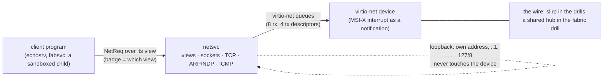
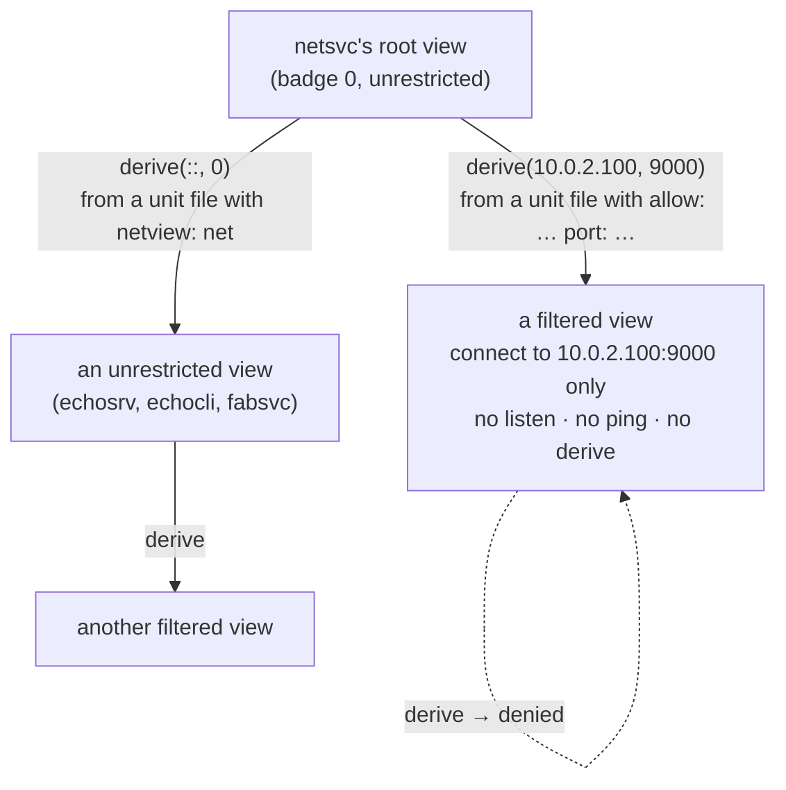
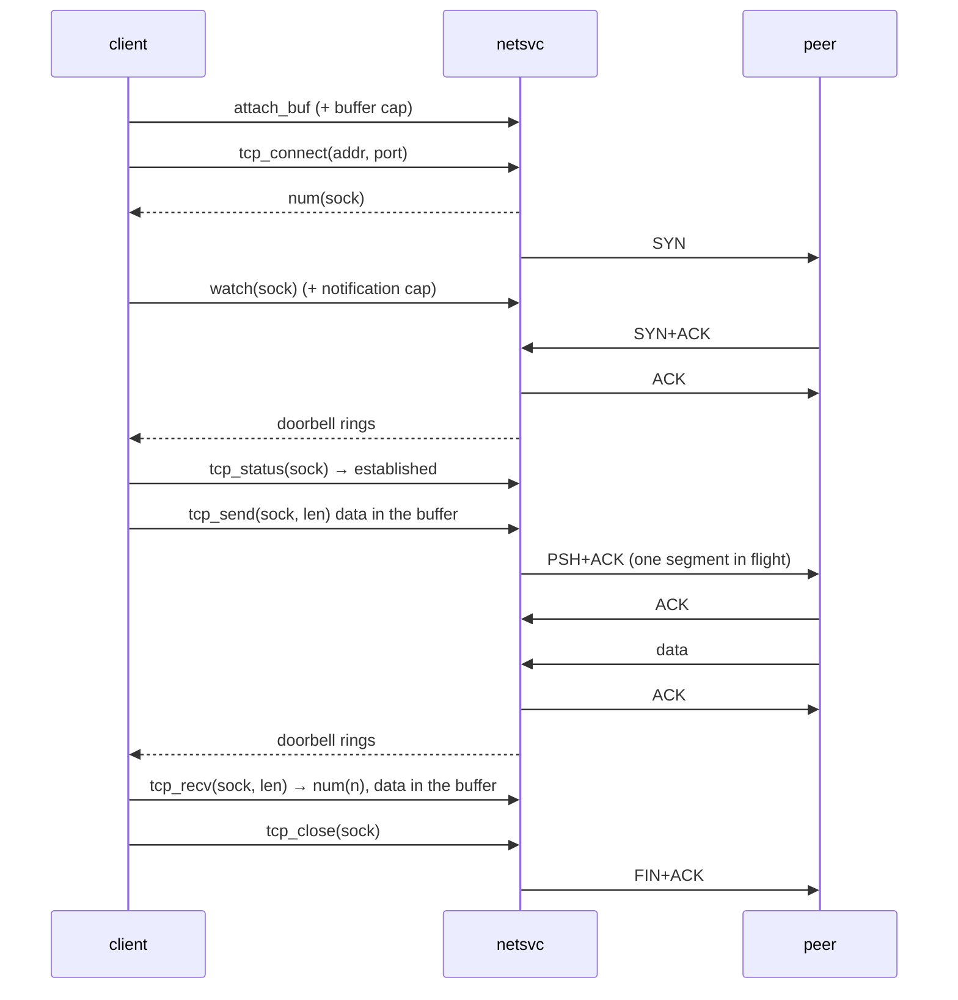
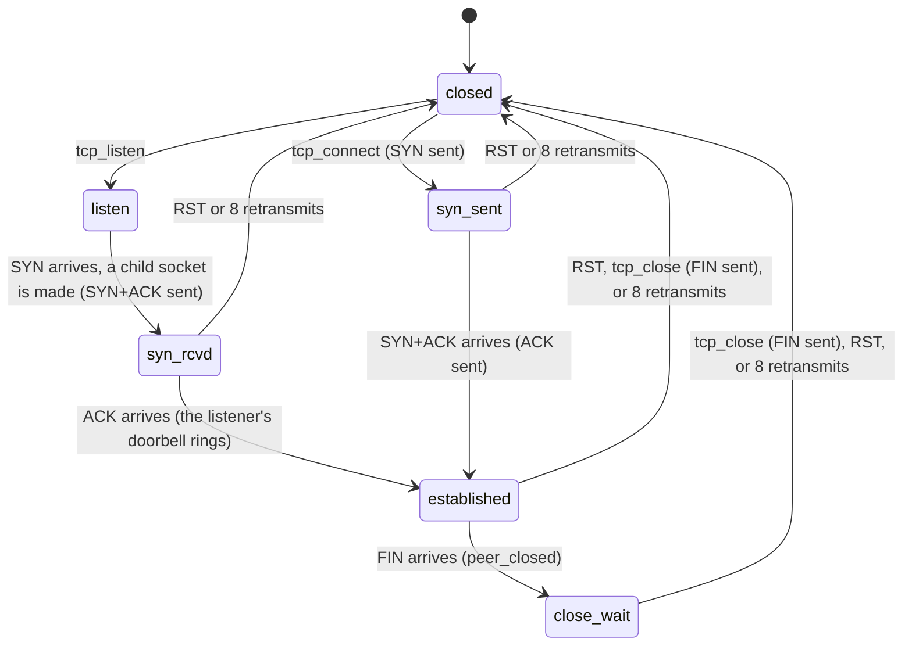

# Networking

## In one breath

Networking in moss is a service like any other. One userspace program,
`netsvc`, holds the network card's driver and a deliberately small
TCP/IP stack, and every other program reaches the network only through
a **network view** it was handed — a capability that says which
destinations it may talk to. A sandboxed program can be given a view
that allows exactly one address and port and nothing else: it cannot
listen, cannot ping, cannot widen its own reach. Addresses are always
IPv6-shaped, with IPv4 carried inside, so there is no second code path
to fossilize. The stack is just big enough for moss's own needs — the
multi-node fabric and the drills — and says so.

## How it works

### One process: driver and stack

`netsvc` is a single domain that receives the virtio-net device
capability over its boot channel, drives it, and serves the network
protocol to clients over one channel. There is no separate driver
process: frames come off the device's receive queue, go through the
stack, and land in sockets, all in the same address space.

The device signals through a notification the service binds to its
serving thread, so a blocked `recv` on the protocol channel is
interrupted when frames arrive; the service drains the receive queue,
reclaims sent frames, runs the retransmission scan, and goes back to
serving.

### Addresses: IPv6-native, IPv4 mapped

Every address in the protocol is 128 bits, carried as two words. An
IPv4 destination is written as a v4-mapped IPv6 address
(`::ffff:a.b.c.d`), so `tcp_connect` and `ping` have one shape for
both families, and on the wire the stack speaks whichever the address
calls for: ARP and IPv4 for a mapped address, NDP, ICMPv6 and IPv6
otherwise. Destinations that are the node's own address, `::1`, or
anything in `127/8` are short-circuited: the segment is fed straight
back into the stack, so two programs on one node speak real TCP
without a frame ever reaching the device.

Two addressing modes exist, chosen by the unit file's argument:

| Mode | Own addresses | Gateways | Used by |
|---|---|---|---|
| slirp (node 0) | `10.0.2.15`, `fec0::15` | `10.0.2.2` (ARP) and `fec0::2` (NDP), resolved before serving anyone | the net drill, the shell boot |
| cluster (node N) | `10.77.0.N`, `fdcc::N` | none: everything is on-link, delivered to the broadcast MAC | the fabric (`net-cluster.msh`, node 1; a guest node joins as 2) |

### Network views

Access is a badged channel capability, exactly like a filesystem view:
the badge selects, inside `netsvc`, a **view** — unrestricted, or
*filtered* to one destination address and port. A filtered view may
connect to that destination and nothing else; it may not listen, ping,
or derive. Only an unrestricted view can `derive` a filtered one, and
the reply carries the new capability. Init does this for a unit whose
file says `{ tag: net, netview: net, allow: 10.0.2.100, port: 9000 }`:
it asks the `net` unit to derive a view for that destination and hands
the result to the program. Without `allow:` the derived view is a
clone of the unrestricted one.

Every socket belongs to the view that created it; a request naming a
socket through a different view is refused as `bad`. When the last
capability carrying a view's badge dies, the kernel tells `netsvc`
(`client_dead`): the view's sockets are closed as if the client had
asked — a FIN goes out where a connection stood — its buffer is
unmapped, and the slot is free again.

### Sockets and the protocol

A view first attaches a shared buffer (`attach_buf`); payloads travel
through it. The operations are `tcp_listen`, `tcp_connect`,
`tcp_status`, `tcp_accept`, `tcp_send`, `tcp_recv`, `tcp_close`,
`ping` and `ping_check`, `derive`, and `watch`. Nothing blocks inside
the service: an operation that cannot complete now answers
`would_block`, and the client either polls or arranges to be told.
Being told is `watch`: the client attaches a notification to a socket
as its **doorbell**, and the service rings it on every change — data
arrived, the peer closed, a connection is waiting to be accepted, a
retransmission gave up. A client that binds that notification to its
serving thread sleeps in its own `recv` and is interrupted when there
is news, which is how the fabric service waits on its peers without
ticking.

TCP is stop-and-wait: a socket keeps one unacknowledged segment, and a
`tcp_send` while it is outstanding answers `would_block`. Receive is
in-order only; a segment that is not the next expected byte is
dropped and the sender's retransmission covers it. Windows are fixed
and there are no TCP options. Retransmission is driven by the tick and
by every interrupt: a segment older than a fifth of a second goes out
again, and after eight retries the socket is closed and its doorbell
rung.

A listener keeps a small **backlog** of connections that completed the
handshake but were not yet taken by `tcp_accept`. It used to be a
single slot, and that was a bug the fabric drill found: a second SYN
overwrote the first, orphaning an established connection whose data
nobody would ever read while the client saw every send succeed. The
backlog is a FIFO now; a SYN that arrives with it full is dropped,
and the client's own SYN retransmission retries.

### What the drill proves

The `net` check boots the `net` profile under QEMU's user-mode network
with one extra rule: TCP to `10.0.2.100:9000` is answered by a `cat`
process on the host, an echo. Three oneshot units run in order:

1. `echosrv` (unrestricted view) listens on `:7777`, family-agnostic,
   and echoes two connections until each closes.
2. `echocli` (unrestricted view) round-trips through the loopback path
   over a v4-mapped address, then over IPv6 to the same listener; then
   over the wire to the host echo; then proves an IPv6 wire round trip
   by pinging the v6 gateway and watching `ping_check` count the reply.
3. `boxed` (filtered view: `10.0.2.100:9000` only) reaches the echo,
   and is refused on the v4 gateway, the v6 gateway, loopback, listen,
   ping, and derive.

The fabric check runs `netsvc` in cluster mode on every node with the
QEMU instances joined by a hub, and the `vmnode` check hands a second
NIC through to a moss guest that runs its own `netsvc` as node 2.

## In detail

- **Tables.** 16 sockets and 8 views per service. A listener's backlog
  holds 4 connections. Each socket has a 2048-byte receive buffer and a
  640-byte buffer for the one segment in flight; a `tcp_send` moves at
  most 512 bytes, a `tcp_recv` at most 2048.
- **Ports.** Listening ports are 1–65535 as asked; connecting sockets
  take ephemeral ports from 40000 upward, wrapping back to 40000.
- **Sequence numbers** start from the low bits of the cycle counter.
  A listener's children inherit its badge, so the accepting view owns
  them.
- **Retransmission.** The scan runs on every drain (interrupt or
  tick): an unacknowledged segment older than `cycleHz / 5` is resent;
  `rexmits > 8` closes the socket. A SYN+ACK that gives up leaves a
  closed child at the head of the backlog, which `tcp_accept` discards.
- **Loopback ordering.** Emitting to a local address runs the peer's
  processing synchronously, inside the send, so all bookkeeping for a
  segment is done before it is emitted — the ACK may have cleared the
  in-flight slot by the time the call returns.
- **The driver.** virtio-net over PCI with MSI-X; 8 receive and 4
  transmit descriptors, 2048-byte frames with a 12-byte virtio header,
  DMA buffers from `dma_alloc` translated through the SMMU. Receive
  buffers are reposted as they drain. The device's config space is read
  at aligned offsets (a lesson).
- **Gateways.** In slirp mode the service resolves both gateways (ARP
  for v4, neighbor solicitation for v6) before it serves its first
  client. In cluster mode there are no gateways; every destination is
  on-link and frames go to the broadcast MAC.
- **Filtered views** answer `denied` to `tcp_listen`, `ping`, and
  `derive`, and to `tcp_connect` for any destination but their own.
  `derive(::, 0)` from an unrestricted view clones it unrestricted;
  any other address or port makes a filtered view.
- **Errors.** `would_block` (nothing to accept, nothing received, a
  segment still in flight), `denied` (the view forbids it), `refused`,
  `closed` (send on a socket that is not established or in
  `close_wait`; recv with nothing buffered after the peer closed),
  `bad` (unknown socket, wrong view, bad port or length, no buffer),
  `no_space` (no socket or view slot).
- **Doorbells.** One notification per socket; `watch` replaces an
  earlier bell (dropping it) and rings immediately if there is already
  news. The bell is dropped with the socket.

## Known limits and bugs

- The stack is minimal by design: stop-and-wait with one segment in
  flight, in-order receive, fixed windows, no options, no congestion
  control, no UDP. It is the fabric's transport and a drill's, not a
  general-purpose host stack.
- Blocking is polling: `would_block` plus a doorbell. The async ring
  transport as a wakeup path for network I/O is planned, not built.
- Sixteen sockets and eight views per service are static pools.
- A filtered view allows one destination, IPv4 by way of a unit file
  (`allow:` takes a dotted v4 address); an IPv6 allowlist can be made
  through `derive` directly but not from a unit file.
- Cluster addressing is static (node N is `10.77.0.N` / `fdcc::N`);
  dynamic addressing is a separate concern.
- Severing an IRQ binding must also mask the line, or a level-triggered
  device storms — a lesson recorded in DESIGN, worth knowing before
  touching the driver's teardown.

## Dig deeper

- DESIGN.md — "Networking" (as built, lessons paid for), "Distribution:
  the fabric" (how the fabric uses sockets, doorbells, and the backlog).
- ROADMAP.md — Phase 10, and the fabric entries that mention netsvc.
- Source — `user/net.zig` (driver, stack, views, sockets, the drill
  roles), `shared/lib.zig` (`NetReq`, `NetResp`, `NetErr`, `TcpState`,
  addresses), `boot/conf/units/net*.msh`, `user/init.zig` (the
  `netview` give), `user/fabric.zig` (a client that waits on doorbells),
  `tools/runner.zig` (the QEMU network for each check).
