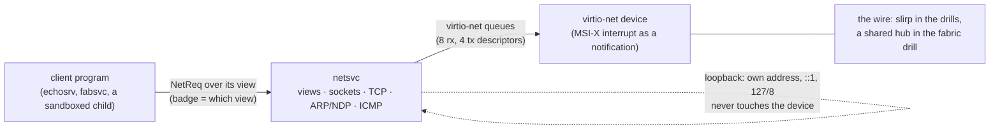
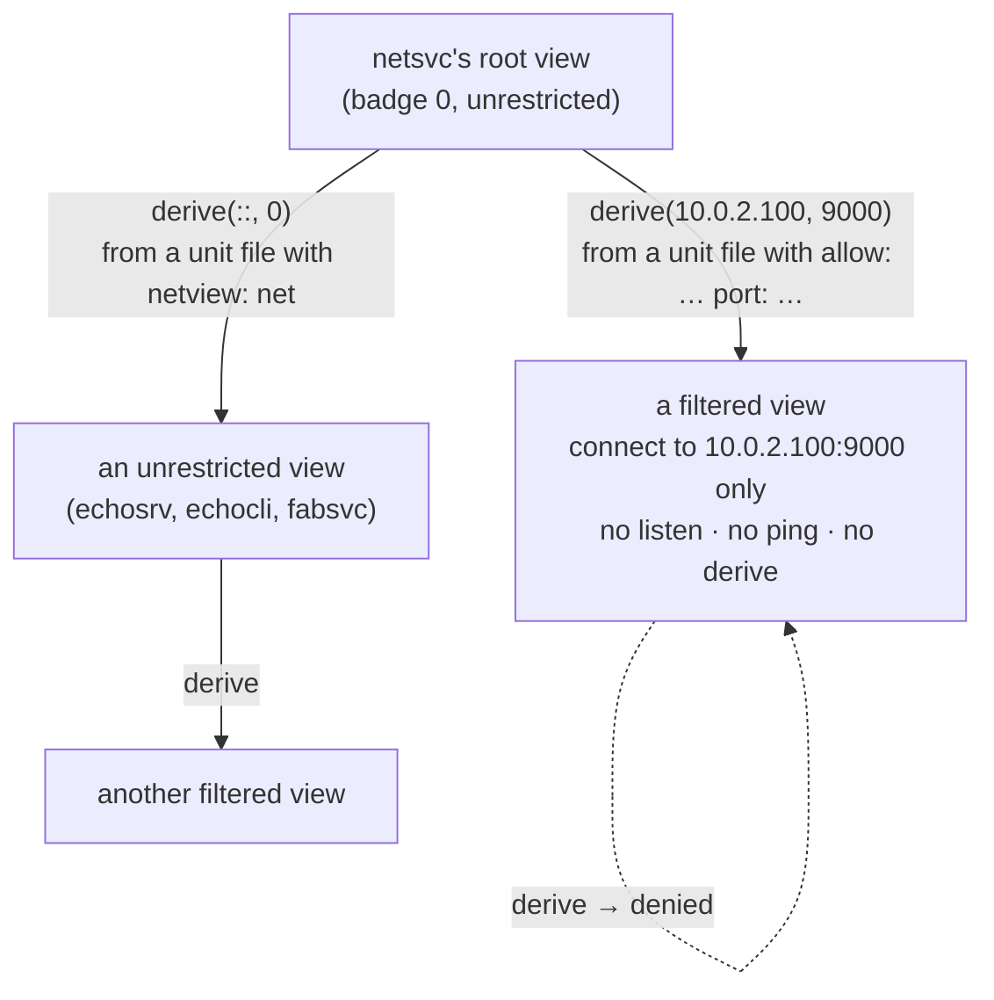
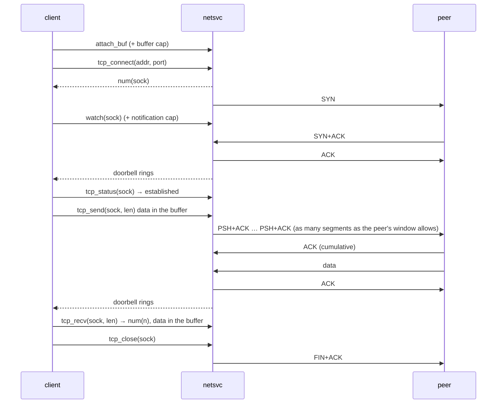

# Networking

## In one breath

Networking in moss is a service like any other. One userspace program,
`netsvc`, holds the network card's driver and a deliberately small
TCP/IP stack, and every other program reaches the network only through
a **network view** it was handed — a capability that says which
destinations it may talk to. A sandboxed program can be given a view
that allows exactly one address and port and nothing else: it cannot
listen, cannot ping, cannot widen its own reach. Addresses are always
IPv6-shaped, with IPv4 carried inside, so there is no second code path
to fossilize. The stack is just big enough for moss's own needs — the
multi-node fabric and the drills — and says so.

## How it works

### One process: driver and stack

`netsvc` is a single domain that receives the virtio-net device
capability over its boot channel, drives it, and serves the network
protocol to clients over one channel. There is no separate driver
process: frames come off the device's receive queue, go through the
stack, and land in sockets, all in the same address space.



The device signals through a notification the service binds to its
serving thread, so a blocked `recv` on the protocol channel is
interrupted when frames arrive; the service drains the receive queue,
reclaims sent frames, runs the retransmission scan, and goes back to
serving.

### Addresses: IPv6-native, IPv4 mapped

Every address in the protocol is 128 bits, carried as two words. An
IPv4 destination is written as a v4-mapped IPv6 address
(`::ffff:a.b.c.d`), so `tcp_connect` and `ping` have one shape for
both families, and on the wire the stack speaks whichever the address
calls for: ARP and IPv4 for a mapped address, NDP, ICMPv6 and IPv6
otherwise. Destinations that are the node's own address, `::1`, or
anything in `127/8` are short-circuited: the segment is fed straight
back into the stack, so two programs on one node speak real TCP
without a frame ever reaching the device.

Two addressing modes exist, chosen by the unit file's argument:

| Mode | Own addresses | Gateways | Used by |
|---|---|---|---|
| slirp (node 0) | `10.0.2.15`, `fec0::15` | `10.0.2.2` (ARP) and `fec0::2` (NDP), resolved before serving anyone | the net drill, the shell boot |
| cluster (node N) | `10.77.0.N`, `fdcc::N` | none: everything is on-link, delivered to the broadcast MAC | the fabric (`net-cluster.msh`, node 1; a guest node joins as 2) |

### Network views

Access is a badged channel capability, exactly like a filesystem view:
the badge selects, inside `netsvc`, a **view** — unrestricted, or
*filtered* to one destination address and port. A filtered view may
connect to that destination and nothing else; it may not listen, ping,
or derive. Only an unrestricted view can `derive` a filtered one, and
the reply carries the new capability. Init does this for a unit whose
file says `{ tag: net, netview: net, allow: 10.0.2.100, port: 9000 }`:
it asks the `net` unit to derive a view for that destination and hands
the result to the program. Without `allow:` the derived view is a
clone of the unrestricted one.



Every socket belongs to the view that created it; a request naming a
socket through a different view is refused as `bad`. When the last
capability carrying a view's badge dies, the kernel tells `netsvc`
(`client_dead`): the view's sockets are closed as if the client had
asked — a FIN goes out where a connection stood — its buffer is
unmapped, and the slot is free again.

### Sockets and the protocol

A view first attaches a shared buffer (`attach_buf`); payloads travel
through it. The operations are `tcp_listen`, `tcp_connect`,
`tcp_status`, `tcp_accept`, `tcp_send`, `tcp_recv`, `tcp_close`,
`ping` and `ping_check`, `derive`, and `watch`. Nothing blocks inside
the service: an operation that cannot complete now answers
`would_block`, and the client either polls or arranges to be told.
Being told is `watch`: the client attaches a notification to a socket
as its **doorbell**, and the service rings it on every change — data
arrived, the peer closed, a connection is waiting to be accepted, a
retransmission gave up. A client that binds that notification to its
serving thread sleeps in its own `recv` and is interrupted when there
is news, which is how the fabric service waits on its peers without
ticking.



TCP is windowed. Each socket has a 4 KB send ring: `tcp_send` queues
its payload whole (or answers `would_block` when the ring cannot take
all of it — never a torn message) and the stack sends as many segments
as the peer's advertised window allows, each at most the MSS the peer
announced in its SYN (we announce 1440 and accept up to that; 536
without an option). A cumulative ACK frees the ring and opens the
window for more. Receive is in-order only, into an 8 KB buffer whose
free space is the window we advertise; a segment that is not the next
expected byte is dropped and the sender's retransmission covers it.
Retransmission is per connection, driven by the tick and by every
interrupt: the oldest unacknowledged thing — the SYN, the first
in-flight segment, or the FIN — goes out again when its timer expires,
starting at a fifth of a second and doubling to a ceiling of 3.2 s;
after eight retries the socket is closed and its doorbell rung. A
closed socket lingers in the stack, unreachable by its client, until
its FIN is acknowledged or gives up, so queued data and the FIN behind
it are delivered even when the program has moved on.

```mermaid
stateDiagram-v2
  [*] --> closed
  closed --> listen: tcp_listen
  closed --> syn_sent: tcp_connect (SYN sent)
  listen --> syn_rcvd: SYN arrives, a child socket is made (SYN+ACK sent)
  syn_rcvd --> established: ACK arrives (the listener's doorbell rings)
  syn_sent --> established: SYN+ACK arrives (ACK sent)
  established --> close_wait: FIN arrives (peer_closed)
  established --> closed: RST, or 8 retransmits
  established --> lingering: tcp_close (queued data, then the FIN; the client's number is gone)
  close_wait --> closed: RST, or 8 retransmits
  close_wait --> lingering: tcp_close
  lingering --> [*]: the FIN acknowledged, or 8 retransmits
  syn_sent --> closed: RST or 8 retransmits
  syn_rcvd --> closed: RST or 8 retransmits
```



A listener keeps a small **backlog** of connections that completed the
handshake but were not yet taken by `tcp_accept`. It used to be a
single slot, and that was a bug the fabric drill found: a second SYN
overwrote the first, orphaning an established connection whose data
nobody would ever read while the client saw every send succeed. The
backlog is a FIFO now; a SYN that arrives with it full is dropped,
and the client's own SYN retransmission retries.

### Sockets as values: the language surface

An mshl host that holds a network view — `mshrun` given `{ tag: net,
netview: net }`, or a shell whose unit gives one — offers the network
as commands whose values are **handles**: a socket or a listener is a
value the program passes around, and the capability it stands for is
released when the last value naming it is gone (the interpreter's
reference counting calls the host's drop, which is `tcp_close`). A
handle nobody binds is closed at the end of the statement that made it.

```
let s = (connect 10.0.2.100 9000)?     # ok <socket 2>, or err "refused"
send $s "hello"                        # ok 5
let reply = (from-bytes (recv $s)?)?   # recv gives bytes; from-bytes checks UTF-8
close $s                               # explicit; dropping $s does the same
let l = (listen 7778)?                 # ok <listener 3>
let c = (connect ::1 7778)?            # loopback: the handshake completes inside the call
let a = (accept $l)?                   # ok <socket 5>
match (recv $a) { ok $b => …; err $e => echo "peer: $e" }
status $a                              # "established", "peer closed", "closed" …
```

Every command the network can fail answers a **result** — `ok` with the
socket, the count sent, or the bytes received; `err` with the reason
(`refused`, `denied by the view`, `closed`, `timed out`, `no socket
left`) — so a script decides with `?` or `match` and never hangs on a
dead peer: `recv` on a socket whose peer closed with nothing buffered
is `err closed`. Addresses are dotted IPv4 (carried v4-mapped) or IPv6
with one `::`. `send` moves a string or bytes in 512-byte pieces;
`recv` returns up to 2048 bytes (`recv $s 100` asks for fewer).
Waiting — for the handshake, for data, for room to send, for a
connection to accept — is a doorbell: the host hangs one notification
on every socket it makes (`watch`) and sleeps on it whenever the
service answers `would_block`, so a waiting script costs nothing and
wakes the moment something happens. `connect` and `send` end when the
stack gives up on the peer (an `err`); `accept` and `recv` wait as long
as it takes.

The network drill's third step is such a script (`scripts/net-drill.msh`,
run by `mshrun` from the boot archive with only a network view): it
echoes through the wire, then listens, connects to itself over
loopback, accepts, sends and receives, then pushes 5000 bytes through
the wire echo and through loopback with a recursive `recv-all` (the
window at work: more than one segment in flight each way), then
proves a closed peer and a refused destination are errors as values.

### HTTP: handlers are functions

On top of those sockets, an mshl host with a network view speaks
HTTP/1.1 — the small part a script needs, parsed and formatted in
`lib/http.zig` (host-tested), JSON in `lib/json.zig` beside it:

```
# a server: the handler is a function of the request record
def handler [req] {
  match $req.path {
    "/hello" => "hello from moss"                       # 200 text/plain
    "/items" => (ls data | select name size)            # 200 application/json
    "/echo"  => { status: 200, headers: { x-method: $req.method }, body: $req.body }
    _        => { status: 404, body: "no such page" }
  }
}
let l = (listen 8080)?
serve $l $handler          # forever; `serve $l $handler 4` returns after four

# the primitives underneath, for anything serve does not do
let s = (accept $l)?
let req = (http-read $s)?  # ok { method, path, query, headers, body } / err
http-write $s { status: 204 }
close $s

# a client
let r = (fetch http://10.0.2.100:9001/hello)?          # ok { status, headers, body }
let p = (fetch http://10.0.2.100:9001/api { method: POST, body: { n: 1 } })?
```

A request record has `method`, `path` (before any `?`), `query` (the
text after it, or null), `headers` (a record, names lowercased) and
`body` (a string if it is UTF-8, bytes otherwise). What a handler
returns decides the response: a record with `status`, `headers` or
`body` is explicit (`body` may be text, bytes, or data); a string is
`200 text/plain`; a list, record or table is `200 application/json`
(`to-json` / `from-json` are the language's own way to and from JSON,
tables included; JSON numbers with a fraction or exponent are refused
because the language has no floats). A handler that fails, or returns
an `err`, answers `500` with the message and the server goes on. Every
response carries `Content-Length` and `Connection: close`, and the
socket is closed after it: one request per connection, no keep-alive,
no chunked transfer (a chunked request or response is an `err`). Bodies
are bounded (a 16 KB head, a 256 KB body). `fetch` takes `http://`
URLs whose host is an address — there is no name resolution — and
reads the response to its `Content-Length` or to the close.

### What the drill proves

The `net` check boots the `net` profile under QEMU's user-mode network
with one extra rule: TCP to `10.0.2.100:9000` is answered by a `cat`
process on the host, an echo. Three oneshot units run in order:

1. `echosrv` (unrestricted view) listens on `:7777`, family-agnostic,
   and echoes two connections until each closes.
2. `echocli` (unrestricted view) round-trips through the loopback path
   over a v4-mapped address, then over IPv6 to the same listener; then
   over the wire to the host echo; then proves an IPv6 wire round trip
   by pinging the v6 gateway and watching `ping_check` count the reply.
3. `net-script` (unrestricted view, an mshl script under `mshrun`)
   does the wire echo and a listen/connect/accept loop over loopback
   from the language, moves 5000 bytes each way, `fetch`es a page from
   a canned server the host runs behind `10.0.2.100:9001`, parses a raw
   request with `http-read` and answers it with `http-write` over
   loopback, then **serves four pages to the runner itself** — the
   check connects through a port forward (`127.0.0.1:31909` → `:8080`)
   and asserts a text page, a JSON page, a POST echoed with a custom
   header, and a 404 — and finally checks that a closed peer and a
   refused destination come back as `err` values. The check also
   writes the wire's packets to `zig-out/check/net.pcap`.
4. `boxed` (filtered view: `10.0.2.100:9000` only) reaches the echo,
   and is refused on the v4 gateway, the v6 gateway, loopback, listen,
   ping, and derive.

The fabric check runs `netsvc` in cluster mode on every node with the
QEMU instances joined by a hub, and the `vmnode` check hands a second
NIC through to a moss guest that runs its own `netsvc` as node 2.

## In detail

- **Tables.** 32 sockets and 16 views per service. A listener's
  backlog holds 8 connections. Each socket has an 8 KB receive buffer
  (its free space is the advertised window) and a 4 KB send ring
  (unacknowledged and unsent bytes); a `tcp_send` queues at most 4096
  bytes, all or `would_block`, and a `tcp_recv` returns at most 4096.
  The socket table is zero-initialized so it lives in `.bss`: a
  default that is not zero would put 400 KB in the image, which is
  exactly what happened once — and the loader stage (then 256 KB, 512 KB since msh outgrew it) reports
  an image that does not fit as "missing from the boot archive".
- **Segments.** MSS 1440 announced and accepted (the option is parsed
  from the peer's SYN; 536 without one); a segment is at most that
  plus 20 bytes of header, and the driver's frame is 2048 bytes.
- **Ports.** Listening ports are 1–65535 as asked; connecting sockets
  take ephemeral ports from 40000 upward, wrapping back to 40000.
- **Sequence numbers** start from the low bits of the cycle counter.
  A listener's children inherit its badge, so the accepting view owns
  them.
- **Retransmission.** The scan runs on every drain (interrupt or
  tick): a socket with anything unacknowledged whose timer (`rto`,
  `cycleHz / 5` at first, doubled per retry up to 16×) has expired
  resends its oldest unacknowledged thing — the SYN or SYN+ACK in the
  handshake states, else the first in-flight segment from the send
  ring, else the FIN; the ninth expiry closes the socket. A SYN+ACK
  that gives up leaves a closed child at the head of the backlog,
  which `tcp_accept` discards. A fresh ACK that advances resets the
  count and the timeout.
- **Loopback reentrancy.** On loopback an emit runs the peer, whose
  ACK runs our input, which would send more: `tcpOutput` is guarded
  per socket, so the nested call returns and the outer loop re-reads
  the window it changed.
- **Loopback ordering.** Emitting to a local address runs the peer's
  processing synchronously, inside the send, so all bookkeeping for a
  segment is done before it is emitted — the ACK may have cleared the
  in-flight slot by the time the call returns.
- **The driver.** virtio-net over PCI with MSI-X; 8 receive and 4
  transmit descriptors, 2048-byte frames with a 12-byte virtio header,
  DMA buffers from `dma_alloc` translated through the SMMU. Receive
  buffers are reposted as they drain. The device's config space is read
  at aligned offsets (a lesson).
- **Gateways.** In slirp mode the service resolves both gateways (ARP
  for v4, neighbor solicitation for v6) before it serves its first
  client. In cluster mode there are no gateways; every destination is
  on-link and frames go to the broadcast MAC.
- **Filtered views** answer `denied` to `tcp_listen`, `ping`, and
  `derive`, and to `tcp_connect` for any destination but their own.
  `derive(::, 0)` from an unrestricted view clones it unrestricted;
  any other address or port makes a filtered view.
- **Errors.** `would_block` (nothing to accept, nothing received, a
  segment still in flight), `denied` (the view forbids it), `refused`,
  `closed` (send on a socket that is not established or in
  `close_wait`; recv with nothing buffered after the peer closed),
  `bad` (unknown socket, wrong view, bad port or length, no buffer),
  `no_space` (no socket or view slot).
- **Doorbells.** One notification per socket; `watch` replaces an
  earlier bell (dropping it) and rings immediately if there is already
  news. The bell is dropped with the socket.
- **A connection is `established` or `close_wait`.** A client polling
  `tcp_status` after `tcp_connect`, and `tcp_accept` looking at the
  head of a backlog, must take both: a peer that answers and closes
  at once (a canned server, a probe) can move the socket through
  `established` into `close_wait` between two polls, and a loop that
  waits for `established` alone then sleeps on a bell that never
  rings again (found 2026-09-04 on the first Linux host, whose faster
  QEMU made the ordering likely).

## Known limits and bugs

- The stack is small by design: a send window bounded by the peer's
  advertised window and our 4 KB ring, no congestion control, no
  window scaling, no selective acknowledgement, in-order receive (a
  lost segment stalls delivery until it is retransmitted), no
  TIME_WAIT, no UDP. It is the fabric's transport and a script's, not
  a general-purpose host stack.
- Blocking is `would_block` plus a doorbell; the async ring transport
  as a wakeup path for network I/O is planned, not built. The
  language's `accept` and `recv` wait on the doorbell for as long as
  it takes — a server's `accept` with no client never returns — and
  `connect` and `send` until the stack gives up (about 16 s of
  retransmission), then answer `err`.
- The language has no `ping`, no `derive` (a script's view is what its
  manifest gave it), and no UDP because the stack has none; a socket
  value cannot cross to another program (no channel surface yet).
- HTTP is one request per connection (`Connection: close` both ways),
  no keep-alive, no chunked transfer, no TLS, no name resolution, and
  a `serve` handles one connection at a time — the language has no
  concurrency, so a slow handler holds the next client at the door
  (the listener's backlog holds eight).
- A server's `serve` never returns unless given a count; there is no
  way to stop it from inside the script but an error.
- Thirty-two sockets and sixteen views per service are static pools.
- A filtered view allows one destination, IPv4 by way of a unit file
  (`allow:` takes a dotted v4 address); an IPv6 allowlist can be made
  through `derive` directly but not from a unit file.
- Cluster addressing is static (node N is `10.77.0.N` / `fdcc::N`);
  dynamic addressing is a separate concern.
- Severing an IRQ binding must also mask the line, or a level-triggered
  device storms — a lesson recorded in DESIGN, worth knowing before
  touching the driver's teardown.

## Dig deeper

- DESIGN.md — "Networking" (as built, lessons paid for), "Distribution:
  the fabric" (how the fabric uses sockets, doorbells, and the backlog).
- ROADMAP.md — Phase 10, and the fabric entries that mention netsvc.
- Source — `user/net.zig` (driver, stack, views, sockets, the drill
  roles), `user/netcmds.zig` (sockets as values for mshl hosts),
  `user/httpcmds.zig` (`http-read`, `http-write`, `serve`, `fetch`),
  `lib/http.zig` and `lib/json.zig` (the parsers, host-tested),
  `boot/scripts/net-drill.msh` (the script step), `tools/runner.zig`
  (`httpProbe`: the check as an HTTP client), `shared/lib.zig` (`NetReq`, `NetResp`, `NetErr`, `TcpState`,
  addresses), `boot/conf/units/net*.msh`, `user/init.zig` (the
  `netview` give), `user/fabric.zig` (a client that waits on doorbells),
  `tools/runner.zig` (the QEMU network for each check).
