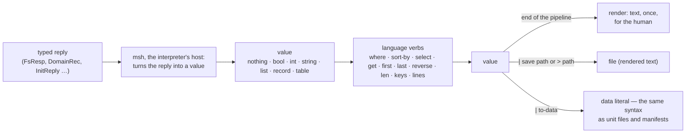
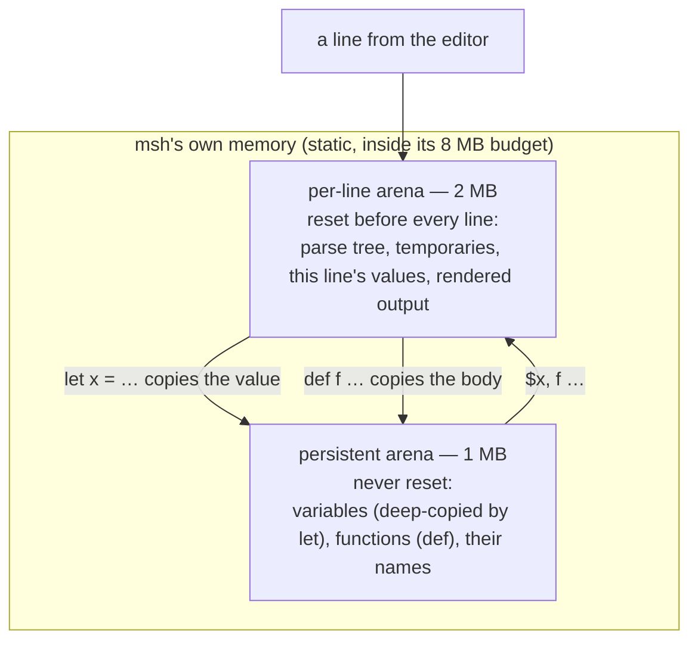
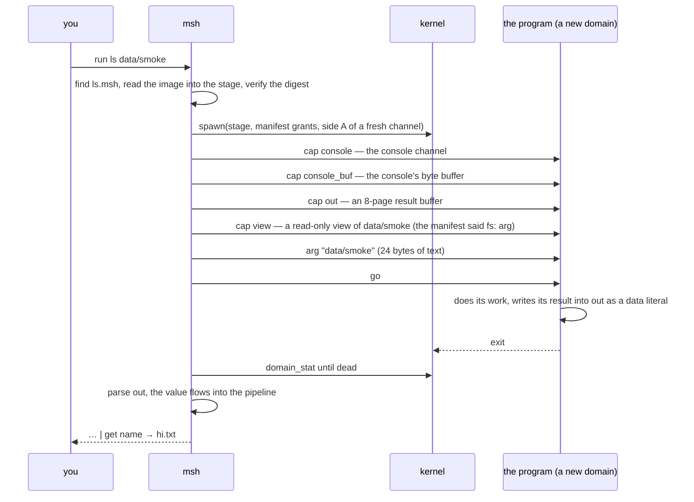

# The shell and its language

## In one breath

msh is the console you get when moss boots, and it is an ordinary
sandboxed program: it holds a console, one filesystem view, a line to
init, and the right to spawn, and nothing else. Its language, mshl, is
a small pipeline language with one unusual rule: what flows between
commands is **values** — records and tables that came straight out of
typed messages — never text to be split and re-parsed. `ps` is a table,
`stat` is a record, `ls | where size > 4kb | get name` works on columns
and rows, and text appears only at the very end, when a value is drawn
for the person at the keyboard. The same syntax that scripts are
written in is also what unit files, settings, and program manifests are
written in, so one parser reads them all.

## How it works

### One program, six capabilities

msh takes its whole world over its boot channel, the way every unit
does (see [Filesystems and views](filesystem.md) for what a view is):

| Capability | What it is for | Required |
|---|---|---|
| `console` | the byte pipe to the virtio-console driver; the line editor lives on it | yes |
| `view` | a filesystem view — the system root in the system boot, the home in a session | yes |
| `init` | init's front channel: `svc`, `start`, `stop` | yes |
| spawner (a kernel grant) | `ps`/`mem` introspection and `run` | yes |
| `fabric` | `nodes`, `rspawn` | no — a session has none |
| `store` | a read-only view of the system program store | no — the system shell finds it in its own view |

Everything the shell does is typed IPC over those: file commands over
the view protocol, service control over init's protocol, `ps` and `mem`
over the kernel's introspection syscalls. There is no text protocol
anywhere below the prompt.

### Values, not text



A command in a pipeline receives the previous stage's value as its
input and produces a value. `ls` yields a table with columns `name`,
`type`, `size`, `mtime` (one `stat` per entry through the view);
`stat` a record with the same fields; `df` a record (`free_kb`,
`total_kb`, `encrypted`); `mem` a record (`free_mb`, `total_mb`,
`cores`, `uptime_s`); `ps` a table (`id`, `name`, `state`, `threads`,
`kobj_kb`, `kobj_max`, `user_kb`, `user_max`) built from the kernel's
own ledger records; `svc` a table (`id`, `name`, `state`, `restarts`,
`max`); `nodes` a table (`id`, `state`, `free_mb`); `cat` and `open` a
string; `tree` a drawn string; `write`, `mkdir`, `rm`, `mv`, `ln`,
`sync`, `install` and `source` nothing. Inside `where`, a bare word that
names a column of the current row *is* that column; everywhere else a
bare word is a string, so `hi.txt` and `10.77.0.1` stay whole.

The rendering is the last step and the only one that makes text. A
value saved with `save` (or `> path`, which is sugar for `| save path`)
is that rendered text; a value passed through `to-data` first is a
*data literal*, the strict subset of the language that `from-data`,
init's unit-file loader, the settings library and the store's manifest
reader all parse with one entry point that accepts literals and nothing
else — no commands, no variables.

### The language

```
let n = (ls data | len)
if $n == 1 { echo "one file" } else { echo many }
for f in (ls data | get name) { echo "file: $f" }
let i = 0; while $i < 3 { let i = $i + 1 }; $i
def twice [x] { $x * 2 }; twice 21
ls data | where size > 4kb | sort-by name --desc | select name size
(stat data/smoke).type == dir
ls data | select name > data/listing.txt
```

Statements are separated by `;` or newlines. A pipeline is stages
joined by `|`; a stage is a command name with arguments, or an
expression. Arguments and expressions may be words, `"strings"` (which
interpolate `$var`), `$vars`, `(sub | pipelines)`, `[lists]`, blocks,
and records `{ key: value, … }` (a `{` followed by `word:` is a record,
otherwise a block). Numbers take size units — `4kb`, `8mb`, `1gb`,
case-insensitive. Operators: `== != < <= > >=`, `+ - * / %`, `not`,
`and`, `or`; `.field` and `.index` reach into records and lists.
`def name [params] { body }` defines a function whose body outlives the
line; inside it `$in` is the pipeline input and the parameters bind for
the call. `source path` runs a script in the session, rendering every
top-level statement's value as it goes, the way the prompt does.

### The interpreter's memory



Nothing is ever freed piecemeal: a line's memory is one arena thrown
away when the next line starts, and what must outlive the line —
variables and function bodies — is copied into a second arena that is
never reset. A line too large for its arena is refused with "out of
memory", not a crash.

### Running a program

`run NAME [path]` looks the program up in the shell's own store and
then the system store (the lookup and what a manifest is are on the
[filesystem page](filesystem.md#programs-are-files-in-a-store)), stages
the image, verifies it against its digest, and spawns it in a fresh
domain under a small budget. The tool then takes its world over a boot
channel, exactly as a unit does from init:



The console is the program's until it exits; a program that was given
no `out` (run some other way) renders text for a human instead. A
non-zero exit is reported as a line; a missing program, an unreadable
image or a digest mismatch is an error and nothing is spawned.
`install NAME` copies a program from the system store into the shell's
own store, image verified on the way.

In a user session the shell also holds a badged channel to the session
manager, and four commands use it: `share PATH NAME USER [rw]` derives
a view of a path in the home and offers it; `shares` lists offers made
to and by this user as a table; `accept NAME` takes an offer and mounts
it as `@NAME`, so `ls @NAME`, `cat @NAME/file` and the rest work on it;
`unshare NAME` withdraws an offer at the source. A path beginning with
`@` names a mount; `mv` refuses to cross between a mount and the home.

### Startup, the prompt, and the editor


The startup script runs in the same interpreter, so its variables and
functions belong to the session. The archive's default prints the
message of the day and defines `alive` as `ps | where state == alive`.
An admin's `conf/msh/startup.msh` on the volume replaces it; in a
session, the home's own `conf/msh/startup.msh` is the only candidate
(a home has no `boot/`), so a session starts silent unless the user
writes one.

The line editor owns the console between commands: a 512-character
line, 16 lines of history (up/down), cursor keys, home/end/delete,
ctrl-a and ctrl-e (start and end of line), ctrl-k (kill to end), ctrl-u
(kill the line), ctrl-l (clear the screen, like the `clear` command),
ctrl-c (abandon the line, echoed as `^C`), and tab completion: command
and language names in command position, otherwise paths — the prefix's
directory listed through the view, directories marked with `/`. Errors
print as `error: <message>`; `exit` prints `bye` and ends the shell,
which in the system boot ends the system (msh is the essential unit)
and in a session ends the session.

### Running it

- `zig build run-shell` boots the system topology with msh on your
  terminal; the kernel log goes to `zig-out/shell-kernel.log`. `exit`
  shuts the machine down.
- `zig build run-login` boots the multi-user profile: a login prompt on
  your terminal and another on a TCP console at `127.0.0.1:31905`
  (`nc` to it); the drill users are `alice` / `alice-pass` and `bob` /
  `bob-pass`, and each gets msh with their home as its whole
  filesystem.
- The `shell` row of the gate drives a real scripted session over a
  socket console — every line of the language above is a step in that
  script, with its expected output asserted — and then `exit` must land
  the leak bar.

## In detail

- **Grants and budget.** The system shell's unit gives `console` (the
  `cons` unit), `view` (the root, rw), `init` (self) and `fabric`
  (`fabsvc`), with `grant: [log, spawner]` and an 8 MB user-memory
  budget; the spawner cap sits in slot 2 of its table. A session's
  template unit gives `console` and `store` from the session's own caps,
  `view` as the home root, and `init` as the session's init.
- **Console.** One 1-page shared buffer, handed to the driver with a
  `setup` message; output goes in 2 KB chunks; reads are blocking calls
  for up to 64 bytes. `\n` in rendered text becomes `\r\n` on the way
  out.
- **Values and verbs.** `where cond` filters rows (bare words are
  columns); `sort-by col [--desc]`; `select cols…`; `get col` (a list of
  that column); `first n`, `last n`, `reverse`, `len`, `keys` (a
  record's keys), `lines` (a string into a list), `echo`, `to-data`,
  `from-data`. The reserved words are `let`, `def`, `if`, `else`, `for`,
  `in`, `while`, `not`, `and`, `or`, `true`, `false`, `null`. `let`
  keeps up to 32 variables and `def` up to 16 functions.
- **Commands.** `ls [p]`, `tree [p] [--depth n]` (default depth 8),
  `cat p`, `open p`, `write p text`, `save p`, `stat p`, `mkdir p`,
  `rm p`, `mv a b`, `ln p target` (a symlink), `readlink p` (up to 256
  bytes), `sync`, `df`, `ps`, `mem`, `svc`, `start N`, `stop N` (a
  deliberate stop is remembered and not restarted), `nodes`,
  `rspawn NODE IMAGE` (a record with the node it landed on and the
  answer to a 40+2 RPC), `rand` (16 bytes from the kernel pool as 32
  hex characters; refused while the pool is unseeded), `run`,
  `install`, `source`, `help`, `clear`, `exit`.
- **run.** The stage is a 256 KB buffer (64 pages); the image is read
  through the store's view in 32 KB pieces and verified before anything
  else. The child gets a 512 KB kernel-object and 2 MB user-memory
  budget, `log`, side A of its boot channel, and `introspect` only if
  the manifest grants it. The result buffer is 8 pages; a program's
  value is a NUL-terminated data literal there, a table being a list of
  records. The run argument travels as three words: 24 bytes.
- **Memory.** Per-line arena 2 MB, persistent arena 1 MB, both static
  in msh's image. A program's result-building arena (`user/result.zig`)
  is 128 KB.
- **Editor.** Line 512 bytes, history 16, completion up to 32
  candidates of 64 bytes.
- **Data files.** `parseData` accepts one literal: numbers with units,
  strings, bare words, `true`/`false`/`null`, lists, records, comments —
  and refuses anything executable. A `.msh` file is a program or data
  depending only on which entry point reads it; `write data/s.msh "let
  n = 7; $n + 1000"` followed by `source data/s.msh` prints 1007, while
  `ls data | to-data | save data/l.msh` followed by `open data/l.msh |
  from-data` gives the table back.

## Known limits and bugs

- `save` alone (and `> path`) writes *rendered text*; only a `to-data`
  value round-trips as data.
- A run argument is 24 bytes of text; a longer path cannot be passed.
- The system store is the only source of programs for `install`.
- At most 8 mounted shares; a mount's buffer stays mapped after the
  share dies or is replaced (the cap is dropped, the page is not).
- A session's shell has no fabric: `nodes` and `rspawn` are errors
  there. `rspawn`'s image argument is a catalog number, not a name.
- 32 variables and 16 functions per session; a 512-character line; 16
  lines of history; one 2 MB arena per line (a very large `open` or
  `tree` is "out of memory", not a crash).
- Strings interpolate `$var` only — no expressions inside strings; no
  globbing; no job control or background commands; the console has one
  client, so a `run` program owns it until it exits.
- The startup script in a session comes only from the home; there is no
  system default there.
- Bare words are strings everywhere but inside `where`; a column name
  used elsewhere is a string, not a lookup.

## Dig deeper

- DESIGN.md — "Developer tooling" (msh as built, msh v2, programs
  return values, the run handshake and the introspection authority).
- ROADMAP.md — "Developer shell and tooling", "msh v2", "Programs as
  files", "Manifests beside images, and a per-user store".
- Source — `user/shell.zig` (the host: every command, `run`,
  `install`, startup, the REPL), `lib/mshl.zig` (the language: grammar
  in the header comment, values, verbs, `parseData`, `writeData`,
  `evalScript`; host-tested with `zig test lib/mshl.zig`),
  `user/lineedit.zig`, `user/tty.zig`, `user/result.zig`,
  `boot/conf/msh/startup.msh`, `tools/runner.zig` (`shell_script`: the
  session the gate drives).
