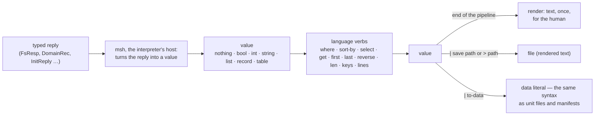
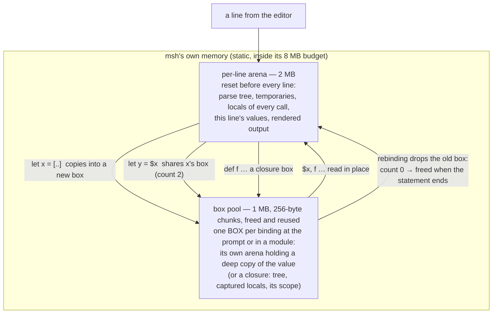
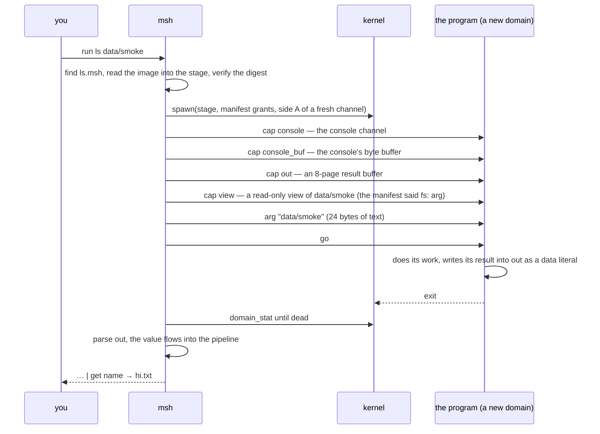
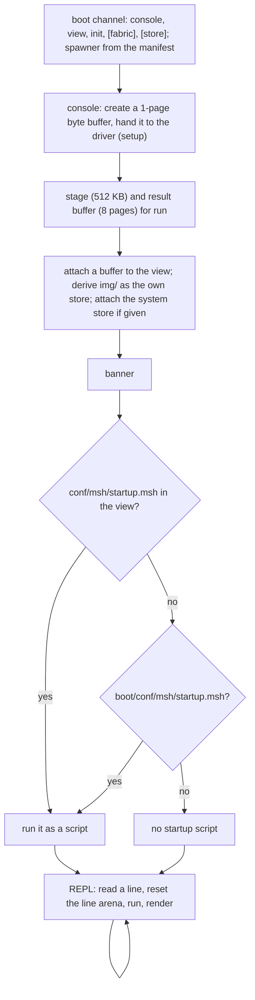

# The shell and its language

## In one breath

msh is the console you get when moss boots, and it is an ordinary
sandboxed program: it holds a console, one filesystem view, a line to
init, and the right to spawn, and nothing else. Its language, mshl, is
a small pipeline language with one unusual rule: what flows between
commands is **values** — records and tables that came straight out of
typed messages — never text to be split and re-parsed. `ps` is a table,
`stat` is a record, `ls | where size > 4kb | get name` works on columns
and rows, and text appears only at the very end, when a value is drawn
for the person at the keyboard. The same syntax that scripts are
written in is also what unit files, settings, and program manifests are
written in, so one parser reads them all.

## How it works

### One program, six capabilities

msh takes its whole world over its boot channel, the way every unit
does (see [Filesystems and views](filesystem.md) for what a view is):

| Capability | What it is for | Required |
|---|---|---|
| `console` | the byte pipe to the virtio-console driver; the line editor lives on it | yes |
| `view` | a filesystem view — the system root in the system boot, the home in a session | yes |
| `init` | init's front channel: `svc`, `start`, `stop` | yes |
| spawner (a kernel grant) | `ps`/`mem` introspection and `run` | yes |
| `fabric` | `nodes`, `rspawn` | no — a session has none |
| `store` | a read-only view of the system program store | no — the system shell finds it in its own view |

Everything the shell does is typed IPC over those: file commands over
the view protocol, service control over init's protocol, `ps` and `mem`
over the kernel's introspection syscalls. There is no text protocol
anywhere below the prompt.

### Values, not text



A command in a pipeline receives the previous stage's value as its
input and produces a value. `ls` yields a table with columns `name`,
`type`, `size`, `mtime` (one `stat` per entry through the view);
`stat` a record with the same fields; `df` a record (`free_kb`,
`total_kb`, `encrypted`); `mem` a record (`free_mb`, `total_mb`,
`cores`, `uptime_s`); `ps` a table (`id`, `name`, `state`, `threads`,
`kobj_kb`, `kobj_max`, `user_kb`, `user_max`) built from the kernel's
own ledger records; `svc` a table (`id`, `name`, `state`, `restarts`,
`max`); `nodes` a table (`id`, `state`, `free_mb`); `cat` and `open` a
string; `tree` a drawn string; `write`, `mkdir`, `rm`, `mv`, `ln`,
`sync`, `install` and `source` nothing. Inside `where`, a bare word that
names a column of the current row *is* that column; everywhere else a
bare word is a string, so `hi.txt` and `10.77.0.1` stay whole.

The rendering is the last step and the only one that makes text. A
value saved with `save` (or `> path`, which is sugar for `| save path`)
is that rendered text; a value passed through `to-data` first is a
*data literal*, the strict subset of the language that `from-data`,
init's unit-file loader, the settings library and the store's manifest
reader all parse with one entry point that accepts literals and nothing
else — no commands, no variables.

### The language

```
let n = (ls data | len)
if $n == 1 { echo "one file" } else { echo many }
for f in (ls data | get name) { echo "file: $f" }
def twice [x] { $x * 2 }; twice 21
ls data | where size > 4kb | sort-by name --desc | select name size
ls data | filter { $it.size > 0 } | map { $it.name }
[1, 2, 3, 4] | reduce 0 { $acc + $it }
let inc = fn [x] { $x + 1 }; $inc 41
match (int $text) { ok $n => $n * 2; err $e => echo "not a number: $e" }
def total { $in | map { (int $it)? } | reduce 0 { $acc + $it } }
let math = (use lib/math.msh); $math.double 21
```

Statements are separated by `;` or newlines. A pipeline is stages
joined by `|`; a stage is a command name with arguments, a function
value with arguments (`$inc 41`, `$math.double 21`), or an expression.
Arguments and expressions may be words, `"strings"` (which interpolate
`$var`), `$vars`, `(sub | pipelines)`, `[lists]`, records
`{ key: value, … }` (a `{` followed by `word:` is a record, otherwise a
block), and blocks. Numbers take size units — `4kb`, `8mb`, `1gb`,
case-insensitive. Operators: `== != < <= > >=`, `+ - * / %`, `not`,
`and`, `or`; `.field` and `.index` reach into records and lists.
`source path` runs a script in the session, rendering every top-level
statement's value as it goes, the way the prompt does.

**Types are strong, not static.** Every value is one of nothing, bool,
int, string, bytes, list, record, table, function, result, and nothing
coerces: `if 1 { }` is the error "if: condition is a int, not a bool",
`1 == "1"` is "cannot compare a int with a string", and `1 + "a"` is
refused. Only `null` compares with anything (absence is a fair
question). Conversions are commands with typed answers: `str v`
renders a value, `int text` gives a *result* (`ok 42` or `err …`), and
`type v` names the type. Strings are UTF-8 by construction — a literal
that is not valid UTF-8 is a syntax error — with `len` in code points;
`to-bytes` makes bytes of one, `from-bytes` gives an `ok` string or an
`err` when the bytes are not UTF-8, and `+` joins bytes with bytes.

**Functions are values.** `def name [params] { body }` binds one to a
name; `fn [params] { body }` makes one anywhere. Inside, `$in` is the
pipeline input and the parameters bind for the call; a `let` in the
body is local to the call. A block written as a *command argument* is
a function of `$it` (and `$acc`, for `reduce`), which is what the
higher-order verbs take: `map`, `filter`, `reduce init`, `any`, `all`,
`find` — on lists, or on tables row by row. A function is a closure: it
carries a snapshot of the locals of the function that made it (an
`adder [n]` returning `fn [x] { $x + $n }` remembers its `n`), and it
reads the *scope* it was defined in — the session's, or a module's —
by name when it runs, so functions call each other, and themselves, by
name (`fact` calls `fact`), and see a scope's names as they are at call
time.

**Failure is a value.** `ok v` and `err e` make results. `?` after an
expression or a stage unwraps an `ok` and returns the `err` from the
enclosing function — at the prompt, where there is nothing to return
to, it is the error "unhandled err …". `try { … }` (or `try (expr)`)
turns a command that fails into an `err` carrying its message, and a
value into an `ok`. `match` takes a result apart:

```
match (try { cat $path }) {
  ok $text if ($text | len) > 0 => $text | lines | first 1
  ok _                          => "empty"
  err $e                        => echo "cannot read: $e"
}
```

**Match.** `match value { pattern [if guard] => body … }` tries the
arms in order; a body is a block or one statement on the same line. Patterns are
`_` (anything), `$name` (anything, bound), literals (`1`, `"text"`, a
bare word as a string — `dir`, `file` — `true`, `false`, `null`),
`ok p` and `err p`, lists `[p, p]`, `[$head, ..$tail]`, `[1, ..]`, and
records `{ name: $n, size: 0 }` or `{ name }` (which binds `$name`);
a record pattern matches a record that has at least those fields.
Bindings are local inside a function and session variables at the
prompt, like `for`'s. A `match` must be exhaustive, and that is checked
when it is parsed, not when the missing case arrives: a catch-all arm
(`_` or `$x`, unguarded), both `ok _` and `err _`, or both `true` and
`false` — a list or record pattern never counts as covering, so
`match $l { [] => …; [$h, ..$t] => … }` needs a `_ =>` too.

**Handles.** A capability the host holds for the program — a socket, a
listener — is a value of its own kind (`type $s` is `socket`), counted
like a function: bind it, put it in a record, capture it in a closure,
and it lives; drop the last of those and the host is told to release
it (a socket is closed). A handle made and not bound is released when
the statement ends. Handles are not data (`to-data` refuses them).

**Modules.** `use path` reads a file through the shell's `open`,
evaluates it in a scope of its own, and returns its bindings as a
record: `let math = (use lib/math.msh)`, then `$math.double 21`,
`$math.version`, `[1, 2] | map $math.double`. The module's functions
find each other in the module's scope, never in the session's, and the
scope lives as long as any of them does. There is no global namespace:
a module reaches another only by `use`.

### The interpreter's memory



Calls allocate nothing lasting, and not much that is temporary: a
call's frame (its parameters, captures and locals) comes from a pool
the line keeps, returned when the call returns, so ten thousand `map`
calls reuse one frame and a recursion fifty deep costs fifty — the
first version made a frame per call and ran a 64 KB `join` out of its
arena. Values are immutable, so memory is a matter of counting who
holds what. Everything a line makes lives in its arena and is gone when the
next line starts. What must outlive the line — a variable bound at the
prompt, a function, a module's bindings — is a *box*: a small arena of
its own with a reference count. `let` deep-copies the value into a
fresh box (a scalar — nothing, a bool, an int — needs no box and lives
in the binding itself), `let y = $x` shares x's box instead of copying,
a record holding a function keeps the function's box alive, and
rebinding or unbinding a name drops a reference. A box at zero is
freed when the top-level statement ends — not the instant it hits
zero, because `for v in $l { let l = … }` is still walking the old
list — and a box freed drops everything it held. The count is exact:
the host tests run every test under Zig's leak-detecting allocator and
the interpreter's `deinit` must give every byte back. Calls allocate
nothing lasting: a function's parameters, captures and locals are a
frame in the line arena.

Scopes — the session's, and one per `use` — are where names live, and
they hold the one cycle in the whole graph: a function points at the
scope it was defined in (that is how it calls its siblings by name),
and the scope's slots hold the function. The interpreter knows this
cycle and collects it deliberately: a scope nobody holds (the session
until `exit`; a module once `use` has returned) whose functions are
referenced only from its own slots is garbage, checked at the end of
every statement; there is no other tracing anywhere. A closure made
inside a function copies the locals it names *at that moment* — a
snapshot — never a pointer to a frame, so frames stay in the arena and
closures never form a cycle among themselves.

### Running a program

`run NAME [path]` looks the program up in the shell's own store and
then the system store (the lookup and what a manifest is are on the
[filesystem page](filesystem.md#programs-are-files-in-a-store)), stages
the image, verifies it against its digest, and spawns it in a fresh
domain under a small budget. The tool then takes its world over a boot
channel, exactly as a unit does from init:



The console is the program's until it exits; a program that was given
no `out` (run some other way) renders text for a human instead. A
non-zero exit is reported as a line; a missing program, an unreadable
image or a digest mismatch is an error and nothing is spawned.
`install NAME` copies a program from the system store into the shell's
own store, image verified on the way. A manifest may carry `arg` (the
program's role, as in a unit file) and grant `bootfs` besides
`introspect`; a run tool gets 1 MB of kernel-object and 8 MB of user
memory. `run apply` makes the volume match `conf/system.msh` (see
[Users and sessions](users.md)) and returns what it did as a table.

### Scripts as programs

A script is a program when `mshrun` runs it. The image takes one view
and an argument — the script's path in that view — evaluates the script
with the shared file commands (`ls`, `tree`, `cat`, `open`, `write`,
`save`, `stat`, `mkdir`, `rm`, `mv`, `ln`, `readlink`, `sync`, `df`,
`source`, and through `open`, `use`) as its whole host, and has exactly
the authority its manifest or unit file gives it: no console, no
spawner, no fabric unless given. Three ways to run one:

- **From the shell**: `run mshrun data/s.msh`. The archive's manifest
  for `mshrun` gives it the shell's whole filesystem as a writable view
  (`fs: ""`), the console, and an `out` buffer; the script's *last*
  statement's value comes back as the command's value (`run mshrun
  data/report.msh | where size > 1kb`), and nothing is rendered on the
  way — a program run by msh returns a value, like `ls` and `ps`. A
  failing script exits 1 with its error on the console, which `run`
  reports as an exit code.
- **As a unit**: a unit file naming the image and the script —
  `{ image: mshrun, script: scripts/hello.msh, give: [ { tag: view, fs:
  boot, ro: true } ], oneshot: true, profiles: [system] }` — runs it at
  boot with the view the unit gives; every statement's value is
  rendered to the log, one `mshrun: …` line each, and an error is a
  non-zero exit (which, for a `oneshot` step, takes the boot down: a
  script can be a drill step). The archive's `script-hello` unit is
  that example: it counts the unit files and logs the count.
- **Anywhere a manifest goes**: the manifest decides the view and the
  grants, so a copy in a user's store with a narrower `fs:` is a script
  that sees one directory, and `install mshrun` puts the runner in a
  home's store.

In a user session the shell also holds a badged channel to the session
manager, and four commands use it: `share PATH NAME USER [rw]` derives
a view of a path in the home and offers it; `shares` lists offers made
to and by this user as a table; `accept NAME` takes an offer and mounts
it as `@NAME`, so `ls @NAME`, `cat @NAME/file` and the rest work on it;
`unshare NAME` withdraws an offer at the source. A path beginning with
`@` names a mount; `mv` refuses to cross between a mount and the home.

### Startup, the prompt, and the editor



The startup script runs in the same interpreter, so its variables and
functions belong to the session. The archive's default prints the
message of the day and defines `alive` as `ps | where state == alive`.
An admin's `conf/msh/startup.msh` on the volume replaces it; in a
session, the home's own `conf/msh/startup.msh` is the only candidate
(a home has no `boot/`), so a session starts silent unless the user
writes one.

The line editor owns the console between commands: a 512-character
line, 16 lines of history (up/down), cursor keys, home/end/delete,
ctrl-a and ctrl-e (start and end of line), ctrl-k (kill to end), ctrl-u
(kill the line), ctrl-l (clear the screen, like the `clear` command),
ctrl-c (abandon the line, echoed as `^C`), and tab completion: command
and language names in command position, otherwise paths — the prefix's
directory listed through the view, directories marked with `/`. Errors
print as `error: <message>`; `exit` prints `bye` and ends the shell,
which in the system boot ends the system (msh is the essential unit)
and in a session ends the session.

### Running it

- `zig build run-shell` boots the system topology with msh on your
  terminal; the kernel log goes to `zig-out/shell-kernel.log`. `exit`
  shuts the machine down.
- `zig build run-login` boots the multi-user profile: a login prompt on
  your terminal and another on a TCP console at `127.0.0.1:31905`
  (`nc` to it); the drill users are `alice` / `alice-pass` and `bob` /
  `bob-pass`, and each gets msh with their home as its whole
  filesystem.
- The `shell` row of the gate drives a real scripted session over a
  socket console — every line of the language above is a step in that
  script, with its expected output asserted — and then `exit` must land
  the leak bar.

## In detail

- **Grants and budget.** The system shell's unit gives `console` (the
  `cons` unit), `view` (the root, rw), `init` (self) and `fabric`
  (`fabsvc`), with `grant: [log, spawner]` and an 8 MB user-memory
  budget; the spawner cap sits in slot 2 of its table. A session's
  template unit gives `console` and `store` from the session's own caps,
  `view` as the home root, and `init` as the session's init.
- **Console.** One 1-page shared buffer, handed to the driver with a
  `setup` message; output goes in 2 KB chunks; reads are blocking calls
  for up to 64 bytes. `\n` in rendered text becomes `\r\n` on the way
  out.
- **Values and verbs.** `where cond` filters rows (bare words are
  columns; `$it` is the row or item); `sort-by col [--desc]`;
  `select cols…`; `get col` (a list of that column); `first n`,
  `last n`, `reverse`, `len`, `keys` (a record's keys), `lines` (a
  string into a list), `echo`, `to-data`, `from-data`; `map f`,
  `filter f`, `reduce init f`, `any f`, `all f`, `find f` (a function
  or a block of `$it`); `range a b`; `join sep`, `split sep`; `str`,
  `int` (a result), `type`; `to-bytes`, `from-bytes` (a result);
  `to-json`, `from-json`; `ok`, `err`; `use path`. The reserved words are `let`, `def`, `fn`, `if`,
  `else`, `for`, `in`, `while`, `match`, `try`, `not`, `and`, `or`,
  `true`, `false`, `null`; `_` and `..` mean something only in a
  pattern. A scope holds up to 128 bindings (variables and functions
  together); modules nest 8 deep.
- **Network commands** (when the unit gives a `net` view; the system
  shell's does not, `mshrun`'s may): `connect ADDR PORT`, `listen PORT`,
  `accept $l`, `send $s DATA`, `recv $s [max]`, `close $s`, `status $s`
  — sockets and listeners are handles, results carry the outcome; and
  HTTP on them: `http-read $s`, `http-write $s RESP`, `serve $l $handler
  [n]`, `fetch URL [opts]`; see [the networking
  page](networking.md#sockets-as-values-the-language-surface).
- **The fabric** (when the unit gives a `fabric` cap: the system
  shell's does, a user session's does not): `x | remote NODE { … }`
  runs the block on another node with `$in` = `x` and returns its
  value; `nodes`, `rspawn`. A function remembers its source text for
  this (`remote NODE $f` ships `$f`'s body; captures do not cross). See
  [the fabric page](fabric.md#remote-stages-a-functions-body-on-another-node).
- **`sleep MS`** waits, in the host's ticks (rounded up to ten
  milliseconds); **`now`** is milliseconds since boot, a clock for
  measuring (the drills time things with it).
- **JSON.** `to-json` writes the data subset (a table as an array of
  objects), `from-json` reads it back (an array of same-shaped objects
  becomes a table); numbers with a fraction or exponent are refused.
- **Commands.** `ls [p]`, `tree [p] [--depth n]` (default depth 8),
  `cat p`, `open p`, `write p text`, `save p`, `stat p`, `mkdir p`,
  `rm p`, `mv a b`, `ln p target` (a symlink), `readlink p` (up to 256
  bytes), `sync`, `df`, `ps`, `mem`, `svc`, `start N`, `stop N` (a
  deliberate stop is remembered and not restarted), `nodes`,
  `rspawn NODE IMAGE` (a record with the node it landed on and the
  answer to a 40+2 RPC), `rand` (16 bytes from the kernel pool as 32
  hex characters; refused while the pool is unseeded), `run`,
  `install`, `source`, `help`, `clear`, `exit`.
- **run.** The stage is a 512 KB buffer (128 pages; it was 256 KB until msh itself outgrew it); the image is read
  through the store's view in 32 KB pieces and verified before anything
  else. The child gets a 512 KB kernel-object and 2 MB user-memory
  budget, `log`, side A of its boot channel, and `introspect` only if
  the manifest grants it. The result buffer is 8 pages; a program's
  value is a NUL-terminated data literal there, a table being a list of
  records. The run argument travels as three words: 24 bytes.
- **Memory.** Per-line arena 2 MB; box pool 1 MB in 256-byte chunks
  (`lib/pool.zig`: first fit for a run of chunks, freed by clearing
  their marks; a box whose value outgrows the pool is "out of memory");
  both static in msh's image. A program's result-building arena
  (`user/result.zig`) is 128 KB.
- **Editor.** Line 512 bytes, history 16, completion up to 32
  candidates of 64 bytes.
- **mshrun.** Reads the script through its view (`open`-style, whole
  file), runs it with a 1 MB arena and a 512 KB box pool, delivers a
  data value (never a function, result or bytes — those are not data)
  through `out` when it has one, else logs or prints the rendering;
  exits 0, or 1 with `mshrun: <path>: <error>`. The script path is the
  24-byte argument text (`script:` in a unit file, the `run` argument
  from the shell).
- **Data files.** `parseData` accepts one literal: numbers with units,
  strings, bare words, `true`/`false`/`null`, lists, records, comments —
  and refuses anything executable. A `.msh` file is a program or data
  depending only on which entry point reads it; `write data/s.msh "let
  n = 7; $n + 1000"` followed by `source data/s.msh` prints 1007, while
  `ls data | to-data | save data/l.msh` followed by `open data/l.msh |
  from-data` gives the table back.

## Known limits and bugs

- `save` alone (and `> path`) writes *rendered text*; only a `to-data`
  value round-trips as data.
- A run argument is 24 bytes of text; a longer path cannot be passed —
  a script's path included.
- A script run by `mshrun` prints nothing when it has an `out` (its
  value is its result); a script that wants to talk and return must
  build a value that says both.
- The system store is the only source of programs for `install`.
- At most 8 mounted shares; a mount's buffer stays mapped after the
  share dies or is replaced (the cap is dropped, the page is not).
- A session's shell has no fabric: `nodes` and `rspawn` are errors
  there. `rspawn`'s image argument is a catalog number, not a name.
- 128 bindings per scope; a 512-character line; 16 lines of history;
  one 2 MB arena per line (a very large `open` or `tree` is "out of
  memory", not a crash); a 1 MB pool for everything bound at the prompt.
- No floats: `int` is the only number. No tuples, by decision: a record
  is the grouping.
- A `?` at the prompt has no function to return from and is an error;
  wrap the line in a function or `match` instead.
- A block argument sees only `$it` (and `$acc` in `reduce`); write
  `fn [a, b] { … }` for anything else.
- A handle's release happens at the end of the statement that dropped
  its last reference (the same rule as every box), not the instant of
  the drop.
- Optional shape annotations (`{ name: string }`) and host-command
  signatures from the protocol types are decided but not built: a
  wrong type is caught when it is used, not at the boundary.
- Rebinding a list-valued variable inside a loop that walks it keeps
  the old value until the statement ends — deliberate, and memory a
  long loop should not spend; `map`/`reduce` are the shape for that.
- Host commands (`cat`, `ls`, `stat` …) still *fail* rather than return
  results; `try { … }` is the bridge until stage 2 gives them
  signatures.
- `use` reads through `open`, so a module path is relative to the view
  like any file; a module cannot be loaded from the store yet.
- A module's functions cannot be called by a bare name from the session
  (`$math.double`, never `double`) — by design, there is no global
  namespace.
- The line editor accepts UTF-8 but counts bytes: the cursor keys and
  delete move one byte at a time, so editing inside a multi-byte
  character can split it — the line is then refused as invalid UTF-8,
  not run.
- Strings interpolate `$var` only — no expressions inside strings; no
  globbing; no job control or background commands; the console has one
  client, so a `run` program owns it until it exits.
- The startup script in a session comes only from the home; there is no
  system default there.
- Bare words are strings everywhere but inside `where`; a column name
  used elsewhere is a string, not a lookup.

## Dig deeper

- DESIGN.md — "Developer tooling" (msh as built, msh v2, programs
  return values, the run handshake and the introspection authority).
- ROADMAP.md — "Developer shell and tooling", "msh v2", "Programs as
  files", "Manifests beside images, and a per-user store".
- Source — `user/shell.zig` (the host: every command, `run`,
  `install`, startup, the REPL), `user/fscmds.zig` (the file commands
  msh and mshrun share), `user/mshrun.zig` (a script as a program),
  `lib/mshl.zig` (the language: grammar
  in the header comment, values, boxes and scopes, closures, `match`,
  results, verbs, `parseData`, `writeData`, `evalScript`; host-tested
  with `zig test lib/mshl.zig`, every test under the leak-checking
  allocator), `lib/pool.zig` (the box pool),
  `user/lineedit.zig`, `user/tty.zig`, `user/result.zig`,
  `boot/conf/msh/startup.msh`, `tools/runner.zig` (`shell_script`: the
  session the gate drives).
