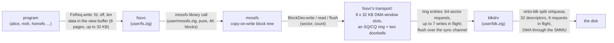
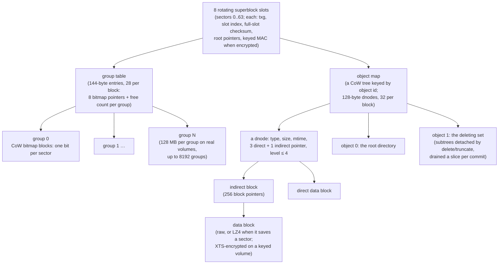
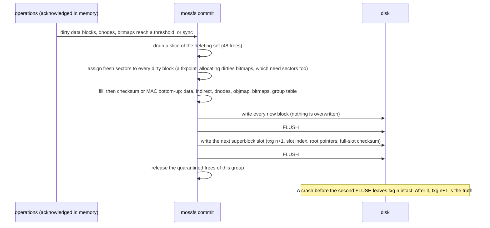
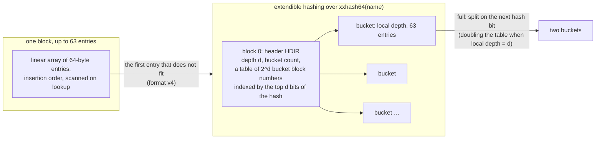

# Storage: the block stack and mossfs

## In one breath

Everything a moss program writes ends up on a disk it never touches. The
program talks to the filesystem service through a shared buffer; the
service runs **mossfs**, a filesystem that never overwrites anything in
place — every change writes new blocks and, at the end, flips one
superblock, so a crash at any instant leaves the disk as it was at the
last completed step, with nothing to repair. Every block carries a
checksum that is verified on every read, so corrupted data is detected
rather than returned. Data is compressed when that saves space and,
when the volume has a key, encrypted so that the disk holds only
ciphertext. Beneath all of that, a userspace block driver moves 32 KB
requests to a virtio disk, several at a time.

## How it works

### The stack

Nothing in the kernel knows what a file is. A write travels through four
userspace programs and one shared buffer before it reaches the device:

The **filesystem service** owns the volume and serves views (see
[Filesystems and views](filesystem.md)). A read or write moves up to
32 KB through the client's view buffer; block-aligned full writes skip
the read-modify-write of the committed block entirely.

The **transport** between fssvc and the block driver is a shared data
window of eight 32 KB slots plus an asynchronous ring: slot 0 is the read
slot, which also holds a 32 KB read-ahead (a sequential reader gets the
next seven blocks free; a write overlapping that range invalidates it),
and slots 1 to 7 are write staging. mossfs's allocator writes mostly
sequential runs, so fssvc merges them into an open 32 KB staging slot
and submits each full slot as one 64-sector request, keeping up to seven
in flight. That is sound because of one invariant the filesystem keeps:
**mossfs orders writes only at flush, and never reads back a sector
written since the last flush except through its own cache**, so writes
between two barriers may complete in any order. Flush itself goes over
the synchronous channel, and the reply is the barrier acknowledgement.

The **block driver** is an ordinary sandboxed program holding the
device's registers, interrupt line and DMA identity. It serves both the
sync channel and the ring from one loop, runs a split virtqueue of 32
descriptors with up to 8 requests in flight (up to 3 descriptors each),
and DMAs through per-slot 32 KB regions — through the SMMU, which
translates the device's addresses with the driver's own page tables, so
a wrong address is a refused access, not a corrupted kernel.

### What is on the disk

mossfs is a copy-on-write block tree in the ZFS family, written against a
4 KB block device interface (`read`, `write`, `flush`, a sector count).
The unit of allocation is a 512-byte sector; the unit of the tree is a
4 KB block.

- **Block pointers** are 16 bytes: `[flags 8 | stored size 8 | sector 48]`
  plus a 64-bit checksum — xxhash64 of the stored form on a plaintext
  volume, a keyed SipHash-2-4 MAC on an encrypted one. Every read
  verifies the pointer's checksum before using the block, so bit rot,
  misdirected writes and torn writes are detected; a torn 4 KB write is
  eight non-atomic sectors, which copy-on-write makes harmless because
  the old block is still there.
- **Objects, not inodes.** A 128-byte dnode holds the type (file,
  directory, symlink), size, modification time, three direct pointers
  and one indirect pointer with up to four levels — 16 TB per file. The
  dnodes live in the object map, itself a copy-on-write tree, with room
  for about a million objects. Object 0 is the root directory and object
  1 the deleting set.
- **Directories** are packed 64-byte entries (names up to 56 bytes).
  A directory that fits in one block is a flat array in insertion order.
  The first entry that does not fit converts it to extendible hashing
  (below).
- **Allocation** is by groups, each owning copy-on-write bitmap blocks
  referenced from a group table entry that also caches the group's free
  count, so mounting reads nothing proportional to the volume's size and
  a commit's cost tracks the groups it dirtied. Since format v3 the
  bitmap bit is a sector: metadata and raw data take one full free byte
  (8 aligned sectors); a compressed run of 1 to 7 sectors packs inside a
  byte and never crosses one. The free counter counts free *bytes*, an
  exact lower bound on full-block capacity, so fragmentation from
  compressed runs can never starve a commit invisibly, and a reserve of
  96 blocks is kept so that a commit can always land.

### How a change reaches the disk

Operations are acknowledged in memory and committed in **transaction
groups**, between operations and never inside one. A commit happens when
enough is dirty (144 data blocks or 32 dnodes — a 512 KB stream is one
group) or on an explicit `sync`, which is the durability barrier:
everything acknowledged before the reply is on disk.

Blocks freed during a group are **quarantined** until its superblock has
landed, so a crash can never find a live tree pointing into reused
space. Mount elects the highest-numbered superblock slot that fully
verifies; a torn slot loses only itself. There is no repair tool because
there is nothing to repair: a crash is always the last completed group.

**Deletes are asynchronous.** Delete and truncate detach whole subtrees
onto the deleting set — a persisted object — and return; each later
commit frees a bounded slice, and a mount resumes where the drain
stopped. A terabyte-scale delete cannot stall a commit, and crashing in
the middle of one needs no special case. `sync` drains fully before it
commits.

### Compression and encryption

A data block (file, directory or symlink content) is stored LZ4-
compressed only when that saves at least one sector; indirect blocks and
the object map stay raw. The checksum covers the stored form, so
verification always precedes decoding, and the decoder is output-driven
and bounds-checked: it stops at 4096 bytes and ignores the sector
padding, so hostile input cannot read or write out of bounds.

On a keyed volume, object data, indirect blocks and the object map are
encrypted with AES-256-XTS per 512-byte sector, the tweak being the
absolute sector number; copy-on-write means a rewrite lands at a fresh
sector, never reusing a tweak for new content under the same key.
Superblocks, the group table and the bitmaps stay in plaintext, so
mounting and allocation need no key, while every object operation and
all background work (draining, committing, clearing `volatile/`) is
gated on it. A 256-bit master key becomes, through HKDF-SHA256, the XTS
key pair, the block MAC key and a superblock MAC key. Encrypted blocks
use keyed MACs as their pointer checksums, so a plaintext parent leaks
no digest of plaintext, and every pointer is protected by a MAC'd parent
rooted at the MAC'd superblock. The key arrives over the service's boot
channel as a secret and is wiped after use; a wrong key fails at mount,
at the superblock MAC check, before anything else is read.

### Hashed directories

Lookup is one hash, one table read, one bucket scan. Buckets are ordinary
blocks of the directory object, so copy-on-write, checksums and
transaction groups cover a split like any other write; the crash sweep
across a conversion proves every cut leaves either the old directory or
the new one. Listing order is bucket order once a directory has grown
past one block. A volume written before v4 mounts unchanged and is
written as v4.

### Testing the format on the host

The mossfs core is a pure library, so `zig build test` runs it against a
RAM device that records every write: a **crash-injection sweep** cuts
the write sequence after every single write (and tears the final one)
and checks the volume mounts and matches a completed or previous state,
on plaintext and encrypted volumes and across a directory conversion; a
**corruption flip** must be detected and never returned; **superblock
election** must prefer an older valid slot over a torn newest; a
**randomized operation sequence** is mirrored against an in-memory
model; and the encrypted suite adds wrong-key and superblock-splice
rejection, ciphertext-flip fail-closed, compression accounting and
hostile-input decoder fuzzing. Persistence on real storage is proven by
the `fs` drill's second boot on the same disk image.

## In detail

- **Format constants** (`user/mossfs.zig`): block 4096 bytes, sector
  512, 8 sectors per block, 256 pointers per indirect block, 8
  superblock slots, 64-byte directory entries with 56-byte names,
  128-byte dnodes (32 per block), 4 indirection levels, 2^20 objects,
  144-byte group table entries (28 per block), superblock magic `MOS3`,
  format version 4 (version 3 volumes still mount). Groups are sized at
  format time (128 MB on real volumes; up to 8192 groups). Pointer
  flags: `comp` = LZ4-compressed, `enc` = XTS-encrypted; the stored size
  is 1 to 8 sectors.
- **Per-group limits**: a read cache of 96 blocks (keyed by masked
  sector, holding logical plaintext, inserted only after verification),
  at most 160 dirty data blocks and 48 dirty dnodes, 24 working bitmap
  blocks, 32 dirty group-table nodes, 768 quarantined frees; commit at
  144 dirty data blocks or 32 dirty dnodes; 48 deleting-set frees
  drained per commit; a reserve of 96 blocks.
- **Hashed directories**: header magic `HDIR`, maximum depth 9 (512
  buckets, about 32 K entries), a 64-byte bucket header, 63 entries per
  bucket, the table at byte 16 of the header block. Entry index is byte
  offset divided by 64 in both layouts, so removal is one zeroed entry
  either way.
- **Transport** (`user/fs.zig`, `user/blk.zig`, `shared/lib.zig`): a
  view buffer is 8 pages and one operation moves at most 32 KB; the DMA
  window is 8 slots of 32 KB (slot 0 reads and read-ahead, 1 to 7
  writes); a block request is at most 64 sectors; the ring has 16
  entries each way with a submission bell and a completion bell; the
  driver's virtqueue has 32 descriptors and 8 in-flight requests. Flush
  is a synchronous call whose reply is the barrier.
- **Mount policy**: a mount failure formats only a genuinely blank disk,
  meaning superblock sectors 0 to 63 entirely zero. Garbage, a wrong
  format or a wrong version are never wiped: the service logs it and
  serves the boot archive alone. A fresh format creates the standard
  tiers. `volatile/` is emptied at every mount. A file-backed home
  volume reads past its end as zeros, so a new file is a blank disk.
- **Encryption**: XTS tweak chaining per the IEEE P1619 XEX scheme over
  std.crypto's AES cores, run 8-wide over a sector's independent blocks;
  userspace builds with NEON and the hardware AES feature. LZ4 is the
  block format without a frame; inputs are capped at 64 KB; the encoder
  is a greedy single pass over a caller-provided hash table.
- **Baselines** (from DESIGN.md, measured 2026-09-01 on an M3 Max;
  `zig build bench` with hardware AES, `zig build bench-soft` with the
  AES feature stripped; ReleaseFast, 4 KB blocks, an 8 MB file over a
  RAM device):

  | Primitive (4 KB blocks) | hw AES | soft AES |
  |---|---|---|
  | xxhash64 | 7.9 GB/s | 7.0 GB/s |
  | SipHash-2-4 MAC | 1.2 GB/s | 1.2 GB/s |
  | AES-256-XTS encrypt / decrypt (8-wide) | 2.32 / 2.49 GB/s | 0.12 / 0.13 GB/s |
  | LZ4 compress, text / random | 2.3 / 1.2 GB/s | 3.0 / 1.3 GB/s |
  | LZ4 decompress, text | 5.7 GB/s | 7.1 GB/s |

  | mossfs core (RAM device), write+sync / read | hw AES | soft AES |
  |---|---|---|
  | plain, compressible | 1421 / 3333 MB/s | 1482 / 3548 MB/s |
  | plain, random | 789 / 4946 MB/s | 777 / 4864 MB/s |
  | encrypted, compressible | 1187 / 2557 MB/s | 435 / 688 MB/s |
  | encrypted, random | 476 / 893 MB/s | 93 / 110 MB/s |

  Whole stack under QEMU with Hypervisor.framework (a program's writes
  through IPC, fssvc, mossfs, the ring, the driver and virtio, on an
  encrypted volume; write / read in MB/s):

  | stage | incompressible | compressible |
  |---|---|---|
  | v3 as first landed (software AES, Debug userspace, 2 KB operations) | 3.6 / 4.1 | 9.6 / 11.2 |
  | with hardware AES | 13.4 / 18.6 | 20.6 / 28.4 |
  | with ReleaseSafe userspace, 32 KB operations, coalesced pipelined writes, read-ahead | 128 / 264 | 275 / 385 |

  Under pure emulation the last row reads 38 / 54 and 44 / 66. The `fs`
  drill logs these whole-stack numbers on every run.

## Known limits and bugs

- **Hard links** are deferred: a second directory entry for one object
  would let a file appear under two views, which the view-exclusivity
  design has to answer first. The dnode reserves a link count that is
  always 1.
- **Rename across parent directories** is refused (there is no ancestry
  walk yet); rename within one directory is atomic.
- A directory holds at most 512 buckets, about 32 K entries; a two-level
  table is the planned evolution.
- **Rollback**: someone with the disk can zero the newer superblock
  slots and roll a volume back by up to 8 transaction groups, or replay
  the whole disk, undetectably — there is no external anti-rollback
  state.
- MAC tags are 64-bit, a format constraint of the 16-byte pointer; a
  wider pointer is the upgrade path.
- Plaintext bitmaps and group table leak how full a volume is and how it
  churns. XTS with the MAC is tamper-evident, not authenticated
  encryption in the AEAD sense.
- Torn writes are detected, not repaired (copy-on-write makes them
  harmless); there is no scrub that walks a volume looking for rot.
- A home volume's capacity (8 MB reported) is not enforced.
- QEMU disks must keep the default writeback cache: `cache=unsafe`
  drops the FLUSH barriers the durability model depends on.

## Dig deeper

- DESIGN.md — "mossfs v2", "mossfs v3: compression and encryption",
  "Performance baselines", and "FP/SIMD context switching + hardware
  crypto" in ROADMAP.md; the "Drivers" section for virtio and the SMMU.
- HACKING.md — running `zig build test` (the mossfs suite), `zig build
  bench`, and the note on QEMU cache modes.
- Source — `user/mossfs.zig` (the format and the host tests at its
  end), `user/fs.zig` (the service, the transport, mount policy),
  `user/blk.zig` (the driver), `shared/lib.zig` (`BlkReq`, the ring,
  `fs_buf_pages`), `lib/lz4.zig`, `lib/xts.zig`, `tools/bench.zig`.
