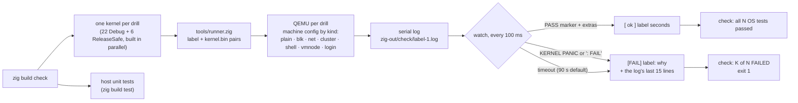
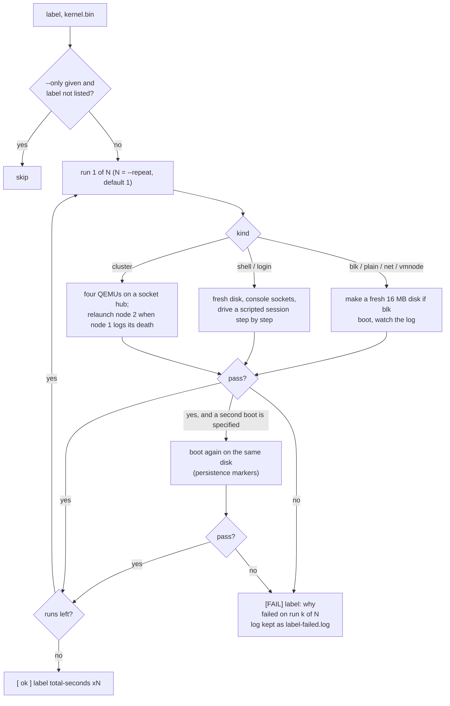
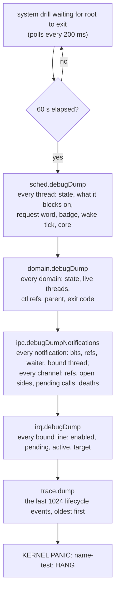
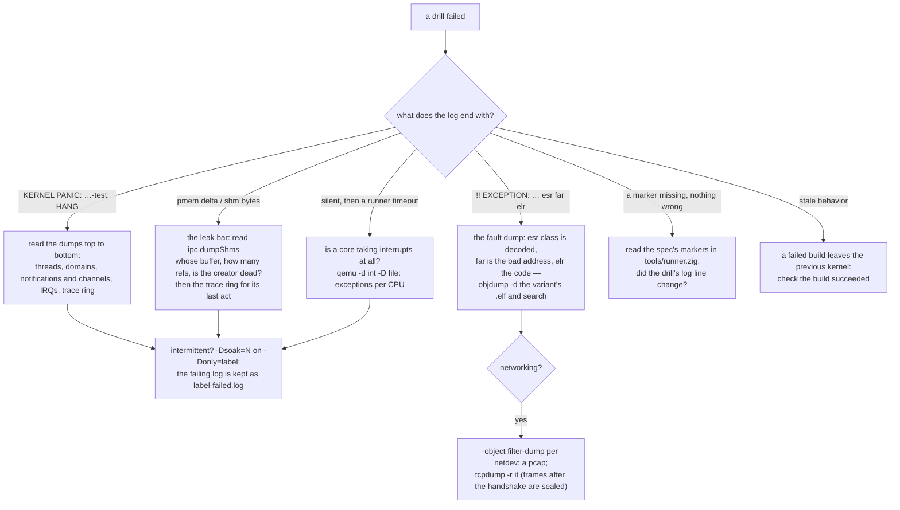

# The test gate and how to debug a failure

## In one breath

Before a change lands, one command boots the whole operating system
twenty-eight times inside an emulator, each boot running one drill —
scheduling under load, a filesystem on a real disk image, two users
logging in over two consoles, three machines forming a cluster — and
each drill ends by printing a pass line and switching the machine off.
The kernel also checks its own books at the end of every drill: not one
byte of memory may be unaccounted for. If a drill hangs instead of
finishing, the kernel prints everything it knows about every thread
and domain, then fails loudly, so that a hang is evidence rather than a
silence. The same command can repeat a drill ten times to catch a bug
that shows one time in four, and can boot the kernel in its optimized
build, where the compiler's reordering exposes races the plain build
hides.

## How it works

### The pipeline

`zig build check` builds one kernel per drill — the same source with a
different `-D<name>-test` option compiled in — and hands the runner
(`tools/runner.zig`) a list of *label, kernel image* pairs. For each
one the runner starts QEMU with the machine configuration the drill
needs (a scratch disk, a user-mode network, a cluster of nodes, console
sockets), points the serial port at a log file, and watches that file.

The verdict is textual. A drill passes when its pass marker
(`<name>-test: PASS …`) and any extra markers the spec requires appear
in the log; it fails the moment `KERNEL PANIC` or `: FAIL` appears, or
when its timeout lapses. Three drills — `panic`, `fault`, `pan` — exist
to prove the failure paths themselves, so for them a panic *is* the
pass marker.

Drills terminate themselves: the kernel driver prints the pass line and
calls PSCI `SYSTEM_OFF`, so QEMU exits and the normal case is a clean
run of a few seconds. The runner also runs the host unit tests
(`zig build test`) as part of the same step.

### The leak bar

Every drill that tears domains down ends with the same bookkeeping.
Before spawning anything the driver records the free page count; after
everything has exited it records it again. The two must be
byte-identical, and the shared-buffer account must be at zero. If not,
the kernel prints every still-active shared buffer with its page count,
reference count and creating domain (`ipc.dumpShms`), then the trace
ring, then panics with the delta. The system drills — those that boot
root and init from unit files — also require root's exit code to be 0.

### What the 23 drills prove

| Drill | Proves | Kind |
|---|---|---|
| `panic` | The panic handler prints and halts (a panic is the pass) | plain |
| `fault` | A kernel fault is decoded and reported with its address | plain |
| `pan` | A syscall touching user memory outside a copy window is refused by PAN | plain |
| `sched` | SMP scheduling: pinned and migrating threads under load | plain |
| `cpu` | CPU budgets and partitions: a quarter-core domain throttled, an unlimited sibling, a core reserved for one domain, a second reservation refused | plain |
| `domain` | Spawn, revoke, leak check; a blank domain has no authority | plain |
| `ipc` | Typed RPC, cap grants, fault-as-message, peer death, in-transit caps released, client identities reported dead, a call/reply benchmark | plain |
| `init` | Userspace root and init: lazy activation, supervised restart, re-wiring | plain |
| `sandbox` | An interposition proxy, nested domains, one-call subtree revocation | plain |
| `flap` | Restart-budget exhaustion escalates up the supervision tree | plain |
| `blk` | The userspace virtio-blk driver over sync channels and async rings, raced | blk |
| `smmu` | Every DMA translated by the SMMUv3; a rogue driver's DMA into a kernel page refused and recorded | blk |
| `vm` | A userspace VMM runs a bare-metal EL1 guest: trapped MMIO, injected timer ticks, PSCI power-off | plain |
| `guest` | A moss kernel as a guest of moss boots its own userspace and powers off | plain |
| `vmnode` | A moss guest with a passed-through NIC joins the fabric as node 2 and takes a remote spawn | vmnode |
| `fs` | Namespace views on real storage; persistence across a second boot; a hundred views reclaimed on client death | blk, two boots |
| `net` | Dual-stack TCP through the userspace network service; allowlist views; a script speaking TCP and HTTP with sockets as values, serving pages the runner fetches through a port forward; packets kept in `zig-out/check/net.pcap` | net |
| `rng` | The userspace virtio-rng driver seeds the kernel pool; `getrandom` fail-closed and policed | plain |
| `fabric` | Three nodes: per-node identities, join, gossip, placement, a node's death and rejoin, an imposter refused, spawn authorization, revocation | cluster |
| `shell` | A scripted msh session over a console socket: pipelines, the language (closures, `match`, results, modules), redirection, scripts, `run` (including `mshrun`, a script as a program, and the `script-hello` unit at boot); identity born on the first boot and restored on the second | shell, two boots |
| `users` | Users as keys, sessions as domains, homes as encrypted volumes; two sessions at once; work persisting across logins; a locked setting | blk |
| `login` | Two users at two consoles at once, each session an init instance with msh on its home; `run` from the system store, `install` into the home's own; a share offered, accepted, read through, refused a write, and withdrawn; seats freed | login |
| `flogin` | Fabric login: node 1 applies the users and publishes its session manager, node 2 (a fresh disk, a console) joins through its seed and alice logs in there — her record fetched from node 1, her home born on node 2 | flogin (two QEMUs on one segment) |

Six of them boot a second time under a ReleaseSafe kernel — the `+rs`
rows: `sched`, `domain`, `ipc`, `sandbox`, `fs`, `users`. These are the
drills that exercise the scheduler, IPC and teardown hardest, and the
optimizer reorders and merges what a Debug build leaves in source
order, so a data race or a non-volatile register read shows up there
and nowhere else. The first optimized boot ever run found exactly such
a bug: the lock's read of the interrupt mask had been scheduled after
the instruction that set it, so every unlock left interrupts masked and
core 0 never took an interrupt again.

### Drills as unit files

Most drills are not kernel code at all. The kernel driver for `fs`,
`net`, `users`, `login`, `shell` and `blk` is one function
(`systemDrill`): spawn root under a boot *profile*, wait for the system
to shut itself down, hold the leak bar. Everything else is unit files
under `boot/conf/units/`: a unit lists the profiles it is eager under,
a drill step is a `oneshot` unit whose exit 0 starts the units that
wait `after:` it, a non-zero exit takes the system down with that code,
and the last step is `essential` so its exit ends the boot.

### The runner's flow per drill

`-Dsoak=N` becomes `--repeat N`: the runner runs each drill N times and
stops that drill at its first failure. `-Donly=a,b` becomes `--only`:
labels not listed are skipped, and a bare name matches both its Debug
and its `+rs` row. On any failure the runner copies the run's log to
`<label>-failed.log`, which no later run overwrites — a failure that
took ten runs to show is not worth losing to an eager rerun.

### The hang watchdog

A drill that neither passes nor fails used to be a runner timeout on a
silent log. Now every system drill has a deadline: 60 seconds without
the system shutting down, and the kernel prints its whole state, then
panics.

Reading the dumps, in the order that has paid off:

- **A caller parked on `chan#N` while the server of `chan#N` sits in
  recv** is a dropped reply: the server took a call and went back to
  waiting without answering it.
- **A domain `dying` with `threads_alive` above zero and no thread of
  that name** is a lost reap: a thread died without being counted.
- **A manager sleeping in a poll of a domain that is not in the list**
  was the slot-reuse bug: the domain it watched had been recycled.
- **A notification with bits latched under a bound thread that is
  parked elsewhere** is a signal nobody consumed.
- **The trace ring** answers "how did it get here": a `destroy` with no
  `reaper_signal` after it, a `signal` whose path was 3 (bound thread
  not interrupted), a `spawn` reporting no watcher.

### The trace ring

`kernel/trace.zig` is a ring of 1024 events, each a tag, two words, the
tick and the name of the thread that recorded it, written with one
atomic increment and no lock or log line. It records domain lifecycle
— `spawn`, `destroy`, the reaper's `reaper_signal` and `no_watcher`,
`domain_stat` answers — and every notification `signal` with the path
it took (nobody waiting, woke a waiter, interrupted a bound recv, or
latched because the bound thread was not in recv). It is printed only
by the hang watchdog and by the leak-bar failure. Its reason to exist:
logging inside a race's window moves the race — forty runs with a log
line in the suspect path never reproduced a hang that the ring caught
on the second try. When a dump shows the end state but not the path to
it, add a `trace.record` at the suspect step.

## In detail

- **Building.** The kernel follows `-Doptimize` (Debug by default);
  user programs build ReleaseSafe by default, overridable with
  `-Duser-optimize`. Each check variant is `kernel/main.zig` compiled
  with exactly one `<name>_test` option true; the `+rs` variants are the
  same with `.ReleaseSafe`. Labels name the log and disk files, so the
  two passes never share them: `zig-out/check/<label>-1.log`,
  `<label>-2.log` for a second boot, `<label>.img` for the disk, and
  `<label>-node1.log` through `-node9.log` for the cluster.
- **Machine.** Every QEMU is `virt` with GICv3, an SMMUv3, EL2
  virtualization enabled, a Cortex-A76, 4 cores, 512 MB, a virtio-rng
  device, and no display; the serial port is a file. Disks are 16 MB
  sparse images created fresh per run; `blk` kinds attach one, `net`
  adds a user-mode NIC with a guest-forwarded echo at 10.0.2.100:9000,
  `shell` and `login` add virtio-serial consoles on TCP sockets the
  runner drives, `vmnode` adds a second NIC and entropy device for the
  guest, and `cluster` starts node 1 hosting a hub of socket listeners
  plus nodes 2, 3 and the imposter node 9.
- **Timeouts.** 90 seconds by default; 120 for `shell` and `login`, 150
  for `fabric`, 180 for `vmnode`. The log is polled every 100 ms and
  read up to 1 MB.
- **Markers.** `pass` is required; `extra` is required on the first
  boot only; `always_extra` on every boot; `second_run_extra` replaces
  `extra` on the second boot of a two-boot drill (`fs` and `shell`).
- **Scripted consoles.** The shell and login drills connect to the
  console sockets, wait for the prompt, send a line, and require an
  expected substring in the reply before the next prompt; the scripts
  live in the runner (`shell_script`, `login_script`).
- **The cluster.** Node 2 boots with `drill=1` and powers itself off;
  the runner waits up to 60 seconds of polls for node 1 to log the
  death, then relaunches node 2 so the rejoin path runs on every check.
- **Host unit tests.** `zig build test` runs four test binaries: the
  shared ABI (handles, message codecs, rings, the boot archive), the
  devicetree parser, the `lib/` modules (lz4, xts, fabric certificates,
  user credentials, layered settings, the msh language), and the full
  mossfs suite including both crash-injection sweeps.
  `zig test lib/mshl.zig` alone runs in about a second and is the loop
  for shell-language work.
- **Benchmarks.** `zig build bench` runs the primitives and the mossfs
  core over a RAM device in ReleaseFast with native AES; `bench-soft`
  strips the CPU's AES feature. The numbers live in DESIGN.md; the `fs`
  drill also logs whole-stack throughput lines on every run.
- **Interactive boots.** `zig build run` (TCG), `run-hvf` (Apple
  Silicon acceleration), `run-blk` (a scratch disk), `run-net`,
  `run-cluster`, `run-shell` (your terminal is msh; the kernel log goes
  to `zig-out/shell-kernel.log`; `exit` powers off), and `run-login`
  (a login prompt on your terminal and another on TCP port 31905).
  Unit-file drills need their profile passed as a boot argument; the
  runner does this itself.
- **One drill by hand.** `zig build -D<name>-test`, then
  `zig-out/bin/moss-check <name> zig-out/bin/moss-kernel.bin`; the
  runner is installed beside the kernel.
- **Watchdog arithmetic.** The wait loop sleeps 2 ticks (200 ms) per
  iteration and fires past 600 ticks; ticks are 100 ms.

### Debugging: which tool for which symptom

Recipes that have paid off, from HACKING.md:

- **The fault dump** prints the decoded exception class, the faulting
  address, the program counter and the top of the current thread's
  stack. A stack pointer below the thread's stack, or a status-register
  value where data should be, is a stack overflow; a Debug kernel spends
  over a kilobyte of stack per formatted log line.
- **Symbolizing an address** uses the variant's ELF, kept beside its
  binary: `objdump -d -l --start-address=… --stop-address=…` on
  `moss-check-<label>.elf` prints source lines.
- **Per-CPU exceptions.** QEMU's `-d int -D file` lists every exception
  with its CPU; one core taking none while the others tick is how the
  interrupt-mask bug above was found.
- **Packets.** `-object filter-dump,id=d0,netdev=n0,file=x.pcap` gives
  a pcap per NIC; fabric frames after the handshake are ciphertext, so
  log on the service side of the seal instead.
- **Device models explain themselves.** `-d guest_errors,unimp` shows
  the SMMU's refusals; `-trace 'smmuv3_*'` shows every translation.
- **A failed build leaves the previous kernel in `zig-out`.** Stale
  behavior means the build did not succeed.

### The habits

Every feature ends with the gate green, the design notes updated with
what was built and the lessons paid for, and one commit that tells the
story including the bugs found on the way. Tests are self-terminating
and panics are failures. Leak checks are part of every teardown test.
Verify in QEMU rather than reason from memory.

## Known limits and bugs

- The gate takes about two minutes and cannot run drills in parallel;
  the cluster, shell and login drills bind fixed TCP ports (31901 to
  31905), so two gates cannot run at once on one machine.
- Reproduction of a timing race depends on host conditions: several
  teardown races showed only on the first run after a build, with a
  fresh disk image, and never under added logging. The soak and the
  trace ring exist for that; there is no deterministic replay.
- The hang watchdog exists only in the system drills (`systemDrill`);
  the kernel-driven drills (`ipc`, `sched`, `vm` and the rest) rely on
  the runner's timeout and print no dumps on a hang.
- `-Dsoak` repeats a whole drill; there is no way to repeat one step
  inside it.
- Host unit tests cover the pure libraries and the ABI, not the kernel:
  kernel code is tested only under QEMU.
- The hypervisor drills (`vm`, `guest`, `vmnode`) run only under TCG;
  Apple's Hypervisor.framework offers no nested EL2 with VHE.
- The trace ring holds the newest 1024 events; a long-running boot
  overwrites the oldest, and the noisy events (doorbell waits) were
  removed from it for that reason.

## Dig deeper

- HACKING.md — "Build & run", "Debugging techniques that have paid off",
  and "An OS test" under "Adding things".
- DESIGN.md — "The gate (as built)" under Developer tooling; the
  "Locking" lessons and "Users and sessions" for the races the gate
  found; "Zig conventions" for the non-volatile register read.
- Source — `tools/runner.zig` (specs, kinds, scripts, verdicts),
  `build.zig` (the check section: variants, `+rs` rows, `soak`, `only`),
  `kernel/main.zig` (`systemDrill` and the kernel-driven test workers),
  `kernel/trace.zig`, and the dump helpers in `kernel/sched.zig`,
  `kernel/domain.zig`, `kernel/ipc.zig`, `kernel/irq.zig`.
