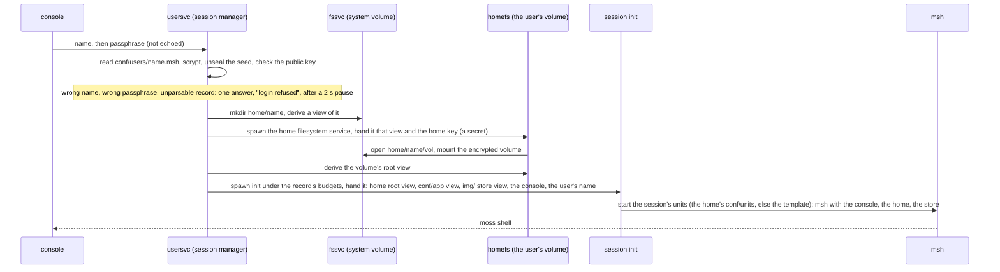
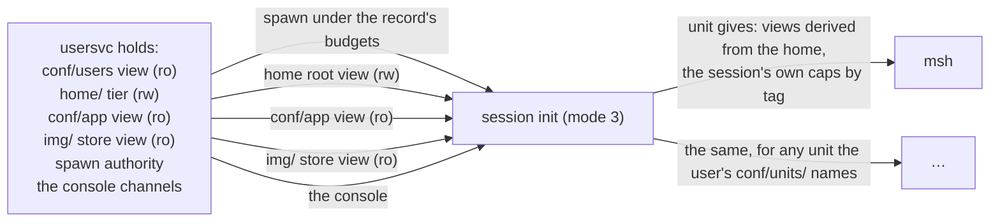
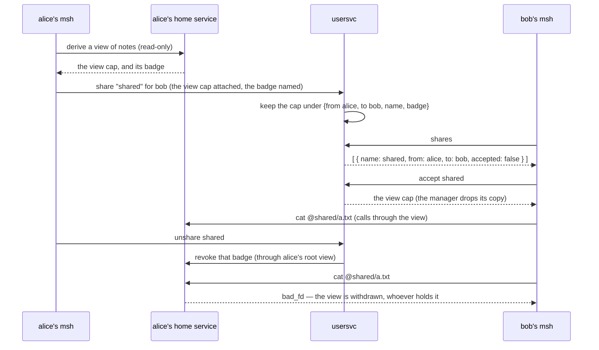
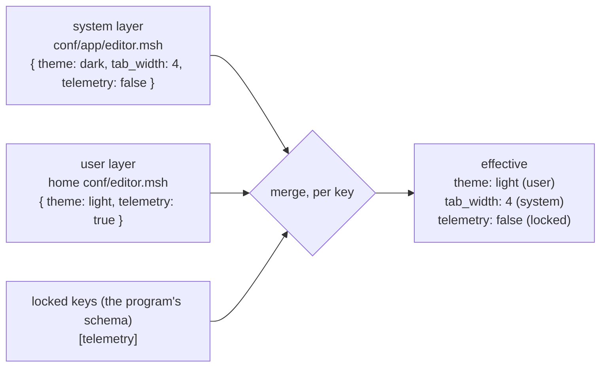
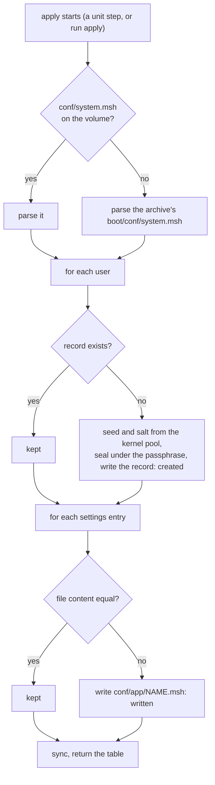

# Users and sessions

## In one breath

In moss a user is not a number the kernel knows about. A user is a
**key**: a cryptographic identity whose secret half is locked in a small
record under a passphrase. Logging in means unlocking that secret; there
is no password to compare and no list of who is allowed what. A login
starts a **session**, which is an ordinary sandboxed program tree running
under that user's resource limits, handed exactly the things it may
touch: the user's own home (a separate encrypted disk of its own — see
[Filesystems and views](filesystem.md)), the system's settings, the
system's program store, and the console it logged in from. Logging out
destroys that program tree, and the unlocked secret with it. There is no
root account, because administrative power is just holding the right
capabilities.

## How it works

### What replaces the usual machinery

| The usual thing | In moss |
|---|---|
| a uid | an Ed25519 identity; the public key is the user |
| `/etc/passwd`, `/etc/shadow` | one record per user, `conf/users/<name>.msh`, readable only by the session manager |
| a password hash | the identity's seed, sealed under a key derived from the passphrase; login unseals it and checks the key it regenerates |
| groups, mode bits, ACLs | views: a program can name only what it was handed |
| root, sudo, setuid | nobody: the records view and the home tier belong to the session manager; `apply` writes records through its own view of `conf/` |
| a login process | a thread of the session manager per console |
| a session | a domain tree spawned under the record's budgets |
| logout | destroying that domain tree |

### A user is a key

A user record is an mshl data literal, written by `apply` (below) into
`conf/users/<name>.msh`:

```
{ key: "…64 hex…", salt: "…32 hex…", sealed: "…96 hex…",
  kdf: { ln: 11, r: 8, p: 1 },
  budget: { kobj: 2mb, user: 12mb, cpu: 500 } }
```

`key` is the Ed25519 public key; `salt` and `kdf` are the scrypt
parameters; `sealed` is the identity's 32-byte seed encrypted with
AEGIS-256 under a key derived from the passphrase and the salt, plus a
16-byte tag. Nothing in the record can be compared against a typed
passphrase: the only way to know the passphrase is right is to derive
the key, unseal the seed, regenerate the key pair, and find that its
public key is the one on record. That is what `lib/usercred.zig` does,
on the host in tests and in the session manager in the system.

The same unlocked identity derives the key of the user's home volume
(HKDF over the seed), so the volume opens for that identity and no
other; and it is the key that will sign challenges when logins cross
the fabric (not built yet — see limits).

### Login is unsealing



The passphrase lives in the manager's memory only for the duration of
the KDF and is zeroed afterwards. What the manager keeps for the
session's lifetime is the unlocked key pair, in the session's slot —
custody: the session never sees its own seed. Every refusal is the same
answer after the same pause, so the reply never says whether the name
or the passphrase was wrong.

### A session is a domain tree

The session manager spawns the session with the kernel's `spawn` under
the budgets the record names — kernel-object memory, user memory, and a
CPU share in permille of one core — so a session's cost is bounded
before it runs a single instruction. What it is handed, and nothing
else:



On a console, the session's root is an instance of **init** — the same
program that orchestrates the whole system, in its session mode — with
spawn authority and the boot archive. It reads the session's units from
`conf/units/` in the home, the user's own topology, and when there are
none, the archive's session template: msh on the session's console,
holding the home as its whole filesystem, the system store, and the
session's own init for service control. A unit in the home can ask for
any of the session's capabilities by tag (`{ tag: console, session:
true }`) and for views, which derive from the home and nothing above it.
Node init, session init and fabric placement are the same orchestrator
at three radii.

Without a console (the `users` drill, or any client speaking the
session protocol), the session is the session program itself, role 3 of
`user/users.zig`, handed the home view and the settings view.

### Consoles and seats

A seat is a virtio-console device. The `login` profile hands the session
manager every console driver's channel — `cons` on device 0, `cons1` on
device 1 — and the manager runs one thread per console, forever:

```mermaid
stateDiagram-v2
  [*] --> Prompt
  Prompt: bind our buffer, print "moss login: "
  Prompt --> Passphrase: a name
  Passphrase: print "passphrase: ", read unechoed
  Passphrase --> Authenticating: a line
  Authenticating --> Refused: unseal fails (2 s pause)
  Refused --> Prompt: "login refused"
  Authenticating --> Open: session spawned
  Open: the console is the session's shell's;\nthe thread only watches the domain
  Open --> Closing: the session domain is dead
  Closing: sync the home, destroy its service, wipe the key
  Closing --> Prompt
```



While a session is open the console belongs to its shell: msh binds its
own byte buffer to the driver, and the manager's thread only polls the
session domain's state. When the user types `exit`, msh — the session's
essential unit — exits; the session's init shuts everything under it
down and exits; the manager's thread sees the domain dead, closes the
session, rebinds its own buffer, and prompts again. The seat is free.

### Logout is teardown

Closing a session is one operation, in this order: destroy the session
domain (the whole tree, transitively — every capability it held is
released, every view it had dies and its filesystem service reclaims
it); sync the home volume through the manager's own view of it, because
a logout is not a crash and what the user was told is written must
reach the disk; destroy the home filesystem service (the only holder of
the volume key in plaintext); and zero the unlocked key pair in the
manager. Nothing of the session survives but the ciphertext of its
volume.

### Sharing between users

A user shares a part of their home by handing out a view of it — a
capability, not a permission bit — and takes it back by revoking that
view at the source. The session manager brokers the exchange; it never
sees the files.



Every session holds its own **badged** channel to the manager (minted
at spawn with the session's slot as the badge), so a sharing request
names its caller by badge and never by a word in the message; the
unbadged channel the drills hold can open and end sessions, a session's
badge can only share. An offer **stands** across logins: the manager
writes `{ name, path, to, rw }` to `conf/shares/<owner>.msh`, and at
the owner's next login derives the view again from the owner's root and
re-offers it — the view itself dies with the owner's session (the home
service goes, and every view of it), but the offer comes back. `unshare`
ends it for good, at the source and in the file. Eight offers at a time,
and whatever a user accepted dies with their domain (the taker accepts
once per session of theirs).

The shell mounts an accepted view as `@name`: `ls @shared`, `cat
@shared/a.txt`, `write @shared/x.txt "…"` (refused when the share is
read-only — and the owner may share read-write with a fourth word,
`rw`). A revoked or dead share simply fails its calls; `accept` of the
same name again replaces the mount. The offer is persistent (the
manager's `conf/shares/` directory); a mount is per session of the
taker, held in the shell.

### Settings in layers

A program's settings are two mshl records merged by `lib/settings.zig`:
the system layer, `conf/app/<program>.msh`, which a session sees
read-only through its `conf` view; and the user layer,
`conf/<program>.msh` in the home. The program's own schema lists the
keys that are **locked**: a locked key keeps the system value whatever
the user layer says, so a setting a user may not change is not
overridable rather than merely discouraged. Keys the system layer does
not define are ignored — a schema, not a dumping ground. There is no
settings daemon and no third syntax.



### Changing a passphrase

`passwd OLD NEW` changes the user's own passphrase. The manager proves
`OLD` by the same unseal a login does, seals the identity's seed again
under `NEW` with a fresh salt, and rewrites the record in place —
budgets and KDF cost unchanged, the identity key unchanged, so the home
volume (keyed from the identity, not the passphrase) opens exactly as
before. It happens only where the home lives: a session running on a
leased remote home is refused (`home_elsewhere`), since the record that
counts is on the home's node and a cached copy would be overwritten by
the next refresh. Both passphrases are wiped from the session's buffer
after the change, as at login.

### Logging in anywhere: fabric logins, and one home

A user is the same identity on every node of the pool, because a
record is safe to copy: it holds a public key and a seed sealed under
the passphrase, nothing a node could misuse. A session manager with a
fabric channel publishes itself to the pool under `ServiceId.usersvc`
(a badged copy of its channel, so a request from the wire is known for
what it is). A login for a user with no local record asks every live
member, in turn, for that user's record — `lookup` hands it a channel
to the member's session manager, the record crosses in 24-byte chunks —
caches it in `conf/users/` with one addition, `home: <node>`, the node
it came from, and unseals it locally like any other.

A user has **one home**, and it stays where it was born. A session on
another node reaches it through a **lease**: the manager where alice is
logging in asks the manager that holds her home for a challenge, signs
the nonce with her unlocked identity key, and gets back a rw view of
her home's ciphertext directory. It then spawns alice's home service
*here*, giving it that remote view as backing and the key derived from
her identity — so the key never leaves the node where she typed her
passphrase, and the home's node stores and ships only ciphertext,
through the fabric's [bulk transport](fabric.md#the-bulk-transport-a-buffers-contents-cross-the-buffer-does-not).
Only the holder of the identity can obtain a lease: the proof is a
signature the record's public key verifies, and a manager that merely
holds the record cannot forge it.

```mermaid
sequenceDiagram
  participant C as console on node 2
  participant M2 as usersvc on node 2
  participant M1 as usersvc on node 1 (holds alice's home)
  participant H as alice's home service (node 2)
  C->>M2: alice / passphrase
  M2->>M1: record alice (chunks, through the fabric)
  M2->>M2: cache it with home: 1, unseal the seed
  M2->>M1: home_challenge alice
  M1-->>M2: a 24-byte nonce, and a lease cap
  M2->>M2: sign "moss-home-lease" ‖ nonce with the identity key
  M2->>M1: on the lease cap: attach a buffer, home_lease (the signature in it)
  M1->>M1: verify under the record's key; no session or lease holds the home
  M1-->>M2: ok, with a rw view of home/alice (ciphertext)
  M2->>H: spawn: the key, that view as backing
  H->>M1: mossfs blocks read and written through the view (bulk transport)
  M2-->>C: moss shell — alice's files, wherever she is
  C->>M2: exit
  M2->>M2: drop the lease cap
  M1->>M1: the lease dies with it; the home is free again
```

One server per home at a time: while a lease is held, a login on the
home's node is refused ("the home is in use"), and while a session is
open there, a lease is refused; the lease ends when its cap dies (the
session's logout, or the node's death, which the fabric reports). A
home whose node is unreachable cannot be opened: the login says which
node it lives on and fails, rather than opening a second home that
would silently diverge.

The `flogin` drill proves it twice: node 1 boots with a disk, applies
the users and publishes its session manager; node 2 boots with a fresh
disk and a console, joins through its seed, and alice logs in there —
her record fetched, her home leased on node 1 and mounted on node 2, a
file written and read back — then logs out and the lease is released.
Then **node 2's disk is wiped** and both boot again: alice logs in on
node 2 and reads the file she wrote. It lives on node 1.

### The desired state, and `apply`

Nothing about users is configured by hand. `conf/system.msh` describes
what the system should look like — the users that exist, each with a
*bootstrap* passphrase, budgets and the seal's scrypt cost, and the
system layer of every program's settings — and `apply` makes the
volume match it:

```
{
  users: [
    { name: alice, passphrase: "alice-pass", budget: { kobj: 2mb, user: 12mb, cpu: 500 }, kdf: { ln: 11 } }
  ]
  settings: { editor: { theme: dark, tab_width: 4, telemetry: false } }
}
```

The boot archive ships a copy as the default; a copy on the volume at
`conf/system.msh` takes precedence. `apply` is idempotent: a user who
already has a record is kept exactly as is — the passphrase in the
file is used only to create a record that does not exist, and nothing
in this file can change one — and a settings file is rewritten only
when its content differs. A user entry marked `absent: true` is
**removed**: the record goes, the standing shares go, and (apply now
holds the home tier) the home volume goes with them, ciphertext and
all. Removal is explicit — a name simply missing from the list is
never taken to mean it, so a partial desired-state file is safe. It runs as the first step of the `users` and
`login` profiles (so a fresh disk boots to a multi-user system with no
manual step: the volume formats, the store installs, the users appear,
the prompt comes up) and from the system shell as `run apply`, where
its value is a table of what it did:

```
run apply
 kind      name    action
 user      alice   created
 user      bob     created
 settings  editor  written
```



### What the drills prove

The `users` drill boots the system profile `users`: `apply` creates
alice's and bob's records from the archive's desired state (seeds and
salts from the kernel's entropy pool) and the system settings file; the driver then has a wrong
passphrase and an unknown user refused with the same answer, opens both
sessions at once, and waits for each to exit clean. Each session, from
inside, writes into its home, finds that `..` is `err bad_path` and that
`conf/users/alice.msh` does not exist rather than being forbidden, and
computes its effective settings: theme from the user layer, tab width
from the system, telemetry locked. The driver, through its own read-only
view of `home/`, then finds each home to be exactly one file, `vol`, in
which neither session's plaintext occurs. Alice logs in again and her
session finds its earlier work. A further session is logged out early.
The kernel's leak bar holds after all of it: every page and every
kernel object is back.

The `login` drill drives two consoles over TCP: alice's wrong passphrase
refused, alice and bob in at once, each home the whole filesystem (`ls`
shows only one's own files, `cat ../b.txt` is `err bad_path`), both shells
visible in `ps` from either seat, alice out and back in to find her
file, `run ps` from the system store inside her session, `install ps`
and the home's own store listing it, then both out. The manager exits
when every console has had a session and none is open.

## In detail

- **Records.** `conf/users/<name>.msh`. Names are 1–16 characters of
  `a-z`, `0-9`, `-`, `_` (a name is a directory name and a domain
  argument). Fields: `key` (32 bytes hex), `salt` (16 bytes hex),
  `sealed` (48 bytes hex: 32-byte seed + 16-byte AEGIS-256 tag), `kdf`
  (`ln`, `r`, `p`; defaults 12, 8, 1 — scrypt memory is 128 · 2^ln · r
  bytes), `budget` (`kobj`, `user` in bytes with size suffixes, `cpu`
  in permille of a core). The seal uses a fixed nonce and the label
  `moss-user-seed-v1`; the key it protects is derived from a per-user
  random salt and used once per seal, so the nonce is unique by
  construction.
- **KDF cost.** The manager's work area is static (2 MiB + 64 KiB, in
  its BSS), so a record whose cost exceeds it is refused as unreadable.
  The drills use `ln 11` (2 MiB); the library's default is `ln 12`
  (4 MiB), which a deployment must budget for.
- **Budgets.** Default when a record names none: 1 MiB kernel objects,
  4 MiB user memory, no CPU cap. The drill's records ask for 2 MiB,
  12 MiB and 500 permille (half a core).
- **The manager.** `usersvc` (`user/users.zig` role 1) holds: the
  records view (`conf/users`, ro), the home tier (`home/`, rw), the
  system settings layer (`conf/app`, ro), the system store (`img/`,
  ro), spawn authority, the boot archive, and in the login profile one
  console channel per seat (up to 4). It serves `SessReq` on one
  channel: `attach_buf` (a client's buffer for names and passphrases;
  the manager wipes the passphrase there after copying it), `login`
  (name and passphrase as offset/length words into that buffer, each at
  most 256 bytes; reply `session { sid }` or `denied`), `wait { sid }`
  (block until the session's domain is dead, close it, reply the exit
  code), `logout { sid }` (close it now). At most 4 sessions at once
  (`sess_err 3` beyond that). A refusal sleeps 20 ticks (2 s) before
  answering `denied`.
- **Custody.** The unlocked Ed25519 key pair lives in the session's slot
  in the manager for the session's lifetime and is zeroed at close. The
  home key is derived from it at login (`usercred.homeKey`: HKDF-SHA256,
  extract with salt `moss-home-volume-v1`, expand with info `home`),
  staged to the home filesystem service through a shared buffer as a
  boot-protocol secret, and zeroed in the manager immediately after.
- **Spawning.** A console session spawns `init` with `arg` 3 (session
  mode), flags log + spawner + bootfs; a protocol session spawns the
  `users` image with `arg` 3 (role 3), flags log only. Both take side A
  of a fresh channel and receive over it, in order: the home root view
  (`view`), the settings view (`conf`), the store view (`store`, when
  the manager has one), the console (`console`, on a console), the
  user's name as the argument, then `go`.
- **Session init.** Loads `conf/units/*.msh` from the home; with none,
  the archive's `conf/session/*.msh` (one unit: `msh` with `{ tag:
  console, session: true }`, `{ tag: view, fs: "", ro: false }`, `{
  tag: store, session: true }`, `{ tag: init, self: true }`, budget 8 MB
  user memory, essential). Views a unit asks for derive from the home
  root; `session: true` hands over one of the session's own caps by
  tag and index.
- **Console threads.** One per console, a 32 KiB stack each, a 1-page
  buffer bound to the driver at every prompt. Lines are read 64 bytes
  at a time with backspace handling; the name is echoed, the passphrase
  is not. Name buffer 64 bytes, passphrase buffer 256. While a session
  is open the thread polls the session domain every 5 ticks. All
  authentication runs under one lock: the KDF work area and the session
  table are shared by every console thread and the protocol loop.
- **Settings.** `settings.merge(system, user, locked)` returns the
  system record's keys with the user's values substituted for unlocked
  keys; a missing user layer yields the system layer. Both layers are
  parsed by the strict data parser (`parseData`) unit files use.
- **Exit codes.** The programs exit with distinct codes on every check
  they make (the drill role 140–159, the session role 160–179, the
  manager 180–185, the admin step 190–195), so a failing drill names its
  step.

## Known limits and bugs

- The `users` drill flakes on its leak bar: one 8-page buffer created
  by the users image keeps a reference after the last, early-logged-out
  session, 32 KB of pmem with it. A soak on this machine (2026-09-05)
  showed it about once in eight runs, on `users` and `users+rs` alike,
  and a `git stash` of that day's session-manager work reproduced it on
  the clean tree — so it is a pre-existing teardown-ordering race in the
  manager's last session, not a regression from standing shares or
  `passwd`. It is on the roadmap's open list; `zig build check
  -Donly=users -Dsoak=N` is how to hunt it.
- Shares are persistent as offers: an offer stands in
  `conf/shares/<owner>.msh` and is re-derived and re-offered at every
  login of the owner, until `unshare`. The offered *view* still exists
  only while the owner's session does (a taker's calls fail between the
  owner's logins), and the offer's target need not be logged in when it
  is made. At most 8 offers at once, 8 mounts per shell. A session on a
  leased *remote* home does not restore standing shares (the manager
  there has no `conf/shares` of its own); they stand on the home node.
- A home reached through a lease reads its volume in 32 KB windows:
  the home service's backing layer fetches a whole aligned window on a
  miss and serves the following blocks from it, and the window crosses
  the fabric in one exchange. The drill measures it on every run: a 64
  KB file written in about 2 ms (mossfs defers the blocks to its
  commit), read back warm in about 2 ms, and read *cold* — a fresh node
  2, every block from node 1 — in about 4 ms, where the block-at-a-time
  transport took 55. The lease makes the session's home service the
  volume's only writer, so the window and mossfs's own 96-block cache
  need no coherence with anyone. Moving a home to another node is an
  administrative action still to be built. A user whose record was applied on several nodes (no
  `home:`) has a home on each, as before; a record fetched from a node
  names that node as the home's.
- A record whose home is on another node is refreshed from that node at
  every login that can reach it (so a passphrase changed on the home
  node takes effect on the next login elsewhere); when the home node is
  unreachable the cached copy still serves, and the lease that follows
  reports the home away.
- `apply` creates, keeps, and removes (a user marked `absent: true`);
  it never rewrites an existing record, so a passphrase change is
  `passwd` from the user's own session, not an admin edit. Its KDF work
  area bounds the cost a record may ask for (about 2 MB: `ln` up to 11
  with `r` 8).
- The passphrases in a desired-state file are bootstrap material in
  plain text; the archive's copy carries the drills' test users.
- A home volume's 8 MB capacity is reported, not enforced (see
  [Filesystems and views](filesystem.md)).
- One seat per virtio-console device; a device's MULTIPORT feature
  (several seats on one device) is not used.
- At most 4 sessions open at once and 4 consoles; names are at most 16
  characters; passphrases at most 256 bytes.
- The KDF cost a record may ask for is bounded by the manager's static
  work area (2 MiB + 64 KiB); raising it is a code change, not a
  configuration.
- The record format carries no version and no expiry; changing the seal
  or KDF means rewriting records.
- A session's CPU budget is a cap on its share, not a guarantee.

## Dig deeper

- DESIGN.md — "Users and sessions" (as built, console login, home
  volumes, lessons paid for), "Domains" (budgets, teardown), "Init and
  supervision" (unit files, session mode).
- ROADMAP.md — "Users and sessions, stage 1" and its residuals.
- HACKING.md — adding a unit file; `give` lines including `session:
  true` and `index:`.
- Source — `user/users.zig` (manager, console threads, `apply`,
  session program, drill), `lib/usercred.zig` (records, unlock, home
  key; host-tested), `lib/settings.zig` (merge; host-tested),
  `shared/lib.zig` (`SessReq`, `SessResp`, `CapTag`), `user/init.zig`
  (session mode, `loadSessionUnits`), `boot/conf/units/usersvc.msh`,
  `usersvc-login.msh`, `apply.msh`, `users-drill.msh`,
  `boot/conf/system.msh` (the desired state),
  `boot/conf/session/msh.msh`, `tools/runner.zig` (the login script).
